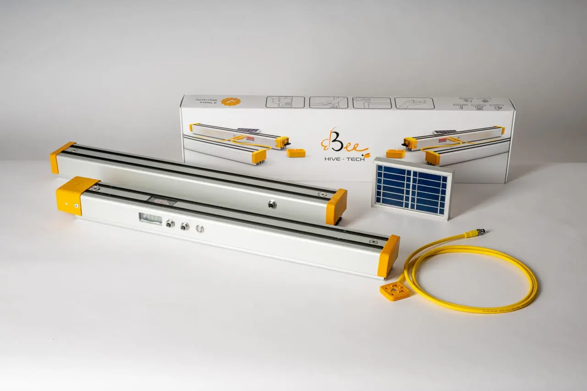

## Overview

3bee is an Italian company focused on biodiversity assessment and monitoring with IoT sensors. Notable for their B2B2C model targeting corporate ESG initiatives.

## Product Features
- Hive monitoring sensors
- Biodiversity assessment and monitoring
- Corporate hive sponsorship program
- ESG reporting integration
- Environmental impact metrics
- https://www.3bee.com/en/esg/corporate-hive/

## Competitive Analysis

### Strengths
- Unique B2B2C business model (corporate sponsorships)
- ESG/sustainability angle appeals to corporations
- European market presence (Italy)
- Biodiversity focus differentiates from pure beekeeping tech
- Revenue from both beekeepers and corporate sponsors

### Weaknesses vs Gratheon
- Less focus on beekeeper needs vs corporate reporting
- No computer vision capabilities
- No entrance monitoring
- Limited automation features
- Focus on biodiversity metrics vs colony health optimization

### Strategic Implications
- Different business model (less direct competition)
- Corporate partnership angle could inspire Gratheon
- Biodiversity messaging resonates with sustainability trends
- Opportunity: Gratheon could add ESG reporting features
- European market presence means potential overlap

