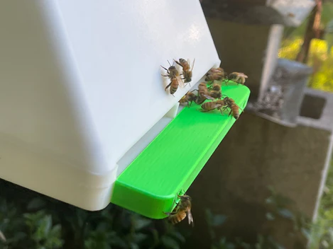

## Overview

Beemate is an Australian entrance observer solution using HD camera and AI for bee counting. Features live streaming capabilities.

[https://blynk.io/clients/beemate-ai-powered-hives](https://blynk.io/clients/beemate-ai-powered-hives)

> uses a HD camera to count bees and run artificial intelligence software. It sends the data to our cloud platform

## Product Features
- HD camera at hive entrance
- AI-powered bee counting
- Live streaming of hive entrance
- Video playback capabilities
- iOS, Android, and web app access
- Cloud platform for data storage
- Real-time monitoring

## Competitive Analysis

### Strengths
- Live streaming feature (unique value proposition)
- AI bee counting (similar to Gratheon)
- Multi-platform app support
- Australian market presence
- Video playback for historical analysis
- Uses Blynk IoT platform (fast development)

### Weaknesses vs Gratheon
- Limited to Australian market (geographic constraint)
- Less sophisticated AI models (presumably)
- No frame-level internal inspection
- Smaller company/less funding
- Limited European presence

### Strategic Implications
- Similar product concept validates Gratheon's approach
- Live streaming is attractive feature (consider for Gratheon)
- Geographic separation reduces direct competition
- Could be partnership or acquisition target
- Learn from their video streaming implementation

<iframe width="433" height="244" src="https://www.youtube.com/embed/77o94J4d1Q0" title="BeeMate Background Video" frameborder="0" allow="accelerometer; autoplay; clipboard-write; encrypted-media; gyroscope; picture-in-picture; web-share" referrerpolicy="strict-origin-when-cross-origin" allowfullscreen></iframe>
