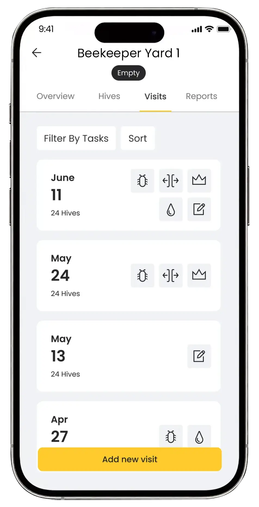

## Overview

BeeHero is a well-funded IoT sensor platform specializing in comprehensive hive monitoring with a strong focus on commercial pollination services. They have raised significant VC capital and have strong market presence in North America.

## Product Features
- Multi-sensor monitoring (weight, temperature, humidity, sound)
- Cloud dashboard with analytics
- Real-time monitoring and predictive analytics
- Mobile and web applications
- Alert systems and data visualization
- Integration with pollination logistics
- Research partnerships with universities

## Competitive Analysis

### Strengths
- Well-funded with significant VC backing
- Strong market presence in North America
- Enterprise-grade dashboard and analytics
- Integration with pollination logistics ecosystem
- Research partnerships provide credibility
- Established brand in commercial beekeeping

### Weaknesses vs Gratheon
- No computer vision or entrance monitoring capabilities
- Higher price point targeting enterprise customers
- Less focus on European market (Gratheon opportunity)
- No frame-level internal inspection capabilities
- Limited appeal to semi-professional beekeepers

### Strategic Implications
- Direct competitor in IoT sensor space
- Better funded (potential concern for competitive pressure)
- Gap in visual inspection features creates opportunity for Gratheon
- Focus on pollination services vs colony health (different value propositions)
- Expanding to Europe: Monitor their moves carefully
- Partnership opportunity: Could integrate Gratheon's vision capabilities

## Business Model
- B2B focus on commercial pollination operations
- Subscription-based pricing
- Enterprise sales model
- Focus on ROI for large-scale operations

<iframe width="100%" height="400" src="https://www.youtube.com/embed/j3Idmm8Gmt4" title="Dr. Huw Evans Technology Testimonial" frameborder="0" allow="accelerometer; autoplay; clipboard-write; encrypted-media; gyroscope; picture-in-picture; web-share" referrerpolicy="strict-origin-when-cross-origin" allowfullscreen></iframe>
