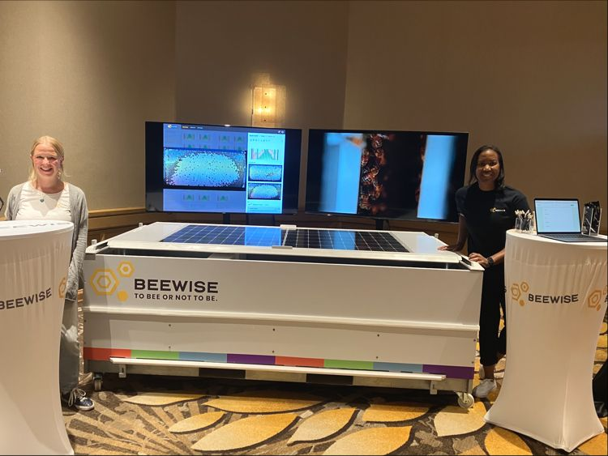
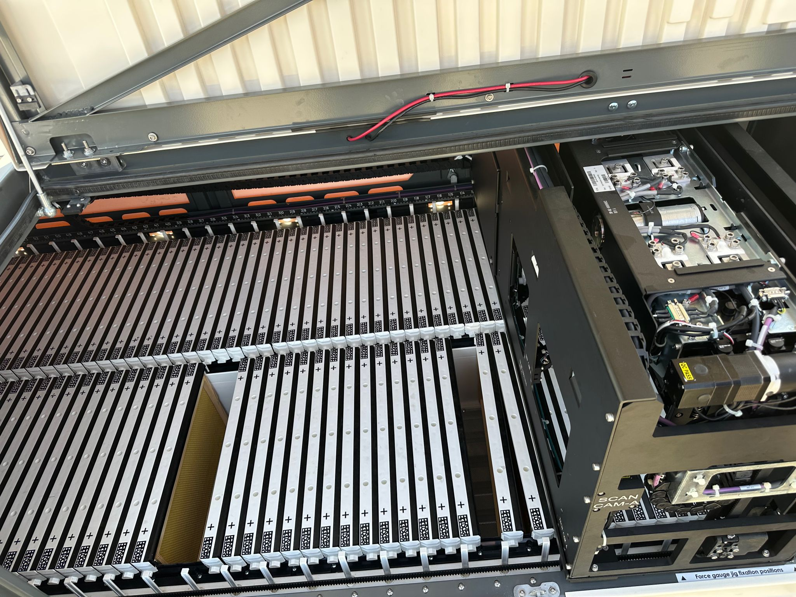
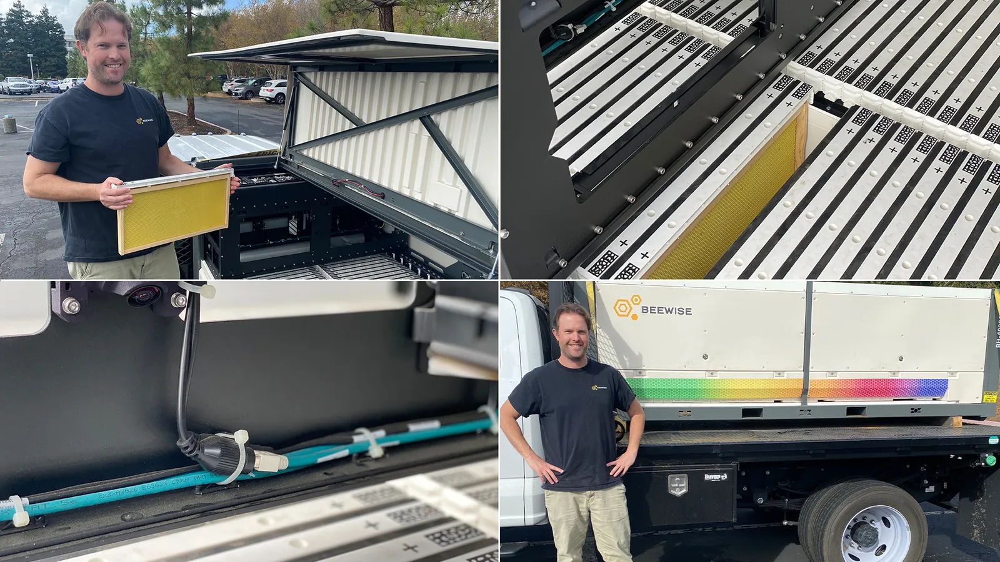

## Overview

Beewise is the leading company in robotic digital beekeeping. They have iterated with multiple beehive systems, gained multiple investment rounds and operate primarily in the US.

Beewise replaces traditional hives with a monolithic container-like structure which hosts 12-28 colonies (depending on the product). The robot does automatic inspections with computer vision.

## Competitive Analysis

### Strengths
- Most mature robotic solution on the market
- Multiple investment rounds secured (well-funded)
- Operating at commercial scale in United States
- Complete automation (feeding, treatment, monitoring)
- Proven image processing for disease/pest detection
- Validates investor appetite for beekeeping tech

### Weaknesses vs Gratheon
- Very high entry cost ($2000-$7200/year per container)
- Industrial scale only (not suitable for hobby/semi-pro beekeepers)
- Proprietary container system (not compatible with existing traditional hives)
- Limited geographic availability (US-focused)
- Requires significant infrastructure investment

### Strategic Implications
- Beewise targets enterprise segment; Gratheon targets semi-professionals (different markets)
- Validates market demand for automation + computer vision
- Proves beekeepers will adopt high-tech solutions
- Competition risk: If they introduce smaller/cheaper units for semi-pros
- Opportunity: Gratheon can win middle market before Beewise moves down-market

## Business Model
- Rental/subscription model
- Focus on large commercial pollination operations
- Premium pricing for complete automation solution

<iframe width="433" height="244" src="https://www.youtube.com/embed/WSvMVJpAQ6M" title="Beehome VS Beehive" frameborder="0" allow="accelerometer; autoplay; clipboard-write; encrypted-media; gyroscope; picture-in-picture; web-share" referrerpolicy="strict-origin-when-cross-origin" allowfullscreen></iframe>

