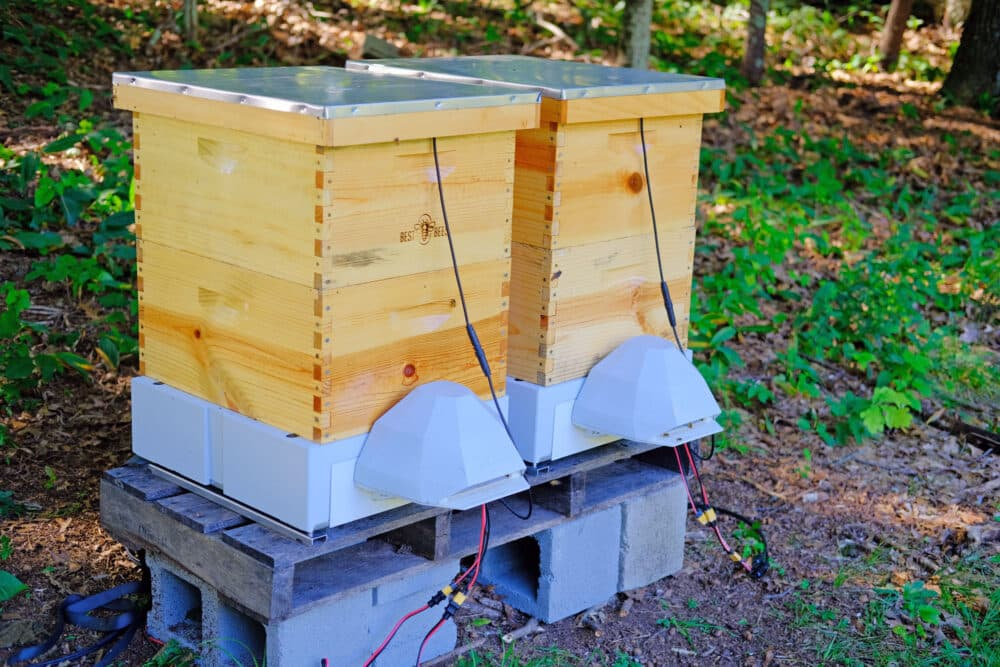
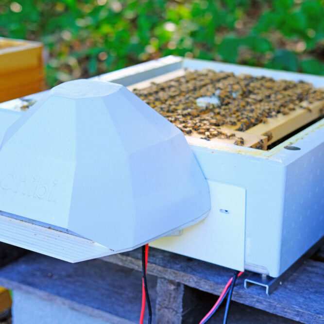

## Overview

Best Bees is a Massachusetts-based company offering managed beekeeping services combined with AI-powered SmartHive technology. Unique business model combining service + technology.

## Product Features
- AI-powered hive entrance monitoring
- Professional beekeeping services
- Managed hive installations
- Computer vision for bee counting
- Health monitoring
- Full-service approach (not DIY)

## Competitive Analysis

### Strengths
- Unique service + technology business model
- Professional beekeeping expertise
- US market presence and brand recognition
- Media coverage (AI tech story angle)
- Corporate clients (urban beekeeping)
- Installation and maintenance included
- Proven technology implementation

### Weaknesses vs Gratheon
- Service model limits scalability (labor intensive)
- US market only (not European)
- Higher total cost (service + tech)
- Not suitable for existing beekeepers
- Limited to managed service clients
- No DIY or self-service option
- Geographic constraints

### Strategic Implications
- Different business model (service vs product)
- Validates entrance monitoring + AI approach
- Shows corporate/urban market exists
- Limited direct competition (different models)
- Gratheon targets DIY beekeepers, Best Bees targets corporate/urban
- Could inspire Gratheon "managed service" tier
- Geographic separation reduces competition

## Business Model Insights
- B2B2B: Corporate sponsors → Best Bees → Managed hives
- Recurring revenue from service + technology
- Higher margins but lower scalability
- Requires beekeeping expertise staff
- Urban/corporate focus vs agricultural

<iframe width="433" height="244" src="https://www.youtube.com/embed/l1SnN9OTo8Y" title="Mass. beekeeping company says AI tech leads to healthier hives" frameborder="0" allow="accelerometer; autoplay; clipboard-write; encrypted-media; gyroscope; picture-in-picture; web-share" referrerpolicy="strict-origin-when-cross-origin" allowfullscreen></iframe>

