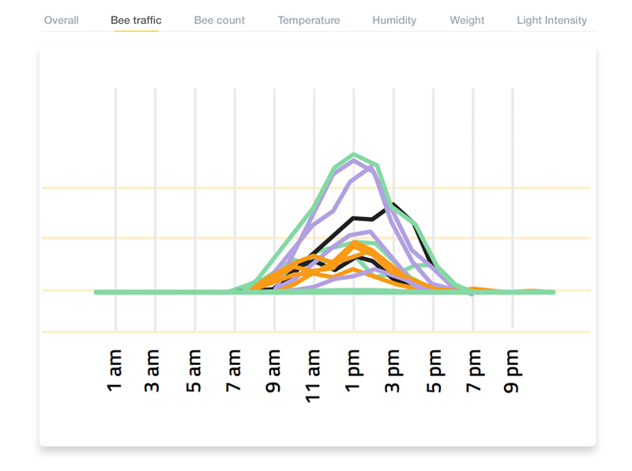
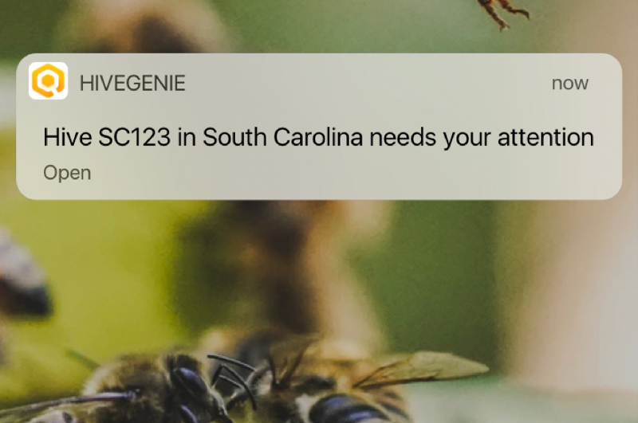
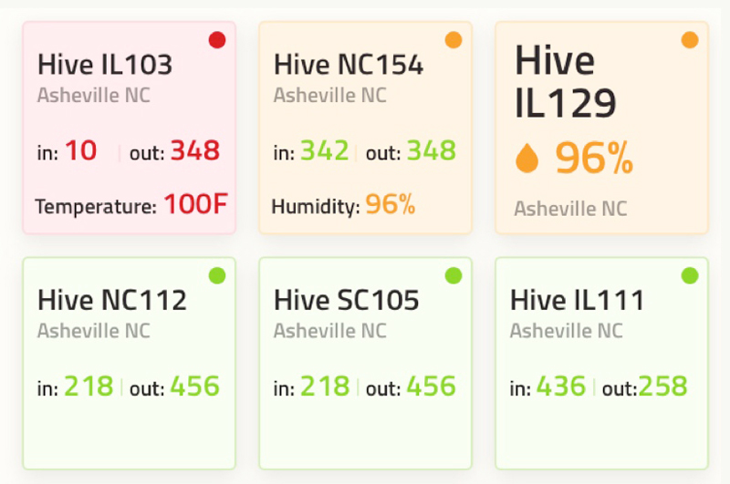

## Overview

HiveGenie is a US-based entrance observer solution with focus on pollination tracking and mobile notifications.

## Product Features
- Entrance monitoring camera
- Pollination tracking
- Mobile notifications
- Bee activity analysis
- Health monitoring
- App-based interface

## Competitive Analysis

### Strengths
- Focus on pollination metrics (appeals to commercial beekeepers)
- Mobile-first approach with notifications
- Visual product marketing (good screenshots)
- Clear value proposition for pollination services
- US market presence

### Weaknesses vs Gratheon
- US market only (not European)
- Limited technical details available
- Smaller company/less visibility
- No frame-level inspection
- Single product focus (no ecosystem)
- Less sophisticated feature set

### Strategic Implications
- Validates entrance observer market demand
- Pollination focus is interesting niche
- Geographic separation reduces direct competition
- Mobile notifications are table stakes feature
- Gratheon should match/exceed their UX quality
- Limited threat due to US focus and smaller scale

## Lessons for Gratheon
- Mobile notifications are expected feature
- Pollination metrics have commercial value
- Clear visual marketing important
- Focus on specific use cases resonates

