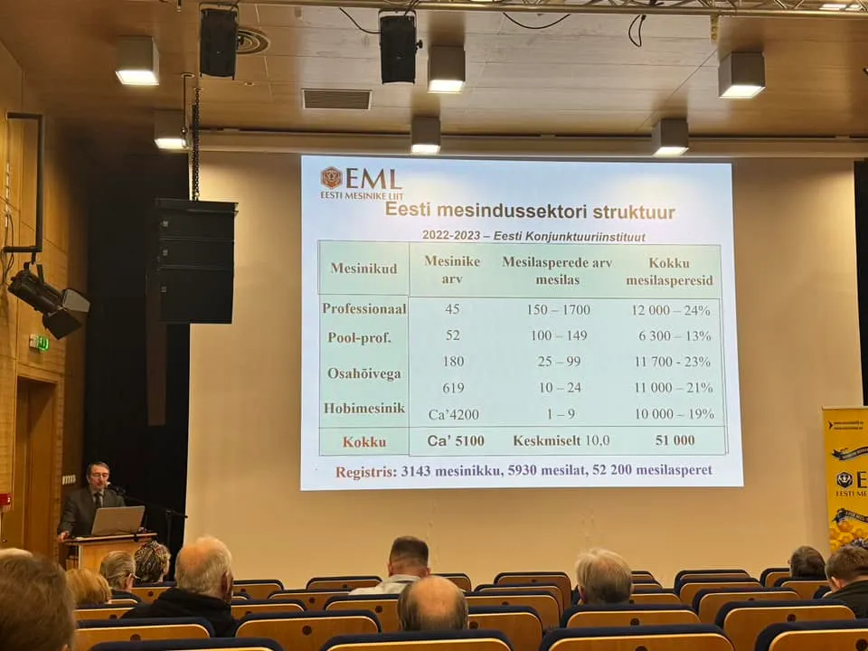

## Estonia

As we are Estonia-based, may be useful to track this data too to be able to extrapolate it on the world

- Estonia alone has over [~6400 apiaries](https://mesi.ee/) (these are registered only)
- 51000 bee colonies
- 5100 beekeepers
- 1.3M population
- thus 0.4 % of population, or ~ every 250th person is a beekeeper
- So almost any grown-up has someone related to beekeeping.

### Amount of bee colonies over the years

( source - https://sekkumine.mesinduskogu.ee/wp-content/uploads/2024/07/Eesti-mesindussektori-struktuur-2021.pdf )
### Amount of beekeepers over the years

(source https://sekkumine.mesinduskogu.ee/wp-content/uploads/2024/07/Eesti-mesindussektori-struktuur-2021.pdf )

### Beekeepers count depending on colony count

Source - [https://www.facebook.com/groups/108065015894483/posts/7747932681907640/](https://www.facebook.com/groups/108065015894483/posts/7747932681907640/?__cft__%5B0%5D=AZU3RQzLClErwsvGlOW3baE9TCxzykebDHTwgvk-ckV3adhny0TtNOoB0c0FqCKyqTLj3sLJpsG20d4shBfQCl7dpHxHzmyRfXbyOTKtC515WUEfDq-gDH55NDKaUcLlE0tX793llRymvhq7M-Cc8E0duQIFbJK7hGGsHf2CC0X_fwiMNnd3dH6B6hLEwP85O3A&__tn__=%2CO*F)

### Age distribution

Below - age distribution of estonian beekeepers depending on amount of owned bee colonies, that answered a poll. The older you are, the less likely you are to won lots of colonies.

Source - https://sekkumine.mesinduskogu.ee/wp-content/uploads/2024/07/Eesti-mesindussektori-struktuur-2021.pdf

## Legal entity
The more you bee colonies you own, the more likely you to use a company (green) or private enterpreneur (blue) legal entity

Source - https://sekkumine.mesinduskogu.ee/wp-content/uploads/2024/07/Eesti-mesindussektori-struktuur-2021.pdf
### Geographic distribution 

### Honey production and cost
We see that on average per colony, we have ~23kg per year

( source - https://sekkumine.mesinduskogu.ee/wp-content/uploads/2024/07/Eesti-mesindussektori-struktuur-2021.pdf )

(source - https://sekkumine.mesinduskogu.ee/wp-content/uploads/2024/07/Eesti-mesindussektori-struktuur-2021.pdf )

<object data={require('../img/uuring-2016-mesindussektor-2015.pdf').default} type="application/pdf" width="100%" height="800"></object>

## Europe and the world markets
- The total number of beekeepers in Europe was estimated at 620 000 ([source](https://www.ncbi.nlm.nih.gov/pmc/articles/PMC3827320/))
- 94 Million hives in 2020 - statista
- 101 M colonies in 2021 - FAO ([source](https://www.notion.so/Marketing-Statistics-06c02962e8294bb98756a75155ce7a6b?pvs=21))

### Number of bees

[https://agriculture.ec.europa.eu/news/beekeeping-sector-results-pilot-study-honey-bee-selection-2022-03-15_en](https://agriculture.ec.europa.eu/news/beekeeping-sector-results-pilot-study-honey-bee-selection-2022-03-15_en)

### Amount of beekeepers in EU countries

(source - https://www.europarl.europa.eu/RegData/etudes/ATAG/2017/608786/EPRS_ATA%282017%29608786_EN.pdf )
### Amount of beehives in EU countries

[https://ec.europa.eu/eurostat/en/web/products-eurostat-news/w/edn-20230519-1](https://ec.europa.eu/eurostat/en/web/products-eurostat-news/w/edn-20230519-1)

Source - [https://agriculture.ec.europa.eu/system/files/2022-04/market-presentation-honey_en_0.pdf](https://agriculture.ec.europa.eu/system/files/2022-04/market-presentation-honey_en_0.pdf)

<object data={require('../img/market-presentation-honey_autumn2024_en.pdf').default} type="application/pdf" width="100%" height="800"></object>

## Worldwide honey exports & imports

source - [https://www.pbc.org.pk/wp-content/uploads/Potential-of-Honey-in-Pakistan-An-Analysis-of-the-Global-and-Domestic-Market.pdf](https://www.pbc.org.pk/wp-content/uploads/Potential-of-Honey-in-Pakistan-An-Analysis-of-the-Global-and-Domestic-Market.pdf)

## Bee statistics

Colony loss. BeeInformed [https://beeinformed.org/2022/07/27/united-states-honey-bee-colony-losses-2021-2022-preliminary-results-from-the-bee-informed-partnership/](https://beeinformed.org/2022/07/27/united-states-honey-bee-colony-losses-2021-2022-preliminary-results-from-the-bee-informed-partnership/)

### Bee races
Which races are owned by beekeepers in Estonia

Source - https://sekkumine.mesinduskogu.ee/wp-content/uploads/2024/07/Eesti-mesindussektori-struktuur-2021.pdf

