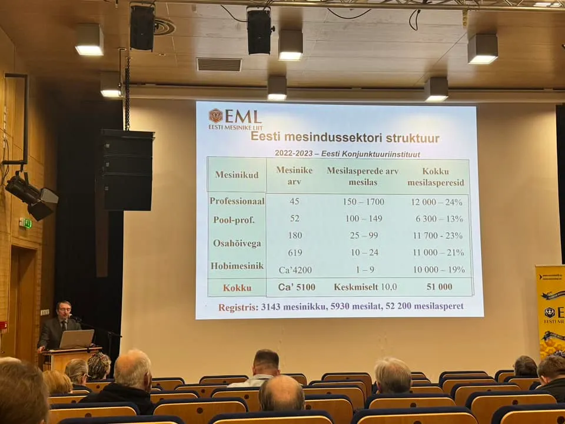

## Estonia

As we are Estonia-based, may be useful to track this data too to be able to extrapolate it on the world

- Estonia alone has over [~6400 apiaries](https://mesi.ee/) (these are registered only)
- 51000 bee colonies
- 5100 beekeepers
- 1.3M population
- thus 0.4 % of population, or ~ every 250th person is a beekeeper
- So almost any grown-up has someone related to beekeeping.

### Amount of bee colonies over the years

( source - https://sekkumine.mesinduskogu.ee/wp-content/uploads/2024/07/Eesti-mesindussektori-struktuur-2021.pdf )
### Amount of beekeepers over the years

(source https://sekkumine.mesinduskogu.ee/wp-content/uploads/2024/07/Eesti-mesindussektori-struktuur-2021.pdf )

### Beekeepers count depending on colony count

Source - [https://www.facebook.com/groups/108065015894483/posts/7747932681907640/](https://www.facebook.com/groups/108065015894483/posts/7747932681907640/?__cft__%5B0%5D=AZU3RQzLClErwsvGlOW3baE9TCxzykebDHTwgvk-ckV3adhny0TtNOoB0c0FqCKyqTLj3sLJpsG20d4shBfQCl7dpHxHzmyRfXbyOTKtC515WUEfDq-gDH55NDKaUcLlE0tX793llRymvhq7M-Cc8E0duQIFbJK7hGGsHf2CC0X_fwiMNnd3dH6B6hLEwP85O3A&__tn__=%2CO*F)

### Age distribution

Below - age distribution of estonian beekeepers depending on amount of owned bee colonies, that answered a poll. The older you are, the less likely you are to won lots of colonies.

Source - https://sekkumine.mesinduskogu.ee/wp-content/uploads/2024/07/Eesti-mesindussektori-struktuur-2021.pdf

## Legal entity
The more you bee colonies you own, the more likely you to use a company (green) or private enterpreneur (blue) legal entity

Source - https://sekkumine.mesinduskogu.ee/wp-content/uploads/2024/07/Eesti-mesindussektori-struktuur-2021.pdf
### Geographic distribution 

### Honey production and cost
We see that on average per colony, we have ~23kg per year

( source - https://sekkumine.mesinduskogu.ee/wp-content/uploads/2024/07/Eesti-mesindussektori-struktuur-2021.pdf )

(source - https://sekkumine.mesinduskogu.ee/wp-content/uploads/2024/07/Eesti-mesindussektori-struktuur-2021.pdf )

<object data={require('../img/uuring-2016-mesindussektor-2015.pdf').default} type="application/pdf" width="100%" height="800"></object>

## Europe and the world markets
- The total number of beekeepers in Europe was estimated at 620 000 ([source](https://www.ncbi.nlm.nih.gov/pmc/articles/PMC3827320/))
- 94 Million hives in 2020 - statista
- 101 M colonies in 2021 - FAO ([source](https://www.notion.so/Marketing-Statistics-06c02962e8294bb98756a75155ce7a6b?pvs=21))

### Number of bees

[https://agriculture.ec.europa.eu/news/beekeeping-sector-results-pilot-study-honey-bee-selection-2022-03-15_en](https://agriculture.ec.europa.eu/news/beekeeping-sector-results-pilot-study-honey-bee-selection-2022-03-15_en)

### Amount of beekeepers in EU countries

(source - https://www.europarl.europa.eu/RegData/etudes/ATAG/2017/608786/EPRS_ATA%282017%29608786_EN.pdf )
### Amount of beehives in EU countries

[https://ec.europa.eu/eurostat/en/web/products-eurostat-news/w/edn-20230519-1](https://ec.europa.eu/eurostat/en/web/products-eurostat-news/w/edn-20230519-1)

Source - [https://agriculture.ec.europa.eu/system/files/2022-04/market-presentation-honey_en_0.pdf](https://agriculture.ec.europa.eu/system/files/2022-04/market-presentation-honey_en_0.pdf)

<object data={require('../img/market-presentation-honey_autumn2024_en.pdf').default} type="application/pdf" width="100%" height="800"></object>

## Worldwide honey exports & imports

source - [https://www.pbc.org.pk/wp-content/uploads/Potential-of-Honey-in-Pakistan-An-Analysis-of-the-Global-and-Domestic-Market.pdf](https://www.pbc.org.pk/wp-content/uploads/Potential-of-Honey-in-Pakistan-An-Analysis-of-the-Global-and-Domestic-Market.pdf)

## Bee statistics

Colony loss. BeeInformed [https://beeinformed.org/2022/07/27/united-states-honey-bee-colony-losses-2021-2022-preliminary-results-from-the-bee-informed-partnership/](https://beeinformed.org/2022/07/27/united-states-honey-bee-colony-losses-2021-2022-preliminary-results-from-the-bee-informed-partnership/)

### Bee races
Which races are owned by beekeepers in Estonia

Source - https://sekkumine.mesinduskogu.ee/wp-content/uploads/2024/07/Eesti-mesindussektori-struktuur-2021.pdf

## Global Market: Digital Beekeeping Scales (Smart IoT Scales)

As Gratheon develops a low-cost hardware + SaaS subscription model for smart beehive scales, understanding the global market landscape is crucial.

### Market Size & Growth

The market for smart beehive monitoring and digital scales is experiencing rapid expansion, driven by the increasing adoption of precision apiculture and the rising demand for real-time hive monitoring.

- **Global Beehive Scale Market:** Valued at approximately **$98.5M – $132.7M in 2024**. It is expected to grow at a Compound Annual Growth Rate (CAGR) of **~10.7%**, reaching around **$245.7M by 2033**.
- **Smart Beehive Monitoring Market:** A broader category (including scales, audio/video sensors, and climate sensors) was valued at **$185M in 2024** and is projected to hit **$1.12B by 2033**, growing at a robust **CAGR of 21.8%**.
- **Overall Apiculture Market:** The entire apiculture market is valued at **$11.42B (2025)** and projected to touch **$16.69B by 2035** (CAGR 3.87%).

*Key Growth Drivers:*
1. **Demand for Pollination Services:** A 54% rise in pollination service contracts.
2. **Organic Product Demand:** Over 48% increase in demand for organic honey and bee products.
3. **Technological Advancements:** Support for urban beekeeping and the transition from traditional to tech-enabled apiary management.

### Key Competitors & Existing Solutions

The market includes several established players with varying pricing and business models. Gratheon's hardware-light approach competes against:

1. **BroodMinder (US/France):**
   - Focuses on simple, cost-effective wireless monitors.
   - Pricing: *BroodMinder-W Weight Scale* is priced around **$242**.
2. **SolutionBee:**
   - Targets both hobbyists and commercial operators.
   - Pricing: *HM-6 Hive Monitor (WiFi)* is around **$359**, and *HM-1 Sensor* is **$64**.
3. **Other Notable Competitors:**
   - **Beewise (Israel) & BeeHero (Israel):** Heavily focused on industrial-scale robotic and sensor solutions.
   - **HiveMind (New Zealand), ApicAI (Germany), Nectar (Canada), ForSage, Apipulse:** Regional and niche providers of smart scales and hive sensors.

### Target Segments for Gratheon

Given Gratheon's mission and open-source foundation, the target audience can be segmented into:
- **Hobbyists & Urban Beekeepers:** Looking for affordable, easy-to-use tech to ensure colony survival (overwintering, swarming alerts).
- **Semi-Professional & Commercial Beekeepers:** Need scalable solutions to monitor distant locations, optimize pollination routes, and reduce physical labor.
- **Farmers:** Interested in pollination efficacy rather than honey production.

### Strategic Insights & Recommendations

Gratheon's business model—**low-margin hardware coupled with a SaaS web app**—positions the project well within this growing market:

- **Strengths:** By keeping hardware costs below competitors (e.g., aiming under $200), Gratheon can lower the barrier to entry for hobbyists and encourage bulk purchases by commercial apiaries. The SaaS model ensures recurring revenue.
- **Opportunities:** There is a significant gap in open-source, flexible platforms that integrate multiple sensor types (scales, entrance observers, robotic interventions). Expanding the SaaS to handle holistic apiary analytics (weather, floral blooming, historical telemetry) will differentiate Gratheon from purely hardware-focused competitors.
- **Threats:** Established players like BroodMinder already have a foothold and brand recognition. Gratheon must leverage its open-source community and superior software UX to win market share.
