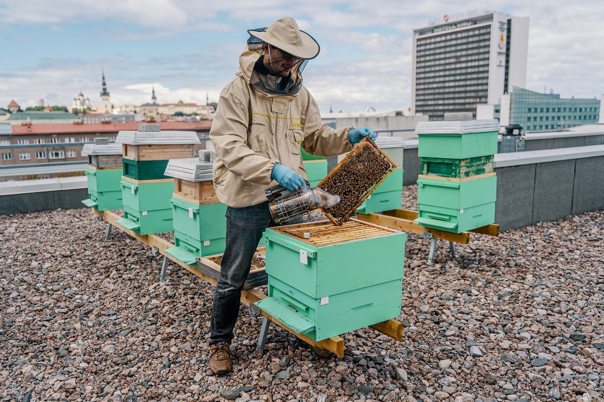
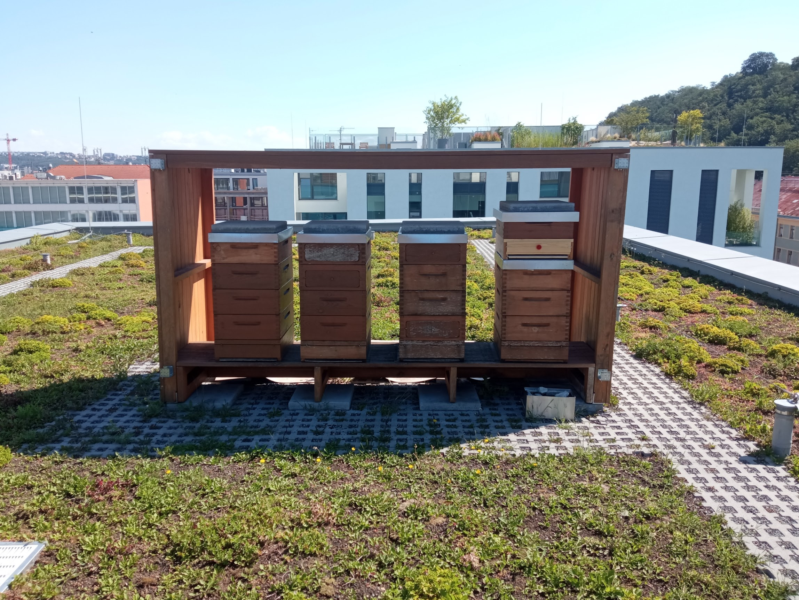

## Overview

Corporations seeking ESG impact, biodiversity initiatives, and authentic sustainability storytelling through bee colony sponsorship and monitoring. Inspired by successful B2B2C models like 3bee's corporate hive program.

## Business Model

**B2B2B:** Corporation → Gratheon → Beekeeper → Monitored Hives

- Corporations sponsor beehives managed by professional beekeepers
- Gratheon provides technology for monitoring and reporting
- Real environmental impact with data-driven transparency
- Brand storytelling with authentic sustainability metrics

## Target Companies

### Tech Scale-ups & Startups
- High-tech companies (LHV, TalTech, Pipedrive already have rooftop hives)
- Software companies prioritizing sustainability
- VC-backed startups building ESG credentials
- Remote-first companies seeking environmental offset

### Corporate ESG Programs
- Companies with ESG reporting requirements
- Organizations pursuing B Corp certification
- Enterprises with sustainability commitments
- Companies offsetting carbon/environmental impact

### Industries
- Technology and software
- Financial services
- Professional services (consulting, legal, accounting)
- Creative agencies and marketing firms
- Manufacturing with green initiatives

## Key Decision Makers

### Primary Contacts
- **ESG/Sustainability Officers** - Lead ESG initiatives, need measurable impact
- **CSR Directors** - Corporate Social Responsibility programs
- **Brand/Marketing Managers** - Sustainability storytelling and brand positioning
- **Office/Facilities Managers** - Rooftop hive installations
- **HR/People Ops** - Employee engagement programs

### Stakeholders
- C-Suite (CEO, COO) - ESG strategy approval
- Procurement - Vendor selection and contracts
- Legal - Contract review and compliance
- Communications - Internal and external messaging

## Motivations & Pain Points

### Primary Motivations
1. **ESG Reporting** - Quantifiable biodiversity impact metrics
2. **Brand Differentiation** - Authentic sustainability story
3. **Employee Engagement** - Visible environmental initiative
4. **Regulatory Compliance** - EU taxonomy, CSRD requirements
5. **Stakeholder Expectations** - Investors, customers want action
6. **Carbon Offset** - Pollination contributes to carbon sequestration

### Pain Points
1. **Greenwashing Risk** - Need authentic, measurable impact
2. **Data Requirements** - ESG reports need quantifiable data
3. **Complexity** - Don't want to manage beehives directly
4. **Verification** - Need third-party validation of impact
5. **Storytelling** - Hard to communicate impact compellingly
6. **ROI Justification** - Need to show value to leadership

## Value Proposition

### What Gratheon Offers

**Turnkey Sponsorship Program:**
1. **Professional Beekeeper Partnership** - No corporate bee management needed
2. **Technology Monitoring** - Real-time hive health via Gratheon platform
3. **Impact Metrics** - Quantified pollination, biodiversity data
4. **ESG Reporting** - Ready-made reports for sustainability disclosures
5. **Brand Assets** - Photos, videos, data visualizations for marketing
6. **Employee Access** - Staff can view "their" hives via app
7. **Storytelling Content** - Authentic sustainability narratives

**Differentiation vs Competitors:**
- **Computer vision** - Visual proof of hive health (not just sensor data)
- **Frame inspection** - Internal colony documentation
- **Automated monitoring** - Real-time data without manual logging
- **Open source** - Transparency validates authenticity
- **European focus** - Local impact, GDPR compliant

## Revenue Model

### Pricing Tiers

**Starter Tier (1-5 hives)**
- €500-1,000 per hive per year
- Basic monitoring and reporting
- Quarterly impact reports
- Company branding on hive
- Target: Startups, small companies

**Professional Tier (6-20 hives)**
- €800-1,500 per hive per year
- Advanced monitoring with computer vision
- Monthly reports and data dashboard access
- Employee app access
- Custom branding and content
- Target: Scale-ups, mid-size companies

**Enterprise Tier (20+ hives)**
- €1,200-2,000 per hive per year
- Full Gratheon ecosystem deployment
- Real-time monitoring dashboard
- Dedicated account manager
- Custom ESG integration
- API access for data integration
- Speaking opportunities at events
- Target: Large corporations, multinational ESG programs

### Additional Revenue Streams
- Setup fees (€2,000-5,000 one-time)
- Custom reporting and analytics
- Educational workshops for employees
- Honey branding and distribution
- Event hosting at apiaries

## Package Components

### Technology Package
- Entrance observer with computer vision
- Beehive sensors (weight, temperature, humidity)
- Frame inspection camera (internal monitoring)
- Web dashboard with corporate branding
- Mobile app access for employees
- Real-time alerts and notifications

### Reporting Package
- **Monthly Impact Reports:**
  - Hive health metrics
  - Bee population trends
  - Environmental conditions
  - Pollination activity estimates
  
- **Quarterly ESG Reports:**
  - Biodiversity impact quantification
  - Carbon offset calculations
  - Aligned with EU taxonomy
  - Ready for sustainability disclosures
  
- **Annual Sustainability Report:**
  - Year-over-year impact comparison
  - Pollination radius maps
  - Flora diversity analysis
  - Photo/video documentation

### Marketing & Storytelling Package
- High-quality hive photos and videos
- Time-lapse colony development
- Beekeeper interview content
- Data visualizations for presentations
- Social media content kit
- Employee engagement materials
- Press release templates

### Employee Engagement Package
- Company-branded app access
- Live hive webcam access
- Educational content and workshops
- Tasting events with harvested honey
- Volunteer days at apiaries
- Team-building activities

## Use Cases & Examples

### Existing Examples

**LHV Bank (Estonia)**
- Rooftop apiary on headquarters
- Brand association with sustainability
- Employee engagement program
- [https://www.lhv.ee/en/news/2020/33](https://www.lhv.ee/en/news/2020/33)

**Pipedrive (Czech Republic)**
- Rooftop hives on Prague office
- Part of sustainability initiative
- Tech company brand alignment

### Potential Use Cases

**Tech Startup Pre-IPO:**
- Building ESG credentials before public offering
- Demonstrating environmental commitment to investors
- Differentiating in competitive talent market

**B Corp Certification Candidate:**
- Quantifiable environmental impact
- Community engagement through local beekeepers
- Measurable biodiversity contribution

**Enterprise Sustainability Report:**
- EU Corporate Sustainability Reporting Directive (CSRD) compliance
- Biodiversity metrics for annual report
- Visual content for stakeholder communications

**Employee Retention Program:**
- Unique perk differentiating from competitors
- Connection to nature for remote/office workers
- Team-building around environmental mission

## Sales & Marketing Strategy

### Inbound Marketing
1. **Content Marketing:**
   - "How tech companies can support biodiversity"
   - "ESG reporting made easy with bee monitoring"
   - "Corporate sustainability beyond carbon offsets"
   - Case studies with existing corporate partners

2. **SEO/Keywords:**
   - Corporate ESG programs
   - Biodiversity sponsorship
   - Corporate bee adoption
   - Sustainability initiatives for tech companies

3. **LinkedIn Presence:**
   - Target ESG officers, sustainability directors
   - Share impact metrics and case studies
   - Engage in ESG/sustainability discussions

### Outbound Sales
1. **Direct Outreach:**
   - Identify companies with ESG initiatives
   - LinkedIn outreach to sustainability officers
   - Email campaigns to HR and office managers
   - Cold calling to CSR departments

2. **Partnership Channels:**
   - ESG consulting firms
   - B Corp certification consultants
   - Sustainability conferences and events
   - Green business associations

3. **Referral Program:**
   - Incentives for existing corporate clients
   - Beekeeper referrals to their corporate contacts
   - Employee referrals within sponsored companies

### Event Marketing
1. **Trade Shows:**
   - ESG and sustainability conferences
   - Corporate responsibility forums
   - Green business expos
   - Tech industry events

2. **Workshops & Webinars:**
   - "ESG Reporting for Tech Companies"
   - "Biodiversity Impact Measurement"
   - "Corporate Sustainability Beyond Greenwashing"

## Competitive Positioning

### vs 3bee (Italy)
- **3bee:** Established corporate program, Italian market, focus on biodiversity assessment
- **Gratheon:** Computer vision differentiation, frame inspection, open source, European expansion
- **Strategy:** Emphasize advanced monitoring technology and transparency

### vs Beekeeping Associations
- **Associations:** Traditional sponsorship, less technology
- **Gratheon:** Data-driven, ESG reporting, visual proof, real-time monitoring
- **Strategy:** Position as modern, tech-enabled sponsorship

### vs Direct Beekeeper Relationships
- **Direct:** Personal relationship, local, custom arrangements
- **Gratheon:** Scalable, standardized reporting, technology platform, multi-location
- **Strategy:** Offer best of both (local beekeepers + technology platform)

## Success Metrics

### For Corporations
- ESG score improvement
- Employee satisfaction increase
- Media coverage and brand mentions
- Pollination impact (acres covered)
- Biodiversity metrics
- Carbon offset equivalent

### For Gratheon
- Number of corporate sponsors
- Average contract value (ACV)
- Annual recurring revenue (ARR)
- Hives under corporate sponsorship
- Customer retention rate
- Expansion revenue (upsells)

## Implementation Roadmap

### Phase 1: Pilot Program (Q1-Q2 2026)
- [ ] Recruit 3-5 pilot corporate sponsors
- [ ] Partner with 2-3 professional beekeepers
- [ ] Deploy full Gratheon monitoring stack
- [ ] Develop ESG reporting templates
- [ ] Create case studies and testimonials

### Phase 2: Product Development (Q2-Q3 2026)
- [ ] Build corporate dashboard with branding options
- [ ] Develop ESG report generation automation
- [ ] Create employee engagement features
- [ ] Build API for corporate data integration
- [ ] Design marketing asset generation tools

### Phase 3: Market Expansion (Q3-Q4 2026)
- [ ] Launch formal sponsorship program
- [ ] Hire corporate account manager
- [ ] Attend ESG/sustainability conferences
- [ ] Build partnerships with ESG consultants
- [ ] Scale to 20+ corporate sponsors

### Phase 4: European Growth (2027)
- [ ] Expand to Germany, France, Italy
- [ ] Localize content and reporting
- [ ] Build network of partner beekeepers
- [ ] Pursue EU funding for biodiversity tech
- [ ] Target 100+ corporate sponsors

## Key Partnerships

### Essential Partners
1. **Professional Beekeepers** - Quality hive management
2. **ESG Consulting Firms** - Channel partners for corporate sales
3. **Sustainability Certification Bodies** - Validation and credibility
4. **Corporate Event Planners** - Employee engagement experiences
5. **Environmental NGOs** - Biodiversity impact validation

### Technology Partners
1. **Carbon Offset Platforms** - Integration for comprehensive impact
2. **ESG Reporting Software** - Data integration APIs
3. **HR Platforms** - Employee engagement features

## Risk Mitigation

### Key Risks & Mitigations

**Risk: Colony Loss**
- Mitigation: Multiple hives per sponsor, professional beekeepers, insurance

**Risk: Greenwashing Accusations**
- Mitigation: Transparent data, third-party validation, open source tech

**Risk: Complex Sales Cycle**
- Mitigation: Clear ROI documentation, pilot programs, references

**Risk: Beekeeper Capacity**
- Mitigation: Network of qualified beekeepers, training programs, scalable model

**Risk: Technology Failures**
- Mitigation: Redundant monitoring, manual backup procedures, SLAs

## Conclusion

Corporate Hive Sponsorship represents a significant B2B2B revenue opportunity for Gratheon:

**Market Opportunity:**
- Growing ESG mandates in EU (CSRD, EU Taxonomy)
- Corporate sustainability budgets increasing
- Differentiated from competitors with computer vision
- Scalable model with high margins

**Competitive Advantages:**
- Technology differentiation (vision + sensors + AI)
- Open source transparency (anti-greenwashing)
- European focus (local impact, compliance)
- Integrated platform (hardware + software + data)

**Next Steps:**
1. Develop pilot program with 3-5 corporate sponsors
2. Create ESG reporting templates and automation
3. Build case studies and marketing materials
4. Hire corporate account manager
5. Target 50+ corporate sponsors by end of 2026

This persona transforms a basic "tech companies on rooftops" concept into a comprehensive B2B2B corporate sponsorship program with clear value proposition, revenue model, and growth strategy.
