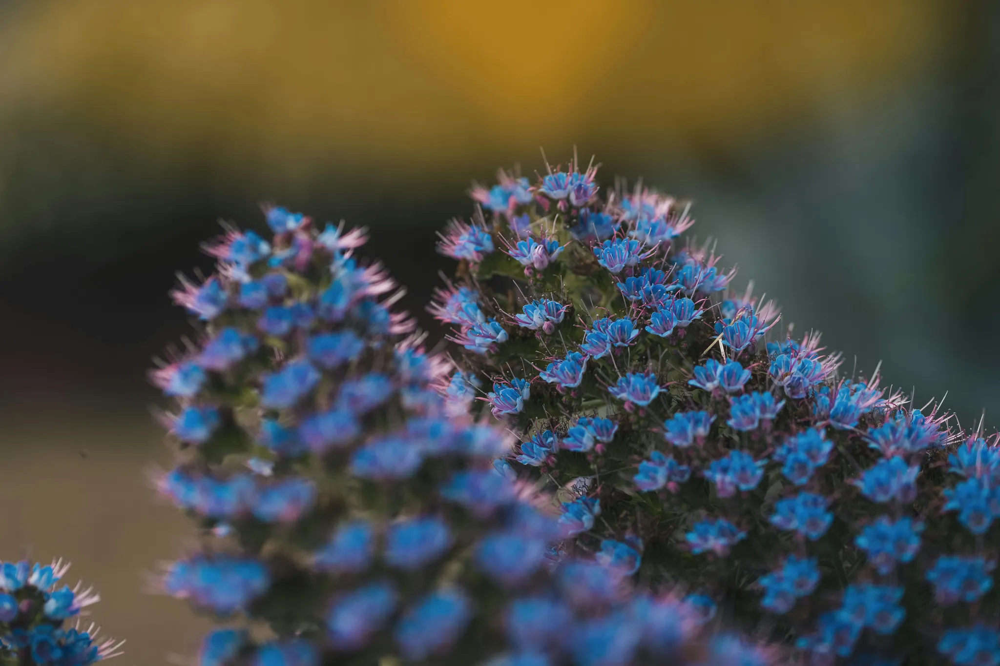

# Harmonize humanity with nature

> How we treat the weakest, defines us. 

Religions describe how humans should interact with each other and with God to ascend to a divine level. We believe that the path lies in expanding our awareness and love toward all sentient species, and in lowering our macrocosmic focus to the smallest forms of life.

As humanity expands its technological horizons, building new types of spaceships and dreaming of distant planets,  we continue to grapple with wars, climate change, social inequality, malnutrition, on a path to population of 10 billion. In these challenging times, we turn our attention to a small insect - the key to plant life reproduction. 

Our mission is balancing human progress with the preservation of nature, aiming for sustainable development and the regeneration of Earth's ecosystems. By doing so, we aspire to maximize human happiness, awareness, responsibilities and efficiency. Caring after the bees 🐝 can teach us compassion and love.

[Culture and values](../company/values/values.md) and [Symbolism](Symbolism.md) are reflecting this mission

<iframe width="100%" height="400" src="https://www.youtube.com/embed/-YwPPHjm2-g" title="Company mission" frameborder="0" allow="accelerometer; autoplay; clipboard-write; encrypted-media; gyroscope; picture-in-picture; web-share" referrerpolicy="strict-origin-when-cross-origin" allowfullscreen></iframe>

<iframe src="https://open.spotify.com/embed/playlist/3hpFjVkATz2rW5cuXaUXeV?utm_source=generator" width="100%" height="560" frameBorder="0" allowfullscreen="" allow="autoplay; clipboard-write; encrypted-media; fullscreen; picture-in-picture" loading="lazy"></iframe>
