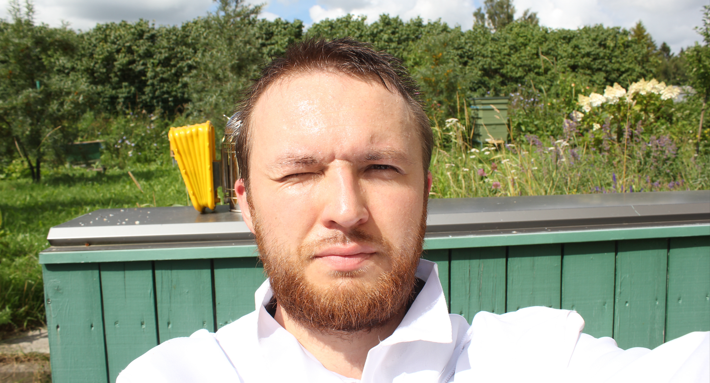

A single healthy colony over the season can collect 40-80 kg of honey.
Usually beekeepers use vertical beehive construction with sections that store frames.
A deep section full of honey can weight 20-30 kg. A "super" section maybe half of that.
A beekeeper needs to lift these sections in order to reach the nest, usually at the bottom of the hive.
Inspections need to happen at daytime when its sunny, so that most of the worker bees are in the field.
Hive frames are glued together with propolis and need extra tools to separate them.
In addition to inspections, [🧑‍🚀 Actions beekeepers make](../../products/🧑‍🚀%20Actions%20beekeepers%20make.md) may also require physical work

source - [[BeeSage](https://beesage.co/)]([https://www.notion.so/BeeSage-85f217cc037c406da140a959b66cdcf4?pvs=21](https://www.notion.so/BeeSage-85f217cc037c406da140a959b66cdcf4?pvs=21))