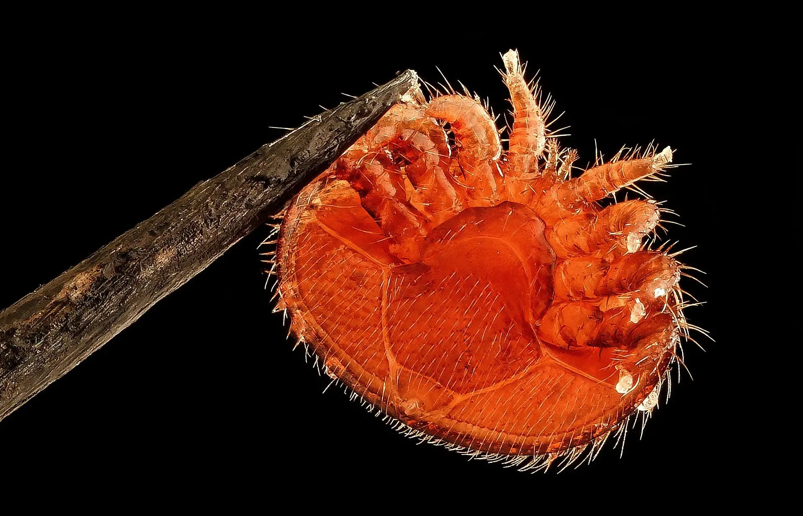
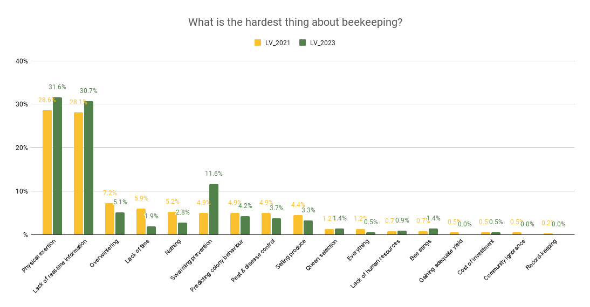

# Problems we are solving

> 💡 Hard, frequent, unscalable work to keep bees healthy for precise pollination and food security

Bees are essential for global food security, with over 35% of food production depending on pollination. However, modern beekeeping faces complex, interconnected challenges that traditional methods struggle to address at scale.

## The Core Challenge

Traditional beekeeping requires constant [👁️ Observability of bee colony](core/👁️%20Observability%20of%20bee%20colony.md) through [💪🏻 Physical labor](core/💪🏻%20Physical%20labor.md) and [👁️ Time-consuming inspections](👁️%20Time-consuming%20inspections.md). This approach becomes [💪🏻 Unscalable work](core/💪🏻%20Unscalable%20work.md) as operations grow, especially for [👨🏻‍🚒 Industrial beekeepers](../company/clients/👨🏻‍🚒%20Industrial%20beekeepers.md) managing [🏘️ Multiple apiaries](systemic/🏘️%20Multiple%20apiaries.md) at [🌲 Distant locations](systemic/🌲%20Distant%20locations.md).

## Problem Categories

### 🎯 Core Operational Challenges (Priority: 80-100)
Critical issues that prevent beekeeping from scaling effectively:

| Problem | Impact | Priority |
|---------|---------|----------|
| [👁️ Observability of bee colony](core/👁️%20Observability%20of%20bee%20colony.md) | Cannot detect issues early | 100 |
| [💪🏻 Unscalable work](core/💪🏻%20Unscalable%20work.md) | Limits operation growth | 90 |
| [💪🏻 Physical labor](core/💪🏻%20Physical%20labor.md) | Time-intensive, seasonal constraints | 80 |

### 🦠 Biological Threats (Priority: 60-80)
Health challenges that can destroy entire colonies:

| Problem                                                                                      | Impact                                 | Priority |
| -------------------------------------------------------------------------------------------- | -------------------------------------- | -------- |
| [❄️ Overwintering collapse](biological/❄️%20Overwintering%20collapse.md)                     | Complete colony loss                   | 80       |
| [🦀 Infestations](biological/🦀%20Infestations.md)                                           | Weakens colonies, spreads disease      | 80       |
| [💢 Hornet attacks](biological/💢%20Hornet%20attacks.md)                                     | Colony becomes non-productive          | 70       |
| [🧶 Swarming](biological/🧶%20Swarming.md)                                                   | Production loss, management complexity | 70       |
| [🦀 Diseases](biological/🦀%20Diseases.md)                                                   | Contagious colony damage               | 60       |
| [🍽️ Bee colony starvation](biological/🍽️%20Bee%20colony%20starvation.md)                   | Preventable colony death               | 60       |
| [💀 Colony with drone-laying queen](biological/💀%20Colony%20with%20drone-laying%20queen.md) | Colony becomes non-productive          | 60       |
| [💢 Robbing state](biological/💢%20Robbing%20state.md)                                                  | Weakens colonies and loses honey       | 50       |

### 🌍 Environmental & Systemic Issues (Priority: 30-70)
Broader challenges affecting the beekeeping ecosystem:

| Problem | Impact | Priority |
|---------|---------|----------|
| [🌲 Distant locations](systemic/🌲%20Distant%20locations.md) | Increases inspection costs | 70 |
| [🏘️ Multiple apiaries](systemic/🏘️%20Multiple%20apiaries.md) | Management complexity | 50 |
| [💢 Aggressive bee colonies](systemic/💢%20Aggressive%20bee%20colonies.md) | Safety and management issues | 50 |
| [🌻 Monocultural agriculture](systemic/🌻%20Monocultural%20agriculture.md) | Reduced bee nutrition diversity | 40 |
| [🤢 Pesticide poisoning](systemic/🤢%20Pesticide%20poisoning.md) | External toxicity threat | 40 |

### 🛡️ Ethical & Welfare Concerns (Priority: 40-50)
Issues related to bee welfare and sustainable practices:

| Problem | Impact | Priority |
|---------|---------|----------|
| [💀 Alcohol washing killing bees](💀%20Alcohol%20washing%20killing%20bees.md) | Unnecessary bee death | 50 |
| [💀 Intrusive inspections](💀%20Intrusive%20inspections.md) | Stress and disruption to colonies | 50 |

### 🏗️ Infrastructure & Knowledge Gaps (Priority: 20-40)
Supporting challenges that affect industry development:

| Problem | Impact | Priority |
|---------|---------|----------|
| [🎒 Challenging to become a new beekeeper](🎒%20Challenging%20to%20become%20a%20new%20beekeeper.md) | Reduces industry growth | 40 |
| [📦 Warehouse organization](📦%20Warehouse%20organization.md) | Operational inefficiency | 30 |
| [🗃️ Poor hive ventilation](🗃️%20Poor%20hive%20ventilation.md) | Equipment design issues | 30 |

### 🌪️ External Threats (Variable Priority)
Unpredictable challenges requiring resilient solutions:

- [🐻 Bears destroying hives & colonies](🐻%20Bears%20destroying%20hives%20&%20colonies.md)
- [🐭 Mice killing a colony](🐭%20Mice%20killing%20a%20colony.md)
- [🗃️ Storm wind collapsing beehives](🗃️%20Storm%20wind%20collapsing%20beehives.md)

## Emerging Challenges We're Addressing

### 🌡️ Climate Adaptation
- Shifting bloom periods disrupting pollination timing
- Extreme weather events increasing colony stress
- Changing migration patterns affecting wild pollinator interactions

### 💰 Economic Pressures
- Rising equipment and land costs
- Market volatility in honey and pollination services
- Cost barriers for adopting monitoring technology

### 📊 Data & Integration
- Fragmented data across different farm management systems
- Privacy concerns with continuous hive monitoring
- Need for standardized metrics across the industry

Survey by BeeSage, [source](https://beesage.co/en/blog/what-is-the-hardest-thing-about-beekeeping)

## Our Approach: Technology + Ethics

Unlike solutions that focus solely on data collection, we prioritize:

- **Bee welfare first:** Technology should reduce stress on colonies, not increase it
- **Practical impact:** Focus on problems that beekeepers actually face daily
- **Scalable solutions:** Address root causes that prevent industry growth
- **Open innovation:** Share knowledge to benefit the entire beekeeping community

> **Note:** We maintain a detailed problem database to link specific issues with solution features. This systematic approach ensures our technology development addresses real beekeeping challenges rather than theoretical problems.
