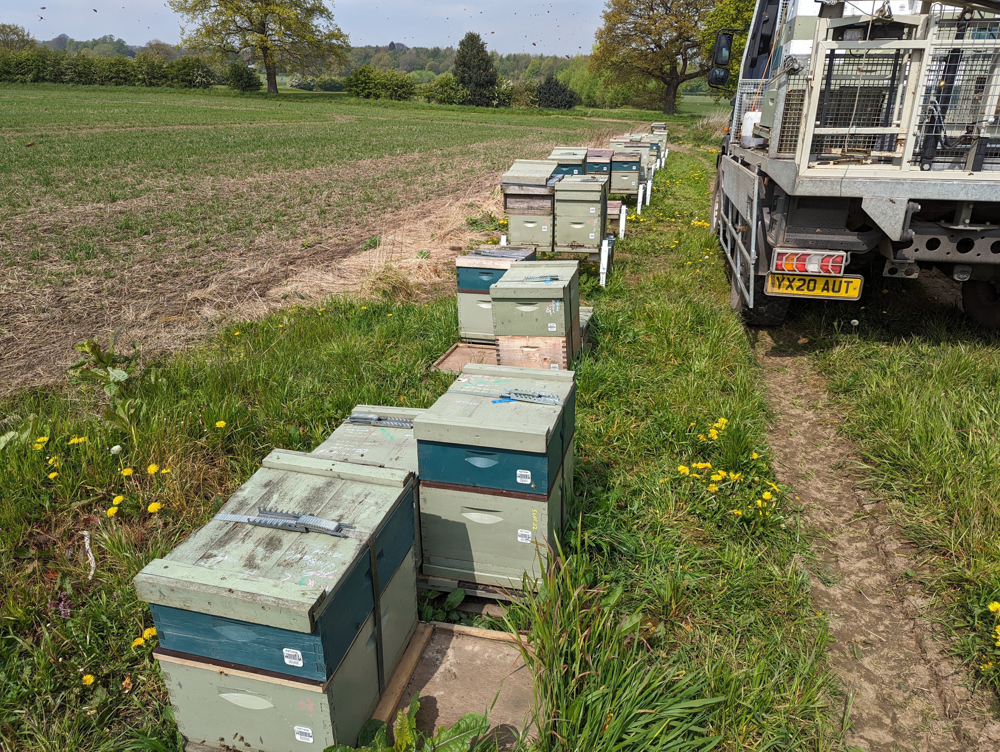

For many beekeepers, managing apiaries in distant or remote locations is both a necessity and a challenge. These locations are often chosen for their ideal foraging conditions, such as proximity to diverse flora or agricultural crops, but their remoteness introduces logistical hurdles. Regular inspections are critical to monitor hive health, check for signs of diseases or pests, and ensure sufficient food stores, especially during changing seasons. However, traveling long distances to reach these apiaries can be time-consuming, costly, and physically demanding. This challenge becomes even more pronounced for beekeepers managing multiple apiaries scattered across different regions.

The physical distance often leads to delayed interventions, which can exacerbate issues like mite infestations, colony starvation, or queen problems. A lack of immediate access means beekeepers must rely heavily on educated guesses or incomplete data, increasing the risk of colony losses. To address these challenges, technological advancements are becoming crucial. By integrating IoT sensors, AI-driven hive monitoring devices, and automated systems, beekeepers can remotely monitor hive conditions in real-time. This enables timely decision-making without the need for frequent travel, ensuring healthier colonies and reducing operational costs. At our digital beekeeping startup, we are developing solutions tailored to these needs, combining innovative technology with the practical realities of beekeeping to make distant apiary management more efficient and sustainable.

source - [https://twitter.com/austincwb/status/1785712653215715354/photo/1](https://twitter.com/austincwb/status/1785712653215715354/photo/1)
