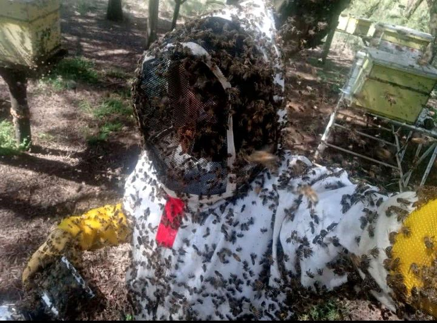

Beekeepers are dealing with aggressive bee colonies. Aggression in bees can manifest as heightened defensiveness, leading to stinging events not only for the beekeeper but also for neighboring colonies, wildlife, and even visitors. This aggressive behavior can arise from a variety of factors, including poor hive management, environmental stressors, genetic traits, or even the presence of predators. When bees feel threatened, they may become more defensive, leading to increased risks for beekeepers and a disruption in the overall hive health. Managing aggressive bees becomes critical to maintaining a peaceful, productive apiary.

Beekeepers often resort to techniques such as selective breeding to reduce aggression, as well as hive management practices that minimize stress, like ensuring ample food and water supply or controlling hive ventilation. However, these strategies don't always guarantee results, and handling aggressive bees can still be dangerous. For commercial beekeepers, aggression can lead to loss of colony productivity, as stressed colonies are less likely to produce honey, and they may become more susceptible to disease. Advanced technology like the AI-powered hive entrance devices developed by companies like Gratheon can help in monitoring hive behavior, predicting potential aggression triggers, and creating a safer environment for both the bees and the beekeepers.

[Africanized bees](https://www.linkedin.com/groups/1583887?q=highlightedFeedForGroups&highlightedUpdateUrn=urn%3Ali%3AgroupPost%3A1583887-7135131410780069888&lipi=urn%3Ali%3Apage%3Ad_flagship3_feed%3BeYFRvSSERLuPws4VJUQm%2Fw%3D%3D)

Risks to surrounding people (sensitive neighbours, kids, allergic visitors) limits possible areas of beekeeping (city apiaries, close to roads)

<iframe width="433" height="244" src="https://www.youtube.com/embed/O4ldpyIE5t4" title="Euthanizing of a dangerous hive." frameborder="0" allow="accelerometer; autoplay; clipboard-write; encrypted-media; gyroscope; picture-in-picture; web-share" referrerpolicy="strict-origin-when-cross-origin" allowfullscreen></iframe>

<iframe width="433" height="244" src="https://www.youtube.com/embed/Wk2HlKE1szo" title="If I didn&#39;t have the suit on, I&#39;d be dead." frameborder="0" allow="accelerometer; autoplay; clipboard-write; encrypted-media; gyroscope; picture-in-picture; web-share" referrerpolicy="strict-origin-when-cross-origin" allowfullscreen></iframe>
