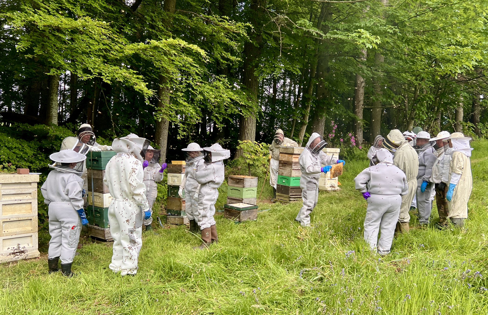

Beekeeping is an age-old craft that plays a critical role in pollination and food production. Yet, for aspiring beekeepers, the journey to start their first hive can be daunting. The steep learning curve, upfront costs for equipment, and lack of access to hands-on guidance often discourage newcomers. Mismanaging a hive can lead to issues like colony collapse, diseases, or aggressive behavior, further intimidating beginners. With bees facing global threats such as habitat loss and pesticides, it’s essential to make beekeeping more accessible to support pollinator populations.

At Gratheon, we’re reimagining beekeeping to lower the barriers for beginners. Our innovative solutions, including a web app with interactive tutorials, IoT sensors for hive health monitoring, and an AI vision system to analyze hive entrances, provide real-time insights that simplify the process. Additionally, our robotic beehive automates essential tasks like temperature regulation and pest control, empowering novice beekeepers to start with confidence. By combining technology with education, Gratheon aims to nurture a new generation of beekeepers, fostering sustainable practices and contributing to the global pollination ecosystem.

source - [https://x.com/KilbarchanBees/status/1792239360659665097](https://x.com/KilbarchanBees/status/1792239360659665097)

## Suggested solutions

What we can do is ease the part with the hive and lowering learning curve, tapping into educational part

- Position [R**obotic Beehive**](https://www.notion.so/Robotic-Beehive-fd9559a2950b44bc8291972299ced18e?pvs=21) as a new and shiny, better and easier alternative to traditional hives 🌈. This is [Marketing](https://www.notion.so/Marketing-a2ce56a88f8045e288280c4b1633e002?pvs=21) area
- Build into web-app community features:
    - [Share of beehive inspection public URL](https://www.notion.so/Share-of-beehive-inspection-public-URL-477d096f683542f4a182e53ff5f23780?pvs=21)
- Build into [Web-app](https://www.notion.so/Web-app-2937ed264e1d434a8664caa4bc40978e?pvs=21) educational mechanisms and features, such as [Beekeeping advice with LLM](https://www.notion.so/Beekeeping-advice-with-LLM-085f16137ed14781be25379238204037?pvs=21), [Product onboarding videos & UI](https://www.notion.so/Product-onboarding-videos-UI-6f6556f7a43648abacaf1d17c044a7fc?pvs=21)
- Build community / educational material in [Academy](https://www.notion.so/Academy-986fc89b80c94e38b6d91ddf596235a3?pvs=21) - maybe a separate portal for knowledge sharing