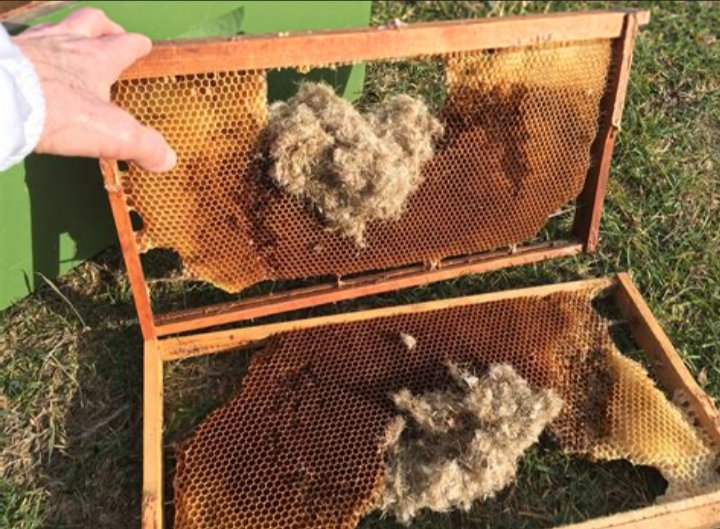
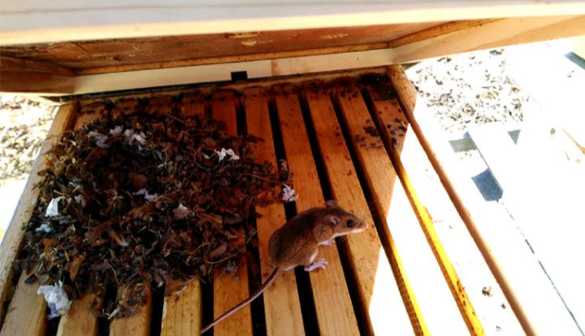

In summer a hive of 50,000 to 60,000 bees can defend itself against intruders like mice. In winter population is reduced to 20,000 bees. Too cold to fly out and defend. The mice urinate and deficate on frames and destroy the wax foundations.

