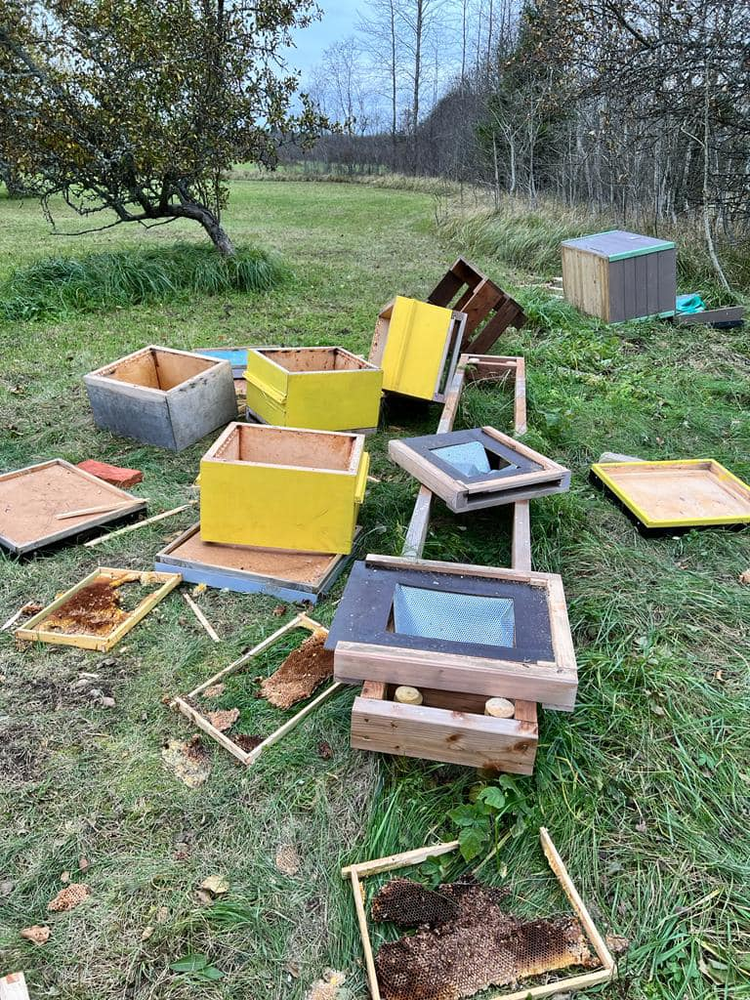

One of the significant challenges faced by beekeepers, especially in regions inhabited by bears, is the destruction of hives by these powerful animals. Bears are naturally drawn to beehives due to their insatiable appetite for honey and protein-rich bee larvae. Unfortunately, this hunger often leads to devastating consequences for apiaries, with entire hives being ripped apart in mere minutes. Beyond the immediate destruction, bear attacks can wipe out months of beekeepers' hard work, disrupt pollination efforts, and threaten the health of local ecosystems reliant on bees. For small-scale beekeepers, such incidents can be financially crippling, making this a pressing issue that demands innovative solutions.

At Gratheon, we are addressing this challenge with a blend of modern technology and ecological mindfulness. Our IoT-enabled hive sensors and AI vision hive entrance devices can detect unusual hive activity, such as vibrations or sudden movement, and alert beekeepers in real-time to potential threats. Additionally, our robotic beehive designs incorporate sturdy materials and deterrent mechanisms to reduce the likelihood of bear damage. By combining proactive monitoring and robust hive architecture, we aim to protect bee colonies and empower beekeepers to focus on nurturing their hives without constant fear of wildlife interference.

photo - [Kristo Hiiu](https://www.facebook.com/groups/108065015894483/user/100012526968833/?__cft__[0]=AZX7fuPj287Ey5NUgGC2KGvmjI0c5VauYoXa120HPUbyoWAdc7gBe0kp0KmQ740ohZS1GKfftyOusItALgpxnWlh4eyUrR-GP-x-6InFjg68VSG7Gvp9HOs2ddxfJH1Pkv1XtJSAjBnZErFTV8aTZBVs5ozfoKkTpu3NL9prtSpZJGNjOYEkNZSEfTmw8QrPcxE&__tn__=%2CP-R)

photo - [Kristo Hiiu](https://www.facebook.com/groups/108065015894483/user/100012526968833/?__cft__[0]=AZX7fuPj287Ey5NUgGC2KGvmjI0c5VauYoXa120HPUbyoWAdc7gBe0kp0KmQ740ohZS1GKfftyOusItALgpxnWlh4eyUrR-GP-x-6InFjg68VSG7Gvp9HOs2ddxfJH1Pkv1XtJSAjBnZErFTV8aTZBVs5ozfoKkTpu3NL9prtSpZJGNjOYEkNZSEfTmw8QrPcxE&__tn__=%2CP-R)