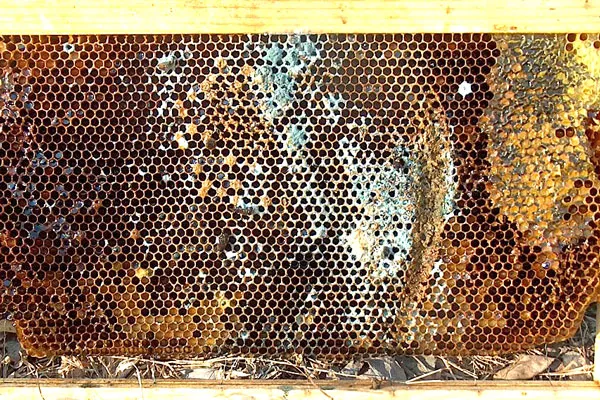

One of the most critical challenges faced by beekeepers is poor hive ventilation, which can have significant implications for the health and productivity of a colony. Bees naturally regulate the temperature and humidity within the hive to ensure the survival of their brood and the proper functioning of the hive. However, inadequate airflow can lead to excessive moisture buildup and heat, creating an environment that promotes disease and stress. This, in turn, weakens the colony, makes them more susceptible to pests like mites, and affects their ability to forage effectively.

Poor ventilation can also impact honey production and overall hive vitality. In hot summer months, hives that lack proper airflow can overheat, stressing the bees and causing them to reduce their activity. In colder months, excessive humidity can freeze the bees or promote the growth of harmful molds. For beekeepers, balancing proper ventilation is a delicate task, as too much airflow can also lead to temperature instability. Implementing IoT sensors, AI-driven monitoring systems, and automated adjustments can provide beekeepers with real-time data and allow them to maintain optimal conditions, ensuring healthy, productive colonies year-round.

source - [https://www.honeybeesuite.com/physics-for-beekeepers-mold-in-a-beehive/](https://www.honeybeesuite.com/physics-for-beekeepers-mold-in-a-beehive/)