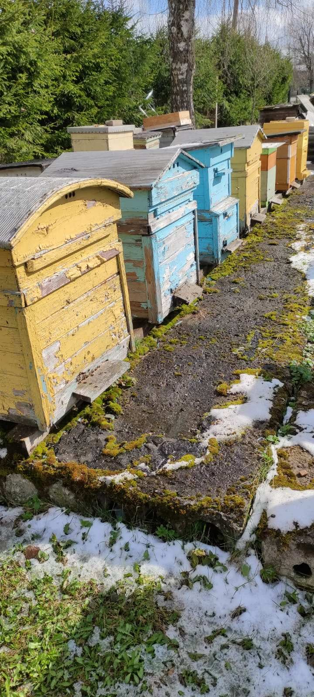
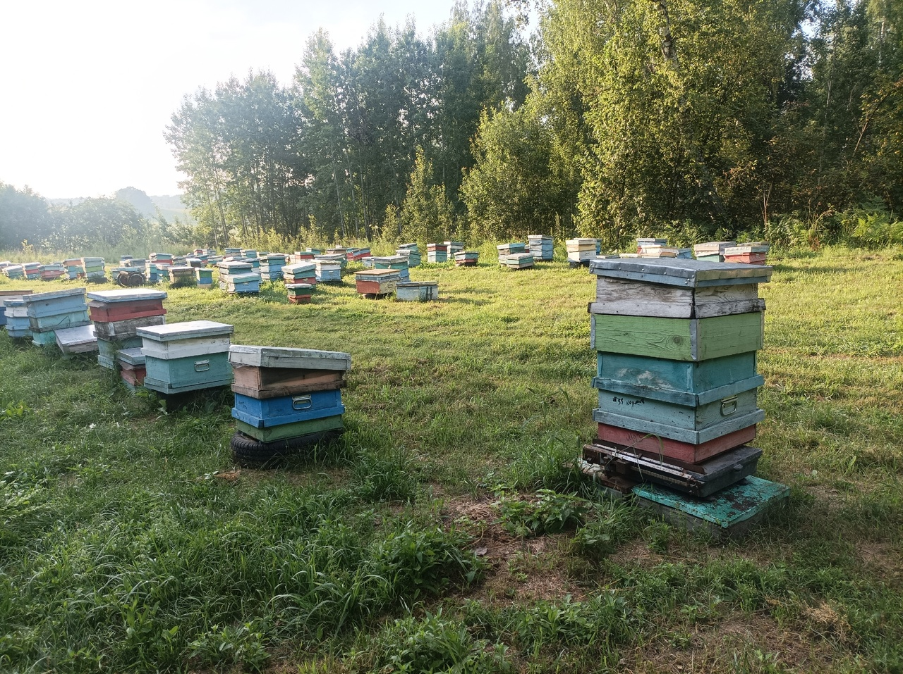
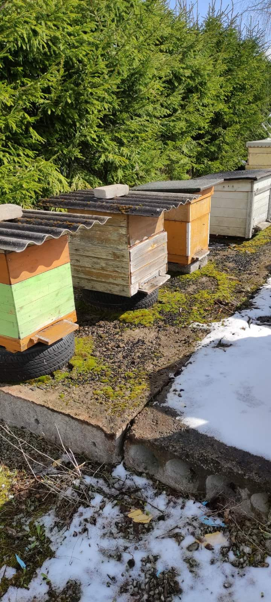

Many beekeepers face is the physical deterioration of their hives. Traditional wooden beehives often suffer from rotting or weakening, particularly in harsh weather conditions. The materials used to construct these hives—such as wood, bricks, and even old tires as stands—can be prone to damage and decay over time. Beekeepers may use bricks on the roof to prevent wind damage, but this makeshift solution can lead to added weight and unnecessary stress on the hive structure. Additionally, the use of asbestos roofing in older hives presents both health and environmental concerns, as it is harmful to both the bees and the beekeeper when deteriorated.

The aesthetic and practical shortcomings of these older hives not only reduce their longevity but can also cause stress for the bees. Mixed sections and mismatched materials make it harder for bees to maintain their homeostasis, as inconsistent temperature regulation and durability affect the hive’s overall functionality. In such environments, the health and productivity of the colony may suffer. As beekeeping technology evolves, solutions like Gratheon's robotic beehives, which integrate modern materials and IoT sensors, are providing a cleaner, safer, and more efficient alternative, helping beekeepers to manage healthier, more sustainable hives.

