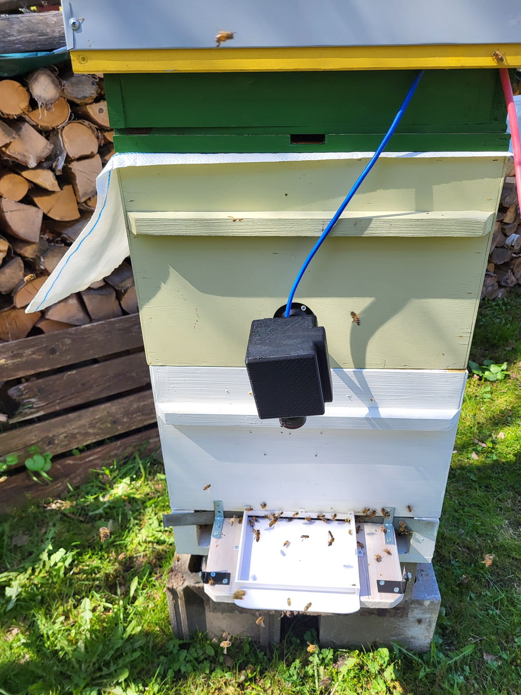
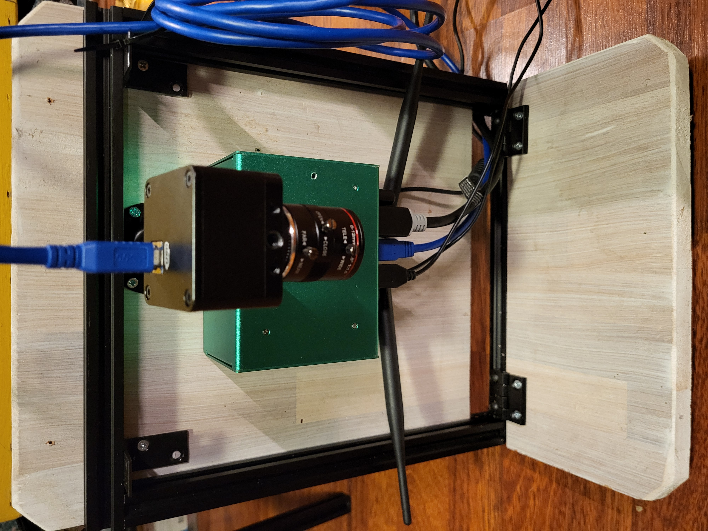

`status: alpha`, [TRL 5](https://www.nasa.gov/directorates/somd/space-communications-navigation-program/technology-readiness-levels/)

💡 Entrance Observer is a set of cameras and a hardware devices that analyze beehive entrance. It records a video stream, runs AI analysis that sends metrics and videos to our [web app](../web_app/web_app.md) for preview and alerts. 

Check and install our [open source code of **entrance-observer**](https://github.com/Gratheon/entrance-observer/)

<iframe width="100%" height="500"  src="https://www.youtube.com/embed/hNval4v44ao" title="Beehive Entrance Observer" frameborder="0" allow="accelerometer; autoplay; clipboard-write; encrypted-media; gyroscope; picture-in-picture; web-share" referrerpolicy="strict-origin-when-cross-origin" allowfullscreen></iframe>

### Problem focus
Out of all beekeeping issues, this product is helping with these:
- [💢 Hornet attacks](../../problems/biological/💢%20Hornet%20attacks.md)
- [💢 Robbing state](../../problems/biological/💢%20Robbing%20state.md)
- [🦀 Infestations](../../problems/biological/🦀%20Infestations.md)
- [🧶 Swarming](../../problems/biological/🧶%20Swarming.md)
- [🦀 Diseases](../../problems/biological/🦀%20Diseases.md)
- [💀 Colony without a queen](../../problems/💀%20Colony%20without%20a%20queen.md)
- [🤢 Pesticide poisoning](../../problems/systemic/🤢%20Pesticide%20poisoning.md)
## Features
- [🎥 Video streaming via API](features/🎥%20Video%20streaming%20via%20API.md)
- [🐝 Detect swarming](ideas/🐝%20Detect%20swarming.md)
- [🎮 Client-side app with UI](features/🎮%20Client-side%20app%20with%20UI.md)
- [📈 Count bees coming in and out - on the edge](features/📈%20Count%20bees%20coming%20in%20and%20out%20-%20on%20the%20edge.md)
- [📊 Bee movement metric reporting](features/📊%20Bee%20movement%20metric%20reporting.md)
- [🛣️ Landing board heatmap generation](features/🛣️%20Landing%20board%20heatmap%20generation.md)

## TODO
- [🦀 Varroa mite infestation detection from video](todo/🦀%20Varroa%20mite%20infestation%20detection%20from%20video.md)
- [🚁 Hornet attack detection](todo/🚁%20Hornet%20attack%20detection.md)
- [Drone bee detection and counting](todo/Drone%20bee%20detection%20and%20counting.md)

## Ideas
- [🌻 Detect bees with pollen for foraging statistics](ideas/🌻%20Detect%20bees%20with%20pollen%20for%20foraging%20statistics.md)
- [🐝 Detect orientation flights](ideas/🐝%20Detect%20orientation%20flights.md)
- [🐝 Detect swarming](ideas/🐝%20Detect%20swarming.md)
- [🐝 Guard detection](ideas/🐝%20Guard%20detection.md)
- [👑 Detect queen mating from entrance video](ideas/👑%20Detect%20queen%20mating%20from%20entrance%20video.md)
- [🔔 Alerts based on bee counter](ideas/🔔%20Alerts%20based%20on%20bee%20counter.md)
- [🤢 Detect pesticide exposure](ideas/🤢%20Detect%20pesticide%20exposure.md)
- [🩻 Bee pose generation](ideas/🩻%20Bee%20pose%20generation.md)

## Target audience

- [🧑‍🚀 Hobby beekeepers & Tech enthusiasts](../../company/clients/🧑‍🚀%20Hobby%20beekeepers.md)
- [👩🏻 Corporate Hive Sponsorship Program](../../company/clients/👩🏻%20Tech%20scale-up%20companies.md)

### Version history

Prototype v4 at field testing. Camera has protective case. Missing the landing board protective cone as it needs artificial lighting

Prototype v3. Added protective cone, now idea is to have CPU/GPU block separated and moved into the hive roof to have less devices on the entrance, have camera integrated with the cone, have WIFI antennae and power blocks farther away from the bees.

Prototype v1 version. Camera at the center on a monopod, jetson orin nano at the center with wiring and antennae facing down
