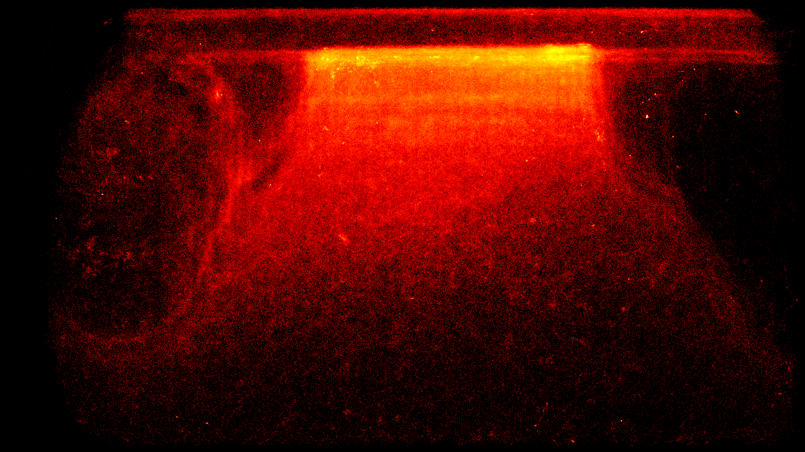

# 🛣️ Landing board heatmap generation

### 🎯 Purpose
Generates visual heatmaps showing bee movement patterns and activity zones on the landing board to optimize hive entrance design and understand traffic flow.

### 🎭 User Story
- As a beekeeper interested in optimizing hive entrance efficiency
- I want to see where bees spend most of their time on the landing board
- So that I can identify traffic bottlenecks and potentially redesign the entrance for better bee flow

### 🚀 Key Benefits
- **Traffic optimization**: Identify congested areas and potential improvements
- **Entrance design insights**: Data-driven approach to landing board modifications
- **Long-term behavior analysis**: Understanding of seasonal and daily patterns
- **Research value**: Visual data for studying bee traffic behavior

### 🔧 Technical Overview
Processes track history data from daily-rotated JSONL files (track_history_YYYY-MM-DD.jsonl) using NumPy to generate density maps. The heatmap_generator.py script aggregates bee position coordinates into a 2D heatmap array with frame dimensions (1280x720), normalizes the data, and applies color mapping for visualization.

### 📋 Acceptance Criteria
- Processes track history from JSONL files with frame dimensions metadata
- Generates heatmaps for 1280x720 frame resolution
- Accumulates position data across multiple track files for temporal analysis
- Applies Gaussian blur and color mapping for visual clarity
- Exports heatmap images in standard image formats (PNG/JPG)
- Handles coordinate bounds checking for frame boundaries
- Supports batch processing of multiple days of data

### 🚫 Out of Scope
- Real-time heatmap generation (batch processing only)
- 3D visualization or depth analysis
- Weather correlation with traffic patterns
- Automated landing board design recommendations

### 🏗️ Implementation Approach
- **Data Input**: Track history JSONL files with coordinate arrays per track ID
- **Processing**: NumPy array accumulation of position frequencies
- **Visualization**: OpenCV and matplotlib for color mapping and blur effects
- **Storage**: Frame dimensions extracted from metadata in JSONL files
- **Batch Processing**: Command-line script for processing historical data

### 📊 Success Metrics
- Accurate coordinate processing within frame boundaries (0 &lt;= x &lt; width, 0 &lt;= y &lt; height)
- Heatmap generation from multiple JSONL track files
- Proper normalization and color mapping for visual interpretation
- Batch processing capability for historical data analysis
- File format compatibility for integration with web interfaces

### 🔗 Related Features
- [📈 Count bees coming in and out - on the edge](📈%20Count%20bees%20coming%20in%20and%20out%20-%20on%20the%20edge.md)
- [📊 Bee movement metric reporting](📊%20Bee%20movement%20metric%20reporting.md)
- [👭 Bee interaction detection](👭%20Bee%20interaction%20detection.md)

### 📚 Resources & References
- [Heatmap generator implementation](https://github.com/Gratheon/entrance-observer/blob/main/heatmap_generator.py)
- [Example heatmap outputs](img/heatmap-09-06%201.png)
- [NumPy array processing documentation](https://numpy.org/doc/stable/)

### 💬 Notes
Actual implementation using NumPy for position aggregation and OpenCV for visualization. Processes real track history data saved by the telemetry system to generate traffic flow insights.
