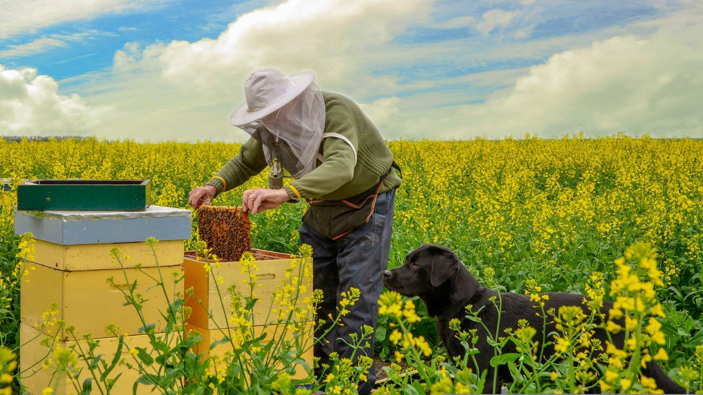

Our products are in development and are a mix of software and hardware, complimenting each other and offering data gathering, analytics and actionable decisions that a beekeeper would need to solve day to day [problems](../problems/problems.md)

[Web app](web_app/web_app.md) is the go-to application that manages all data and devices.

[Scales](scales/scales.md) 

[Entrance observer](entrance_observer/entrance_observer.md) 

[Robotic Beehive](robotic_beehive/robotic_beehive.md) 

[Robotic Apiary](robotic_apiary/robotic_apiary.md) 

