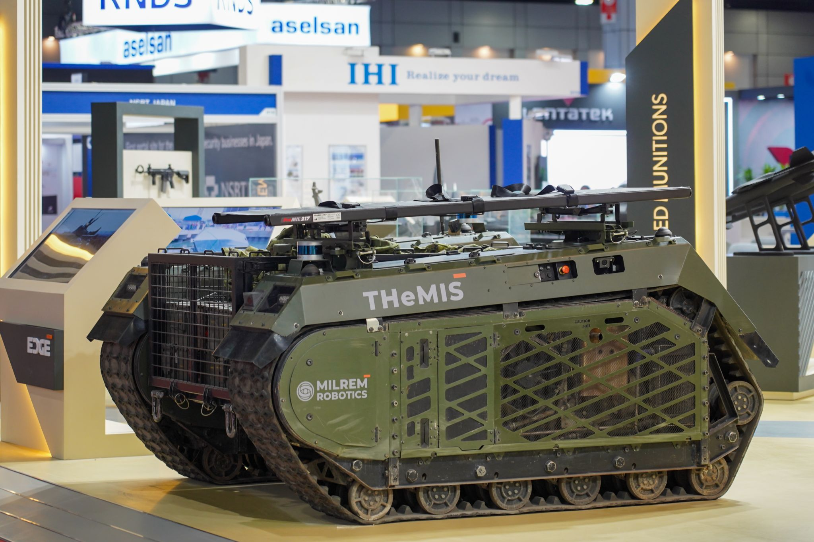
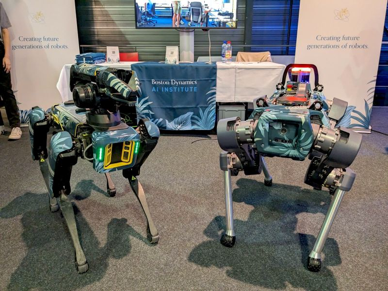

Idea that [[Natalia Kinash](https://www.linkedin.com/in/nataliia-kinash/)]([https://www.notion.so/Natalia-Kinash-6f77baebfee945acbe6221b0776ac498?pvs=21](https://www.notion.so/Natalia-Kinash-6f77baebfee945acbe6221b0776ac498?pvs=21)) and myself had. If we have a robotic hive and its fully autonomous, we could place it on wheels and have it move from one location to another a-la starship delivery bots.

This solves a problem of inefficient field pollination. Robots need to move at night time when all of the foraging bees are in the hive.

Robots likely need a very good wheels / suspension to be able to move in the field terrain.

And this would also mean that we need to have vision/cameras pointing not only to the hive entrance, but also around the hive to be able to see where we drive.

We also need a remote control of this robot to give commands where to drive.

