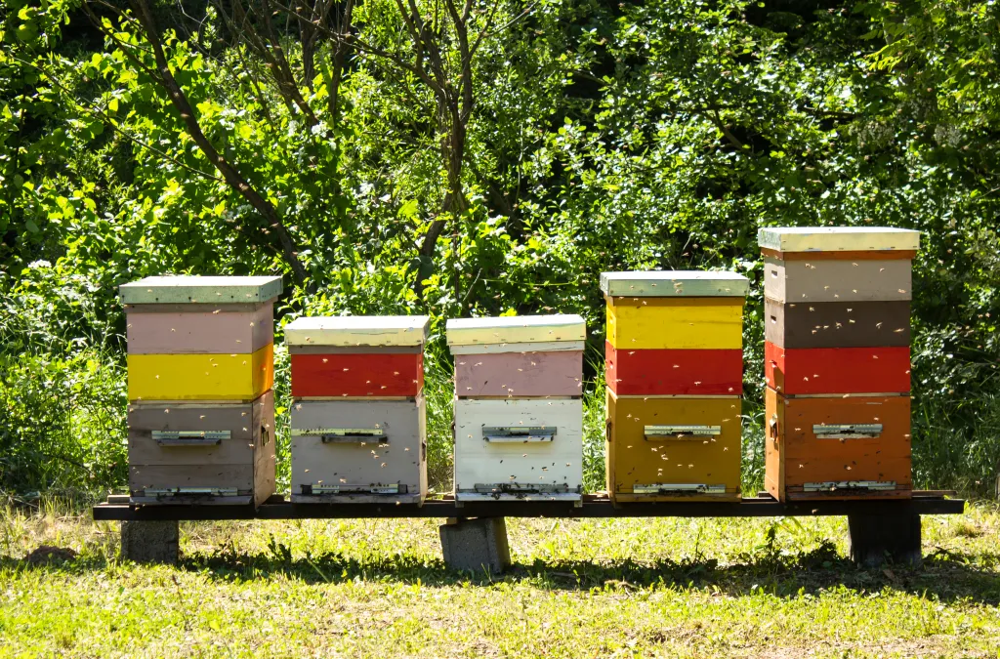
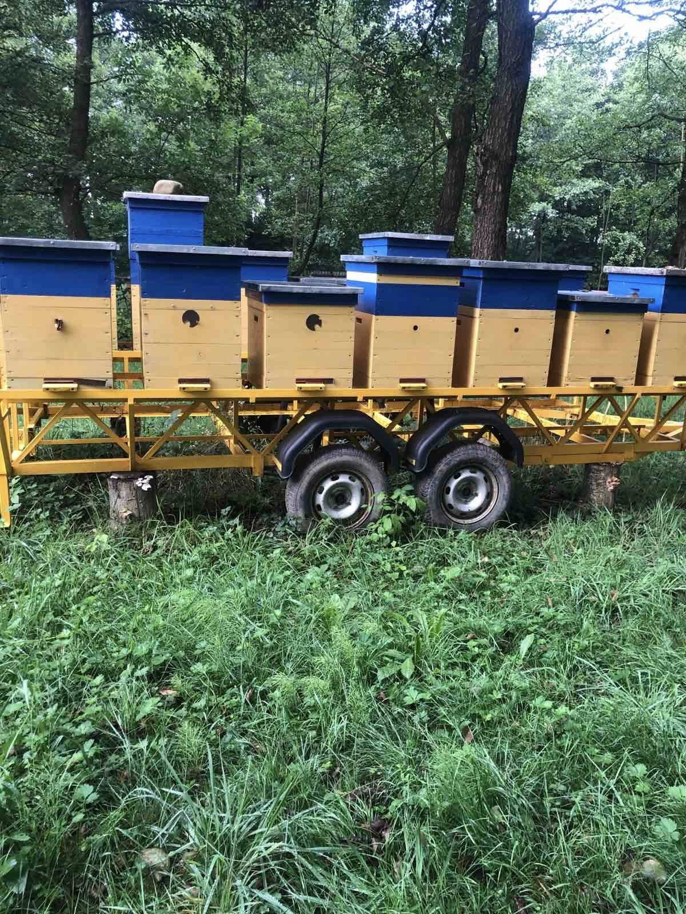
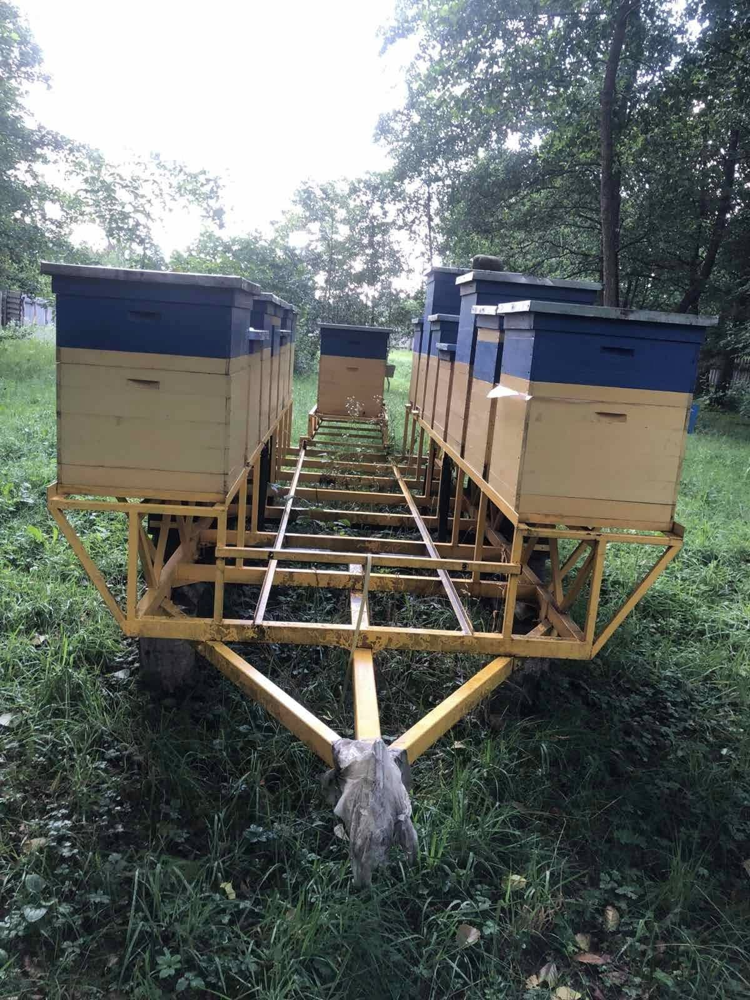

As a more cost-effective solution for large apiaries, we want to reuse [Robotic Beehive](../robotic_beehive/robotic_beehive.md)  functionality and equip it with ability to move around the apiary to inspect hives on-demand or on-schedule.

`status`: [TRL 1](https://www.nasa.gov/directorates/somd/space-communications-navigation-program/technology-readiness-levels/)

### Problem focus
Out of all beekeeping issues, this product is helping with these:
- [❄️ Overwintering collapse](../../problems/biological/❄️%20Overwintering%20collapse.md)
- [🌲 Distant locations](../../problems/systemic/🌲%20Distant%20locations.md)
- [🌻 Precise pollination](../../problems/🌻%20Precise%20pollination.md)
- [🏘️ Multiple apiaries](../../problems/systemic/🏘️%20Multiple%20apiaries.md)
- [👁️ Observability of bee colony](../../problems/core/👁️%20Observability%20of%20bee%20colony.md)
- [💪🏻 Unscalable work](../../problems/core/💪🏻%20Unscalable%20work.md)

### Target audience

- [👨🏻‍🚒 Industrial beekeepers](../../company/clients/👨🏻‍🚒%20Industrial%20beekeepers.md)
- [🧑🏻‍🌾 Farmers](../../company/clients/🧑🏻‍🌾%20Farmers.md)

## Challenges / Requirements

- inspect multiple (~10) hives, same functionality as [robotic_beehive](../robotic_beehive/robotic_beehive.md)
- cost-effective - use one moveable module
- mobile trailer form - should be possible to move entire apiary with a car. The goal is to transport hives back to the base for winter time, but not rely on a huge container.

# Vision

We’ll use an improvement over [R**obotic Beehive**](https://www.notion.so/Robotic-Beehive-fd9559a2950b44bc8291972299ced18e?pvs=21) but have it **movable between hives**. Design is not set yet and its up for the team to decide on the architecture

Apiary - beehives traditionally are positioned in a line Source - [https://beeswiki.com/what-is-an-apiary/](https://beeswiki.com/what-is-an-apiary/)

# Ideation

### Movement

|      | Move on rails                                                                          | Move on wheels                                                   |
| ---- | -------------------------------------------------------------------------------------- | ---------------------------------------------------------------- |
| Pros | - simple and predictable movement                                                      | - hive positions can be random                                   |
| Cons | - limited reach   - hives need to be in line   - costs more with larger apiaries | - need to stabilize the X-Y angles to have horizontal plane even |

## Construction

|      | Monolithic                                                                                | Distributed                                                                                 |
| ---- | ----------------------------------------------------------------------------------------- | ------------------------------------------------------------------------------------------- |
| Pros | - simple installation, maintenance, setup   - good weather protection                | - can scale in amount of hives and in their height   - cost effective   - healthy |
| Cons | - colonies can infect each other   - higher cost   - loss of existing inventory | - more complex integration, maintenance                                                     |

## Moveable with a car

Example of what beekeepers currently build themselves:

source - https://www.facebook.com/groups/1565659347190712/posts/2000328063723836