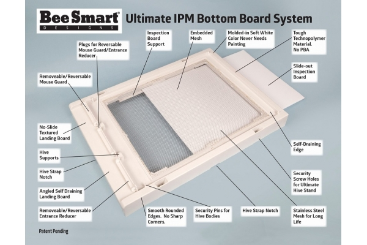
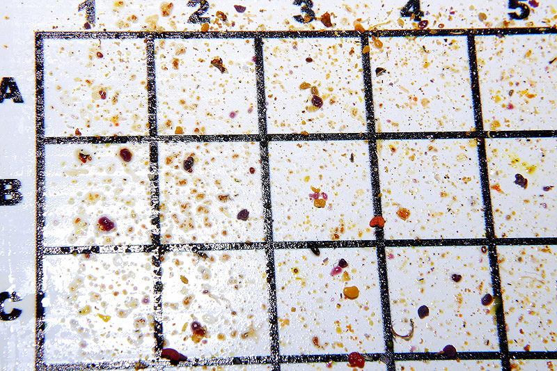
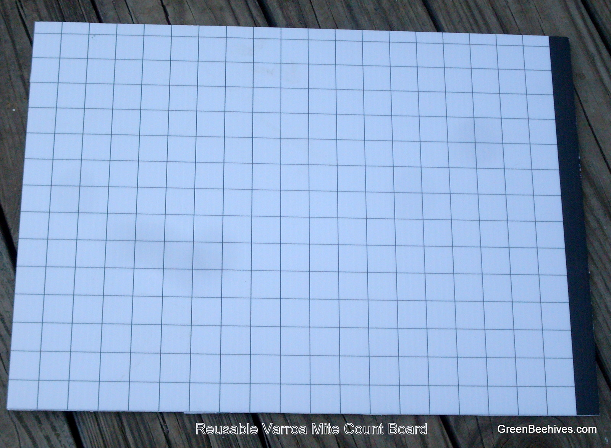

The idea here is to have hive bottom painted white and have it extracted into the hive robotic area such that we could take a photo, upload it to the web-app and count detected varroa mites to help measuring [Varroa infestation management](https://www.notion.so/Varroa-infestation-management-b84228df14494c0ba78f4d473046cca7?pvs=21)

[https://curbstonevalley.com/hive-health-varroa-monitoring/](https://curbstonevalley.com/hive-health-varroa-monitoring/)

[https://www.amazon.com/Varroa-Counting-Monitoring-Bee-8-Frame/dp/B08CY61FPP?th=1](https://www.amazon.com/Varroa-Counting-Monitoring-Bee-8-Frame/dp/B08CY61FPP?th=1)

