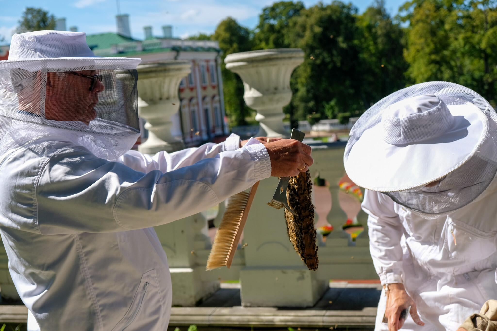

We are developing a robotic vertical beehive inspection platform, which is
- capable of lifting multiple hive sections to faster reach the nest
- take photos of the beehive frames with built-in cameras - manual hive frame lifting is needed
- uploading inspection result to the [web app](../web_app/web_app.md)
- transported on wheels, you can use it to inspect different hives

`status`: [TRL 2](https://www.nasa.gov/directorates/somd/space-communications-navigation-program/technology-readiness-levels/)

## Overview

### Problem focus
Out of all beekeeping issues, this product is helping with these:
- [👁️ Observability of bee colony](../../problems/core/👁️%20Observability%20of%20bee%20colony.md)
- [💀 Intrusive inspections](../../problems/💀%20Intrusive%20inspections.md)
- [💪🏻 Physical labor](../../problems/core/💪🏻%20Physical%20labor.md)
- [🦀 Infestations](../../problems/biological/🦀%20Infestations.md)
- [💀 Alcohol washing killing bees](../../problems/💀%20Alcohol%20washing%20killing%20bees.md)
- [💀 Colony without a queen](../../problems/💀%20Colony%20without%20a%20queen.md)
- [💀 Colony with drone-laying queen](../../problems/biological/💀%20Colony%20with%20drone-laying%20queen.md)
- [🗃️ Ugly beehives](../../problems/🗃️%20Ugly%20beehives.md)
- [🎒 Challenging to become a new beekeeper](../../problems/🎒%20Challenging%20to%20become%20a%20new%20beekeeper.md)

### Target clients

A robotic inspection platform will cost (>2000 EUR) and its main value is in digitalization and organization of the apiary state. It might be too cumbersome for [👨🏻‍🚒 Industrial beekeepers](../../company/clients/👨🏻‍🚒%20Industrial%20beekeepers.md) or [🧑🏻‍🌾 Farmers](../../company/clients/🧑🏻‍🌾%20Farmers.md) and too hard for [👨🏻 Potential new beekeepers](../../company/clients/👨🏻%20Potential%20new%20beekeepers.md). But it does look viable for:

- [👨🏻‍🚀 Semi-professional beekeepers](../../company/clients/👨🏻‍🚀%20Semi-professional%20beekeepers.md)
- [👩🏼‍🏫 Urban beekeepers](../../company/clients/👩🏼‍🏫%20Urban%20beekeepers.md)
- [👩🏻 Corporate Hive Sponsorship Program](../../company/clients/👩🏻%20Tech%20scale-up%20companies.md)

President Alar Karis harvesting honey from the Kadriorg Palace beehives. ([Photo: Office of the President](https://news.err.ee/1609070024/gallery-president-alar-karis-harvesting-honey-in-front-of-kadriorg-palace#lg=1&slide=1)) An example of potential complimentary brand

## Features
<!-- QueryToSerialize: table WITHOUT ID "[" + default(title, file.name) + "]" + default( "("+  replace(replace(file.path, "about/products/robotic_beehive/", ""), " ", "%20") + ")", "") as title FROM "about/products/robotic_beehive/ideas" WHERE file.name != "index" -->
<!-- SerializedQuery: table WITHOUT ID "[" + default(title, file.name) + "]" + default( "("+  replace(replace(file.path, "about/products/robotic_beehive/", ""), " ", "%20") + ")", "") as title FROM "about/products/robotic_beehive/ideas" WHERE file.name != "index" -->

| title                                                                                                                                                       |
| ----------------------------------------------------------------------------------------------------------------------------------------------------------- |
| [🍭 Automatic sugar syrup feeder](ideas/🍭%20Automatic%20sugar%20syrup%20feeder.md)                                                                         |
| [🎙️ 6-channel audio monitoring](ideas/🎙️%206-channel%20audio%20monitoring.md)                                                                             |
| [🎮 Client-side app with UI in manual override mode](ideas/🎮%20Client-side%20app%20with%20UI%20in%20manual%20override%20mode.md)                           |
| [🎮 Connecting robot to web-app UX](ideas/🎮%20Connecting%20robot%20to%20web-app%20UX.md)                                                                   |
| [🐝 Bee nursing video analysis](ideas/🐝%20Bee%20nursing%20video%20analysis.md)                                                                             |
| [🐝 Bee specialization classification](ideas/🐝%20Bee%20specialization%20classification.md)                                                                 |
| [🔊 Audio-interface to talk to bees](ideas/🔊%20Audio-interface%20to%20talk%20to%20bees.md)                                                                 |
| [🔌 Energy autonomy](ideas/🔌%20Energy%20autonomy.md)                                                                                                       |
| [🔥 Hive heating](ideas/🔥%20Hive%20heating.md)                                                                                                             |
| [🚁 Ventilation control](ideas/🚁%20Ventilation%20control.md)                                                                                               |
| [🛑 Close mechanised hive entrance in case of robbing behaviour](ideas/🛑%20Close%20mechanised%20hive%20entrance%20in%20case%20of%20robbing%20behaviour.md) |
| [🛑 Close mechanized hive entrance in case of hornet attack](ideas/🛑%20Close%20mechanized%20hive%20entrance%20in%20case%20of%20hornet%20attack.md)         |
| [🛑 Mechanically reduce hive entrance in case of high wind](ideas/🛑%20Mechanically%20reduce%20hive%20entrance%20in%20case%20of%20high%20wind.md)           |
| [🤖 Talk to bee colony with AI](ideas/🤖%20Talk%20to%20bee%20colony%20with%20AI.md)                                                                         |
| [🦀 Hive bottom scanning](ideas/🦀%20Hive%20bottom%20scanning.md)                                                                                           |
| [🦾 Moveable hive bottom with varroa counting](ideas/🦾%20Moveable%20hive%20bottom%20with%20varroa%20counting.md)                                           |
| [🦾 Robotic frame reordering](ideas/🦾%20Robotic%20frame%20reordering.md)                                                                                   |
| [🦾 Robotic insertion of new frames](ideas/🦾%20Robotic%20insertion%20of%20new%20frames.md)                                                                 |
| [🦾Robotic frame isolation & extraction](ideas/🦾Robotic%20frame%20isolation%20&%20extraction.md)                                                           |
| [🧪 Automatic acid treatment against varroa](ideas/🧪%20Automatic%20acid%20treatment%20against%20varroa.md)                                                 |
<!-- SerializedQuery END -->

## Non-functional requirements

Extraction should happen without disturbing the bees, exposing them to elements or risking people around.

- able to adjust to frame size and hive section size of customer’s choice (Langstroth, Farrar, National etc)
- should not harm human operator - @Regulations and Compliance (ex. breaking hands)
- not kill 🐝 bees [squashing with moving mechanisms, cause hypothermia, open to stealing or attacks via cracks]
- be able to extract frame if bees glued it with wax
- not 🔥 ignite from overheating, sun, electrical wiring etc. Beewax is highly flammable
- move frame that is full of honey (4kg)
- be repairable (modular, hot-swappable)
- be offline-first. Provide data to beekeeper without internet or cloud account
- provide manual on-site control over frame movement
- fallback to safe mode on power loss

## Prototype

Consists of actuators that can move the frame in/out, GPU, cameras. Very early stage as we’re focusing on [Web-app](https://www.notion.so/Web-app-2937ed264e1d434a8664caa4bc40978e?pvs=21) and [Entrance Observer](https://www.notion.so/Entrance-Observer-b0319799ab7744dc928c08119de4fc43?pvs=21) first.
