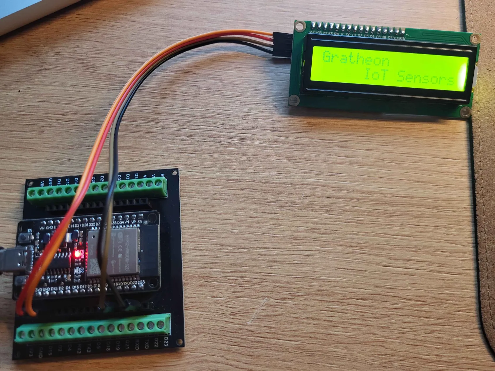
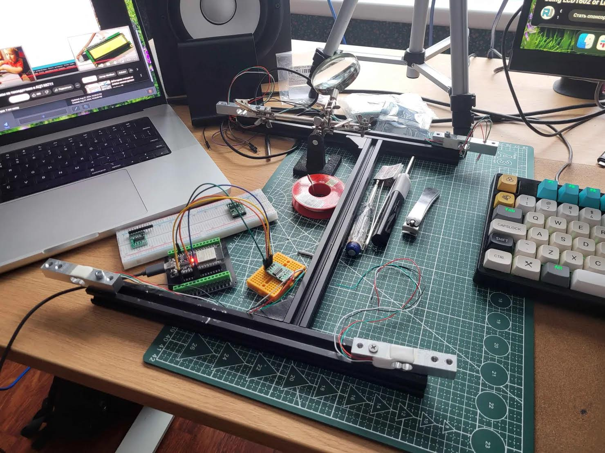

🌡️ Beehive scales are smart IoT scales equipped with additional sensors and communication chips. They periodically measure the hive's state and send data to a [web app](../web_app/web_app.md). This aggregated data helps beekeepers monitor their colonies in the field with minimal costs.

`status`: [TRL 4](https://www.nasa.gov/directorates/somd/space-communications-navigation-program/technology-readiness-levels/) (prototype)

## Overview

### Problem focus
Out of all beekeeping issues, this product is helping with these:
- [🧶 Swarming](../../problems/biological/🧶%20Swarming.md)
- [🍽️ Bee colony starvation](../../problems/biological/🍽️%20Bee%20colony%20starvation.md)
- [💢 Robbing state](../../problems/biological/💢%20Robbing%20state.md)
- [🐻 Bears destroying hives & colonies](../../problems/🐻%20Bears%20destroying%20hives%20&%20colonies.md)
- [🗃️ Storm wind collapsing beehives](../../problems/🗃️%20Storm%20wind%20collapsing%20beehives.md)
- [🌲 Distant locations](../../problems/systemic/🌲%20Distant%20locations.md)

## Target audience
- [🧑‍🚀 Hobby beekeepers](../../company/clients/🧑‍🚀%20Hobby%20beekeepers.md)
- [👨🏻‍🚒 Industrial beekeepers](../../company/clients/👨🏻‍🚒%20Industrial%20beekeepers.md)
- [👩🏼‍🏫 Urban beekeepers](../../company/clients/👩🏼‍🏫%20Urban%20beekeepers.md)

### Prototype

