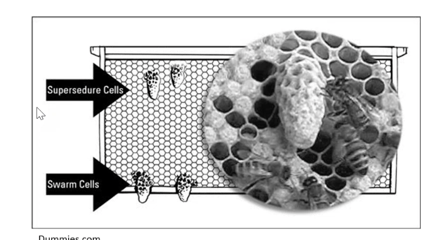

## Problem

We have a very simple queen cup object detection running that was training on small ~15 images in a dataset, its in image-splitter service calling [clarifai.com](http://clarifai.com/) that hosts the model

The problem is that in beekeeping, there are different types of queen cups. We need to distinguish them

## Suggested steps

Create and train either two different models, or, better - one model with two classes.

