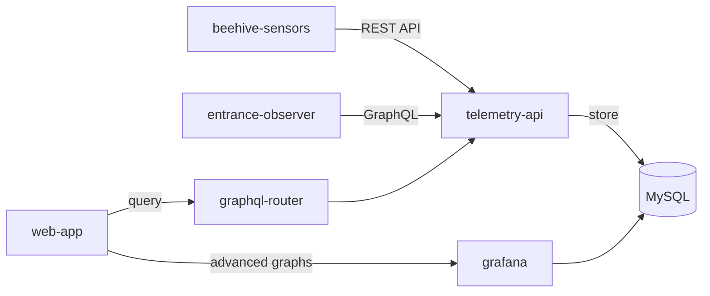

Store and visualize time-series sensor data from IoT devices attached to beehives, enabling long-term monitoring of hive health indicators like temperature, humidity, weight, and entrance traffic.

## Overview

Professional beekeepers need historical data to make informed decisions about hive management. The telemetry storage system collects metrics from hardware sensors and stores them for analysis and visualization.

This feature supports:
- Continuous monitoring of environmental conditions
- Historical trend analysis across seasons
- Early detection of anomalies through data patterns
- Evidence-based decision making for hive interventions

## Supported metrics

### Environmental data
- **Temperature** - Internal hive temperature in Celsius
- **Humidity** - Moisture levels inside the hive (percentage)
- **Weight** - Total hive weight for tracking honey flow (kg)

### Entrance activity
- **Bees in/out** - Count of bees entering and exiting
- **Net flow** - Difference between incoming and outgoing bees
- **Average speed** - Movement velocity of bees
- **Stationary bees** - Bees not moving at entrance
- **Detected bees** - Total count in camera frame
- **Bee interactions** - Encounters between bees at entrance

## How it works

1. **Connect hardware sensors**
   - Install beehive-sensors for temperature, humidity, and weight
   - Install entrance-observer for bee traffic analysis
   - Configure devices with API authentication token

2. **Automatic data collection**
   - Sensors send data every 5 seconds to telemetry-api
   - Data is stored in time-series optimized MySQL tables
   - Authentication verified via user-cycle service

3. **View and analyze data**
   - Real-time metrics displayed in hive dashboard
   - Historical charts with configurable time ranges
   - Advanced analytics via Grafana integration
   - Export data for external analysis

4. **Set up alerts**
   - Create threshold-based alert rules
   - Get notified when metrics exceed safe ranges
   - Monitor for sudden changes or anomalies

## Data retention

Pro tier includes:
- **Storage period**: 3 years of historical data
- **Resolution**: Configurable from 1-minute to daily aggregates
- **Query ranges**: From last hour to 2 years
- **Storage size**: Approximately 500MB per hive per year

## Architecture



The system uses:
- **telemetry-api** - Core service for metric storage and querying
- **MySQL** - Time-series optimized storage (indexed by hive_id and timestamp)
- **graphql-router** - API gateway for web-app queries
- **grafana** - Advanced visualization and analytics

## API access

Both REST and GraphQL APIs available:

**REST API** (for IoT devices):
```
POST /v1/metrics/:hiveId
POST /v1/entrance/:hiveId/:boxId
GET /v1/metrics/:hiveId/temperature?minutes=60
```

**GraphQL API** (for web-app):
```graphql
query {
  temperatureCelsius(hiveId: "123", timeRangeMin: 60)
  humidityPercent(hiveId: "123", timeRangeMin: 1440)
  weightKgAggregated(hiveId: "123", days: 7, aggregation: DAILY_AVG)
  entranceMovement(hiveId: "123", timeFrom: "2024-12-01", timeTo: "2024-12-06")
}
```

## Use cases

### Seasonal comparison
Compare temperature and humidity patterns across multiple years to:
- Identify optimal conditions for brood rearing
- Plan spring buildup strategies
- Prepare for winter clustering

### Honey flow tracking
Monitor weight changes to:
- Detect when nectar flow begins
- Determine optimal harvest timing
- Calculate daily weight gain during flow

### Colony health monitoring
Track entrance activity to:
- Detect queenless colonies (reduced activity)
- Identify robbing events (unusual traffic patterns)
- Monitor foraging behavior changes

### Treatment efficacy
Analyze metrics before and after treatments to:
- Verify temperature stability during treatment
- Confirm colony recovery post-treatment
- Optimize treatment timing based on data

## Technical limitations

- Maximum query range: 2 years without aggregation
- Data point limit: 10,000 records per query
- Write frequency: Minimum 1-second interval per device
- Polling-based updates (no real-time websockets)
- Grafana requires separate authentication

## Related features

- [🔔 Alerts](/about/products/web_app/flexible-tier/alerts) - Configure threshold-based notifications
- [⚖️ Colony comparison analytics](./colony_comparison_analytics) - Compare metrics across hives

## Resources

- [Technical documentation](/docs/web-app/features/telemetry-storage)
- [Telemetry API on GitHub](https://github.com/Gratheon/telemetry-api)
- [Beehive sensors setup](/docs/beehive-sensors/)
- [Entrance observer setup](/docs/entrance-observer/)

