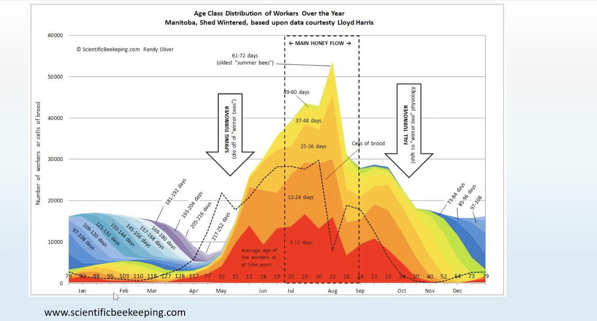

Calendar view (of events, treatments, alerts)

## Event types

- Queen cup appearance
- Queen growth takes 16 days
- Queen mating flights ~ 5 days after birth
- Queen laying ~ 14 days after mating
    - if after 21 days queen is not mated - she won’t be able to lay eggs
- From queen egg to first worker bee hatching = 46 days. So ~20 july is the latest time to have queen change (to reach september)

