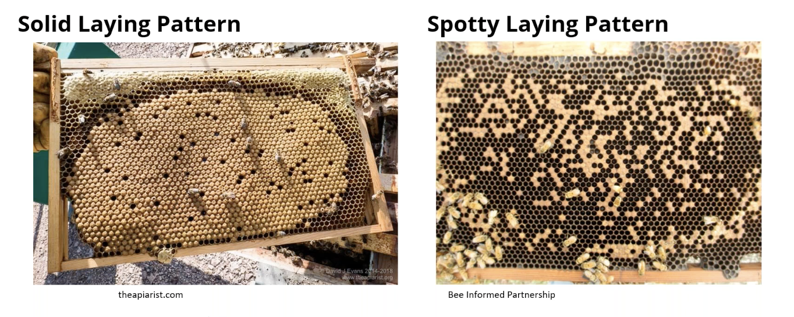

spotty laying pattern = bad cells, brood pathogen of larvae, queen failure

we want to alert a beekeeper if there is such situation and hint on possible reasons. Preferably with a timeline of past inspections of the same frame to see whats happening here - were the eggs in every cell at the beginning or not

