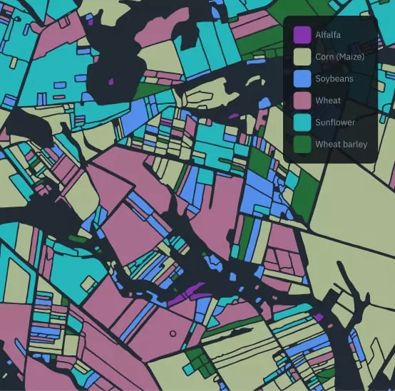

See also [Pollination optimization with hive placement recommendation](https://www.notion.so/Pollination-optimization-with-hive-placement-recommendation-c824e0e6b0c441c2a7815057ef0958d5?pvs=21)

[beehero.io](http://beehero.io) hive placement optimization

eosdata field classification

## References and potential data sources

- EOS Data - crop types [https://eos.com/products/crop-monitoring/custom-solutions/crops-classification/](https://eos.com/products/crop-monitoring/custom-solutions/crops-classification/)
    
- Sentinel-2 [https://apps.sentinel-hub.com/eo-browser/?zoom=15&lat=59.45154&lng=24.89232&themeId=DEFAULT-THEME&visualizationUrl=https%3A%2F%2Fservices.sentinel-hub.com%2Fogc%2Fwms%2Fbd86bcc0-f318-402b-a145-015f85b9427e&datasetId=S2L2A&fromTime=2023-09-14T00%3A00%3A00.000Z&toTime=2023-09-14T23%3A59%3A59.999Z&layerId=2_FALSE_COLOR&demSource3D="MAPZEN"](https://apps.sentinel-hub.com/eo-browser/?zoom=15&lat=59.45154&lng=24.89232&themeId=DEFAULT-THEME&visualizationUrl=https%3A%2F%2Fservices.sentinel-hub.com%2Fogc%2Fwms%2Fbd86bcc0-f318-402b-a145-015f85b9427e&datasetId=S2L2A&fromTime=2023-09-14T00%3A00%3A00.000Z&toTime=2023-09-14T23%3A59%3A59.999Z&layerId=2_FALSE_COLOR&demSource3D=%22MAPZEN%22)
    
- [https://dataspace.copernicus.eu/browser/?zoom=13&lat=59.43336&lng=24.9207&themeId=DEFAULT-THEME&visualizationUrl=https%3A%2F%2Fsh.dataspace.copernicus.eu%2Fogc%2Fwms%2Fa91f72b5-f393-4320-bc0f-990129bd9e63&datasetId=S2_L2A_CDAS&fromTime=2023-08-15T00%3A00%3A00.000Z&toTime=2023-08-15T23%3A59%3A59.999Z&layerId=SCENE-CLASSIFICATION&demSource3D="MAPZEN"&cloudCoverage=7](https://dataspace.copernicus.eu/browser/?zoom=13&lat=59.43336&lng=24.9207&themeId=DEFAULT-THEME&visualizationUrl=https%3A%2F%2Fsh.dataspace.copernicus.eu%2Fogc%2Fwms%2Fa91f72b5-f393-4320-bc0f-990129bd9e63&datasetId=S2_L2A_CDAS&fromTime=2023-08-15T00%3A00%3A00.000Z&toTime=2023-08-15T23%3A59%3A59.999Z&layerId=SCENE-CLASSIFICATION&demSource3D=%22MAPZEN%22&cloudCoverage=7)
    
- show pollen API 1kmx1km with google [https://mapsplatform.google.com/maps-products/pollen/](https://mapsplatform.google.com/maps-products/pollen/) [https://console.cloud.google.com/google/maps-apis/api-list?project=gratheon](https://console.cloud.google.com/google/maps-apis/api-list?project=gratheon)
    
- [https://apps.sentinel-hub.com/sentinel-playground/?source=S2L2A&lat=40.400032551179976&lng=-3.7298583984375&zoom=12&preset=null&layers=B01,B02,B03&maxcc=20&gain=1.0&gamma=1.0&time=2023-05-01|2023-11-02&atmFilter=&showDates=false](https://apps.sentinel-hub.com/sentinel-playground/?source=S2L2A&lat=40.400032551179976&lng=-3.7298583984375&zoom=12&preset=null&layers=B01,B02,B03&maxcc=20&gain=1.0&gamma=1.0&time=2023-05-01%7C2023-11-02&atmFilter=&showDates=false)
    
- [https://apps.sentinel-hub.com/eo-browser/?zoom=15&lat=59.45154&lng=24.89236&themeId=DEFAULT-THEME&visualizationUrl=https%3A%2F%2Fservices.sentinel-hub.com%2Fogc%2Fwms%2Fbd86bcc0-f318-402b-a145-015f85b9427e&datasetId=S2L2A&fromTime=2023-09-14T00%3A00%3A00.000Z&toTime=2023-09-14T23%3A59%3A59.999Z&layerId=2_TONEMAPPED_NATURAL_COLOR&demSource3D="MAPZEN"](https://apps.sentinel-hub.com/eo-browser/?zoom=15&lat=59.45154&lng=24.89236&themeId=DEFAULT-THEME&visualizationUrl=https%3A%2F%2Fservices.sentinel-hub.com%2Fogc%2Fwms%2Fbd86bcc0-f318-402b-a145-015f85b9427e&datasetId=S2L2A&fromTime=2023-09-14T00%3A00%3A00.000Z&toTime=2023-09-14T23%3A59%3A59.999Z&layerId=2_TONEMAPPED_NATURAL_COLOR&demSource3D=%22MAPZEN%22)
    

Potential approach

- [https://medium.com/@ya_71389/sentinel-2-deep-resolution-3-0-c71a601a2253](https://medium.com/@ya_71389/sentinel-2-deep-resolution-3-0-c71a601a2253)
- [https://medium.com/sentinel-hub/multi-temporal-super-resolution-on-sentinel-2-imagery-6089c2b39ebc](https://medium.com/sentinel-hub/multi-temporal-super-resolution-on-sentinel-2-imagery-6089c2b39ebc)
- [https://medium.com/sentinel-hub/how-to-normalize-satellite-images-for-deep-learning-d5b668c885af[h](https://github.com/sentinel-hub/eo-learn)](https://medium.com/sentinel-hub/how-to-normalize-satellite-images-for-deep-learning-d5b668c885af%5Bh%5D(https://github.com/sentinel-hub/eo-learn))
- [https://github.com/sentinel-hub/eo-learn](https://github.com/sentinel-hub/eo-learn)

## Estonia only

- [https://teenus.maaamet.ee/ows/wms-satiladu?sensor=sentinel-2&filter=msi&bands=1,2,3&curve=0&curver=0&curveg=0&curveb=0&lut1=0:0,31:31,63:63,95:95,127:127,159:159,191:191,223:223,255:255&lut2=0:0,31:31,63:63,95:95,127:127,159:159,191:191,223:223,255:255&lut3=0:0,31:31,63:63,95:95,127:127,159:159,191:191,223:223,255:255&date=2023-08-07&csensor=sentinel-2&cfilter=rgb&cdate=2023-08-31&hybrid=1&orto=1&points=0&mapbox=544602,6588848,546021,6589824](https://teenus.maaamet.ee/ows/wms-satiladu?sensor=sentinel-2&filter=msi&bands=1,2,3&curve=0&curver=0&curveg=0&curveb=0&lut1=0:0,31:31,63:63,95:95,127:127,159:159,191:191,223:223,255:255&lut2=0:0,31:31,63:63,95:95,127:127,159:159,191:191,223:223,255:255&lut3=0:0,31:31,63:63,95:95,127:127,159:159,191:191,223:223,255:255&date=2023-08-07&csensor=sentinel-2&cfilter=rgb&cdate=2023-08-31&hybrid=1&orto=1&points=0&mapbox=544602,6588848,546021,6589824)
    
- [https://teenus.maaamet.ee/ows/wms-satiladu?sensor=sentinel-2&filter=ndvi&date=2023-07-13&csensor=sentinel-2&cfilter=ngr&cdate=2023-07-13&hybrid=1&mask=0&mapbox=512079,6401247,666439,6579674&rotation=12.79](https://teenus.maaamet.ee/ows/wms-satiladu?sensor=sentinel-2&filter=ndvi&date=2023-07-13&csensor=sentinel-2&cfilter=ngr&cdate=2023-07-13&hybrid=1&mask=0&mapbox=512079,6401247,666439,6579674&rotation=12.79)
    
- [https://teenus.maaamet.ee/ows/wms-satiladu?sensor=sentinel-2&filter=msi&bands=1,2,3&curve=0&curver=0&curveg=0&curveb=0&lut1=0:0,31:31,63:63,95:95,127:127,159:159,191:191,223:223,255:255&lut2=0:0,31:31,63:63,95:95,127:127,159:159,191:191,223:223,255:255&lut3=0:0,31:31,63:63,95:95,127:127,159:159,191:191,223:223,255:255&date=2023-08-07&csensor=sentinel-2&cfilter=rgb&cdate=2023-08-31&hybrid=1&orto=1&points=0&mapbox=549383,6591323,550286,6591959](https://teenus.maaamet.ee/ows/wms-satiladu?sensor=sentinel-2&filter=msi&bands=1,2,3&curve=0&curver=0&curveg=0&curveb=0&lut1=0:0,31:31,63:63,95:95,127:127,159:159,191:191,223:223,255:255&lut2=0:0,31:31,63:63,95:95,127:127,159:159,191:191,223:223,255:255&lut3=0:0,31:31,63:63,95:95,127:127,159:159,191:191,223:223,255:255&date=2023-08-07&csensor=sentinel-2&cfilter=rgb&cdate=2023-08-31&hybrid=1&orto=1&points=0&mapbox=549383,6591323,550286,6591959)
    
- pollution data in estonia, city specific [http://airviro.klab.ee/en](http://airviro.klab.ee/en) [https://hub.eaaci.org/patients_resources/worldwide-pollen-map/](https://hub.eaaci.org/patients_resources/worldwide-pollen-map/)
    
- [https://geoportaal.maaamet.ee/est/Ruumiandmed/Topokaardid-ja-aluskaardid/Eesti-pohikaart-1-10000/Leppemargid-juhendid-ja-abifailid-p130.html](https://geoportaal.maaamet.ee/est/Ruumiandmed/Topokaardid-ja-aluskaardid/Eesti-pohikaart-1-10000/Leppemargid-juhendid-ja-abifailid-p130.html)
    

## Glossary

- NDVI (Normalized Difference Vegetation Index): NDVI is a commonly used vegetation index calculated from satellite imagery. It quantifies the amount of live vegetation in an area. NDVI values typically range from -1 to 1, with higher values indicating healthier and more abundant vegetation.
- **True Color** - Visual interpretation of land cover.
- **False Color** - Visual interpretation of vegetation.
- **NDVI** - Vegetation index.
- **Moisture index** - Moisture index
- **SWIR** - Shortwave-infrared index.
- **NDWI** - Normalized Difference Water Index.
- **NDSI** - Normalized Difference Snow Index.

[https://hub.docker.com/r/kartoza/geoserver](https://hub.docker.com/r/kartoza/geoserver)

## Related scientific work for inspiration

- [https://www.mdpi.com/2077-0472/13/3/669](https://www.mdpi.com/2077-0472/13/3/669)