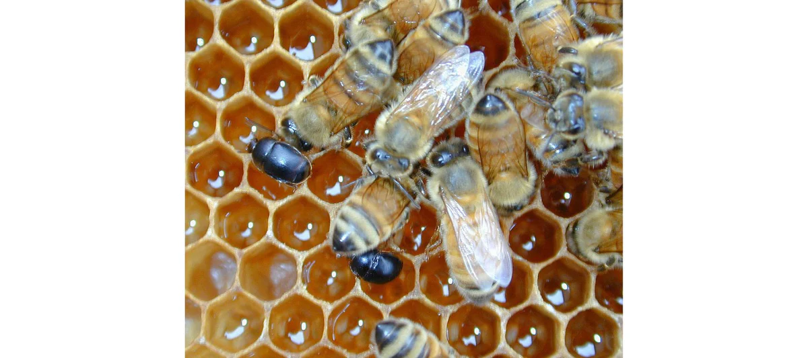
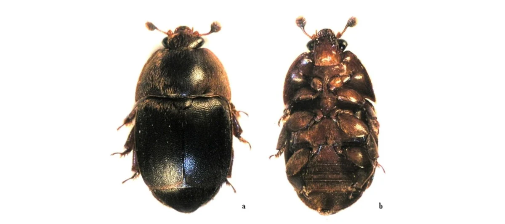

- bees can't really attack hive beetles
- worse in shady apiaries, warm and wet regions
- colony is likely in decline

source - [https://www.honeyflow.com/blogs/pests-and-diseases/small-hive-beetle-shb](https://www.honeyflow.com/blogs/pests-and-diseases/small-hive-beetle-shb)