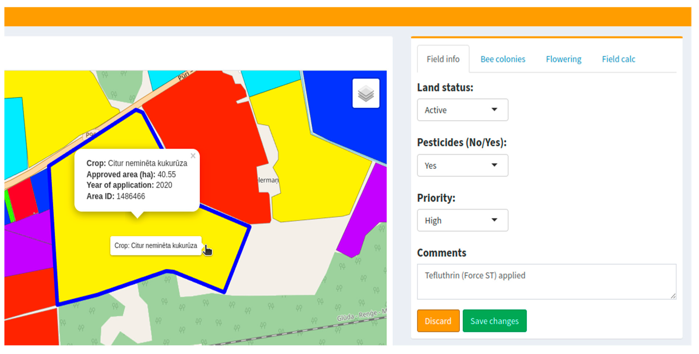
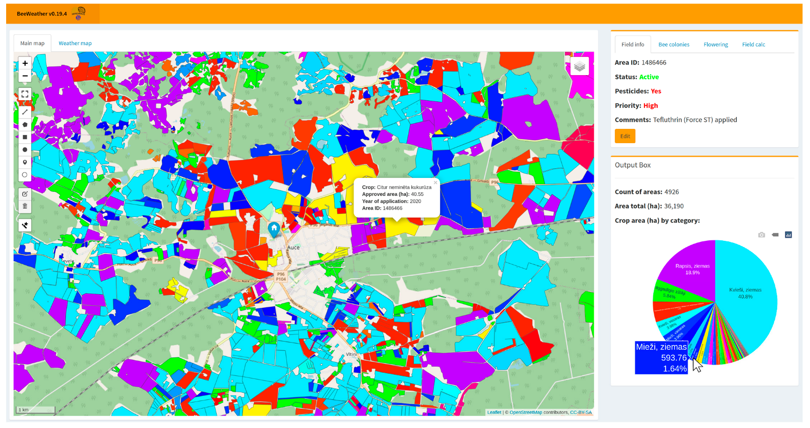
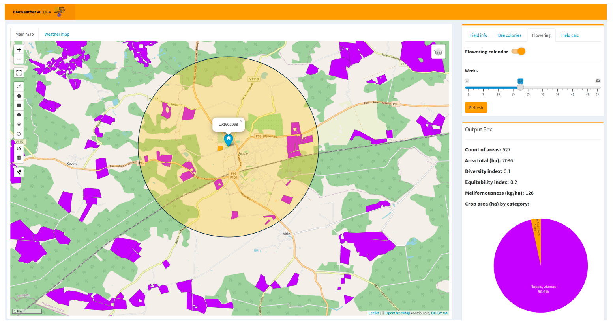

Idea is to show when specific flower within apiary vicinity is blooming.

## Research papers

[https://www.mdpi.com/2077-0472/13/3/669](https://www.mdpi.com/2077-0472/13/3/669)

[https://www.bjmc.lu.lv/fileadmin/user_upload/lu_portal/projekti/bjmc/Contents/11_1_01_Komasilova1.pdf](https://www.bjmc.lu.lv/fileadmin/user_upload/lu_portal/projekti/bjmc/Contents/11_1_01_Komasilova1.pdf)

## Acceptance criterias

1. Import field information data from public governmental sources (likely needs to be done on continous basis and depends on a country) → will need separate features. Use PRIA for Estonia
    
2. Allow editing of fields that grow around the apiary
    
 
    
3. Show what grows around the apiary
    

4. Depending on time of the year, highlight what is activewly blooming
5. Allow to go forward-backward in time with a selector

