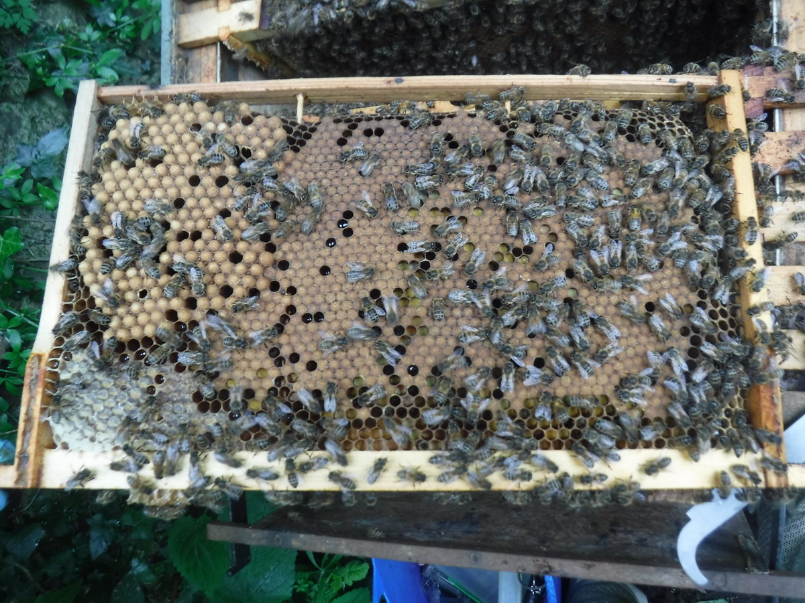

## Why

So when queen is too old and runs out of sperm, she can start laying drone eggs instead of workers and thus colony can collapse

Another issue is that when colony becomes powerful and we do not do [Create colony split](https://www.notion.so/Create-colony-split-2d98cc5cabd34534a758595fb2a78bd8?pvs=21), it starts producing drones for mating and [Swarming](https://www.notion.so/Swarming-13184fe7583e452dbbc8c4e57333ef97?pvs=21). Drones eat lots of honey, so beekeepers should be aware of their [Analytics - demography and simulation](https://www.notion.so/Analytics-demography-and-simulation-b438f638fe694c06b66f9249b6bb0e88?pvs=21).

## Suggested solution

- in addition to detecting frame cells with existing models [Honeycomb cell detection & management](https://www.notion.so/Honeycomb-cell-detection-management-e9ff03128cdb489293737b8a4c1e7098?pvs=21), we need to also detect drone cells and add this to frame statistics
    - Create a new ML model or improve existing one to detect drone brood
    - Update image-splitter to store this new statistics
    - Update web-app to display these metrics in hive frames and in frame side view
- warn beekeeper if his drone cell ratio is too high - [Alerts](https://www.notion.so/Alerts-8b65dea8fc164a7f91b0a76fa0948189?pvs=21)

