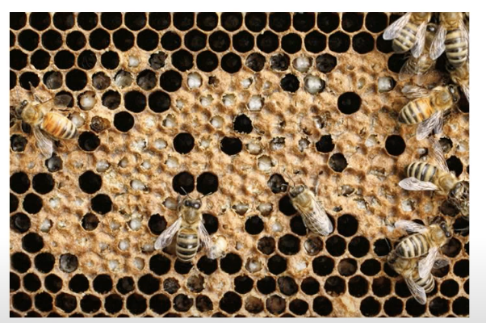

when colony is not large enough to maintain temparature of the entire brood nest

uncapped larvae appear discolored

capped larvae are chewed

some of the brood may be healthy

may be the result of a beekeeper mismanagement + bad weather

