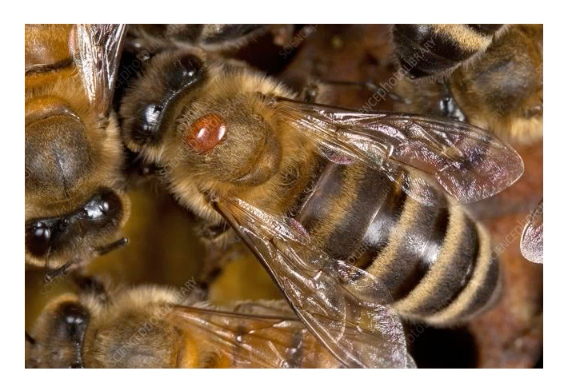
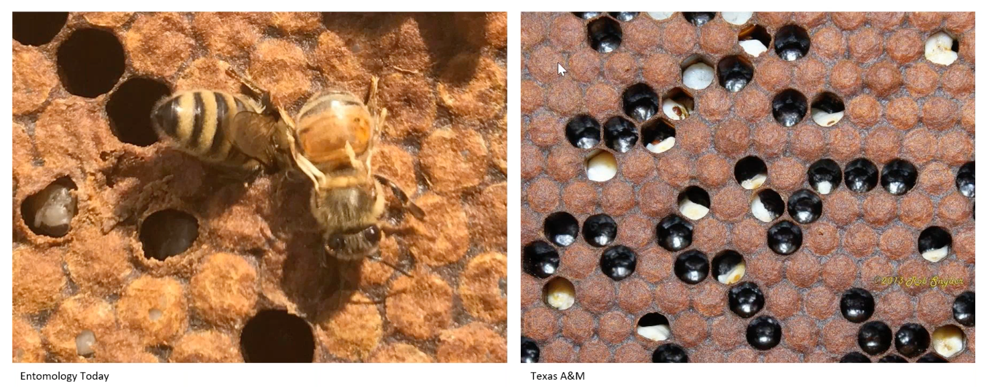
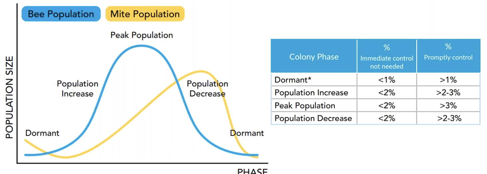

## Why

Varroa mites are the biggest danger to colonies today

- they feed on larvae, pupae, adult honey bees
- they leave open wounds
- they consume fat body of a bee, making bees weak (immune response, energy storage, detoxification)

## Suggested solution

- Datasets:
    - [https://universe.roboflow.com/varroa-double/v_test](https://universe.roboflow.com/varroa-double/v_test)
    - [https://universe.roboflow.com/beproj/varroa-mites-detection--test-set](https://universe.roboflow.com/beproj/varroa-mites-detection--test-set)
    - [https://universe.roboflow.com/varroa-virus-detection/varroa-mites-detector](https://universe.roboflow.com/varroa-virus-detection/varroa-mites-detector)
    - [https://universe.roboflow.com/beproj/varroa-mites-detection](https://universe.roboflow.com/beproj/varroa-mites-detection)
    - [https://universe.roboflow.com/myworkspace-8q0cl/bee-detector](https://universe.roboflow.com/myworkspace-8q0cl/bee-detector)
    - [https://universe.roboflow.com/varroa-virus-detection/varroa-mites-detector](https://universe.roboflow.com/varroa-virus-detection/varroa-mites-detector)
    - [https://universe.roboflow.com/yolov5-object-detection-on-honey-bees-u8kya/varroua-mite-detection-in-honey-bees](https://universe.roboflow.com/yolov5-object-detection-on-honey-bees-u8kya/varroua-mite-detection-in-honey-bees)
    - [https://universe.roboflow.com/beproj/varroa-mites-detection--train-set](https://universe.roboflow.com/beproj/varroa-mites-detection--train-set)

## App integration

- Prepare the data. For this we need to cut regions from the original frame where we detect bees - see [Worker bee detection](https://www.notion.so/Worker-bee-detection-3927d59c9f0e465db0ec11b7832ebd18?pvs=21)
- use AI model like yolo, get weights to detect and count mites on individual bees
- return absolute number of mites found in an image
- add http API to this model
- integrate image-splitter with this model - it manages frame photos
- store result in DB (a db migration would be needed)
- display mite infection % per frame and per hive in web-app
- generate an alert beekeeper if its above some treshold after some period of time (blocked by another issue)

## Related possible detections

- detect deformed wings virus that is spread by varroa
- detect parsitic mite syndrome - uncapped larvae caused by high mite infestation
- paralysis viruses (black-shiny immobile bees)

[https://github.com/Gratheon/image-splitter/assets/445122/c5b2954a-0239-4946-91e5-525f2c92ccff](https://github.com/Gratheon/image-splitter/assets/445122/c5b2954a-0239-4946-91e5-525f2c92ccff)

## Solution

[https://github.com/Gratheon/web-app/pull/70](https://github.com/Gratheon/web-app/pull/70)

[https://github.com/Gratheon/image-splitter/pull/17](https://github.com/Gratheon/image-splitter/pull/17)

Problem currently

- roboflow costs too much
- has too strict limits for free tier
- prediction does not work well for frame photos, even if they are sliced in parts