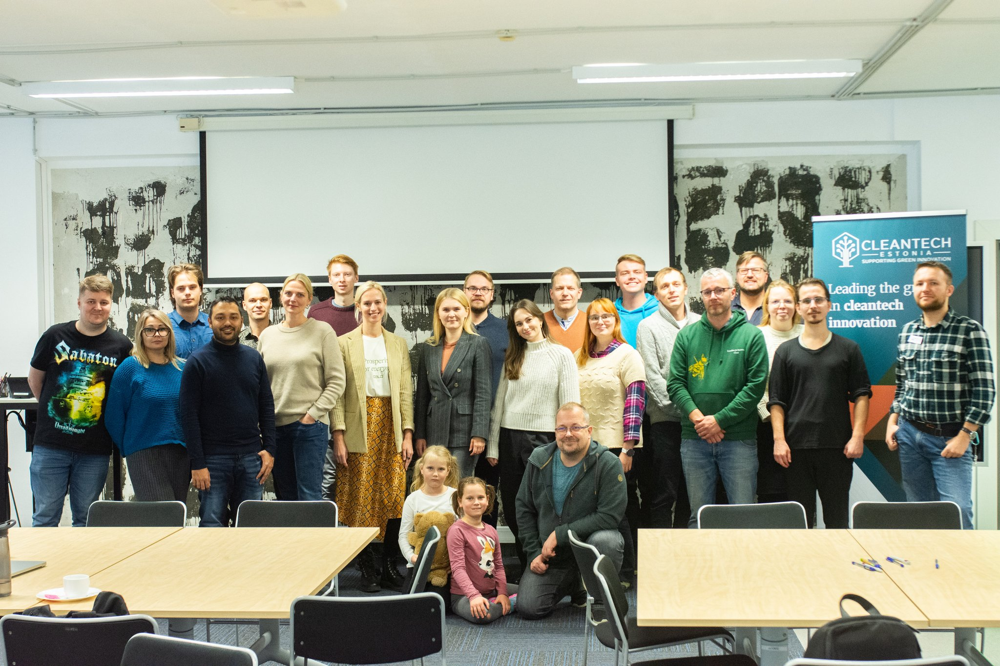
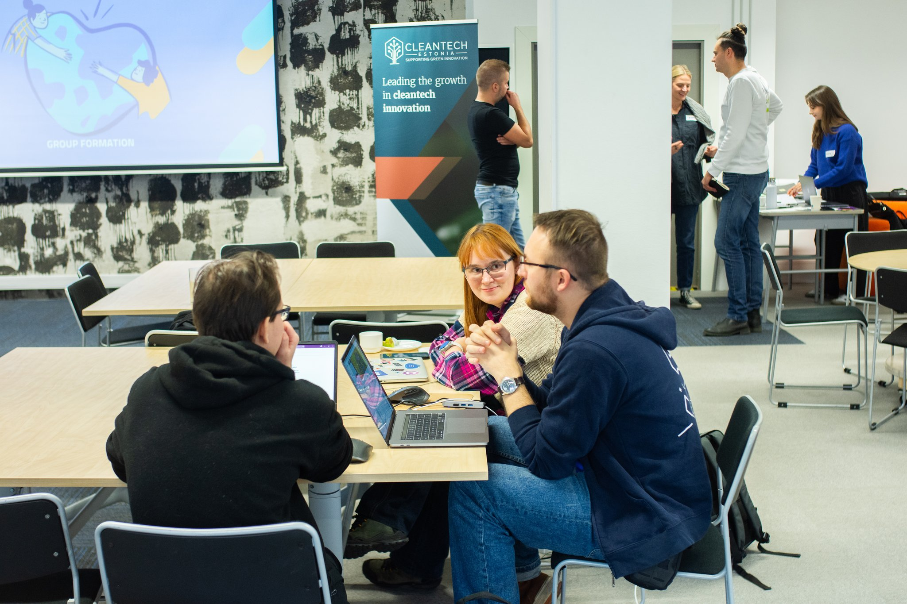
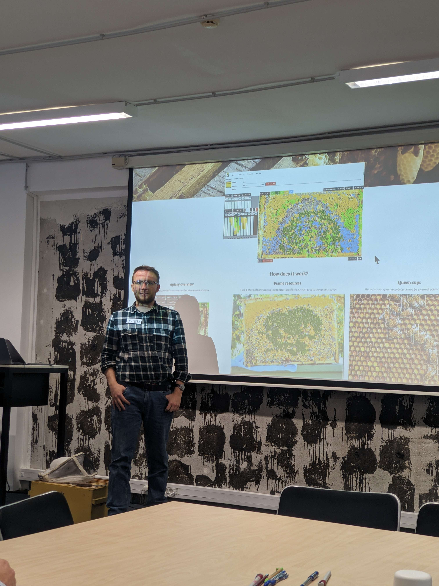
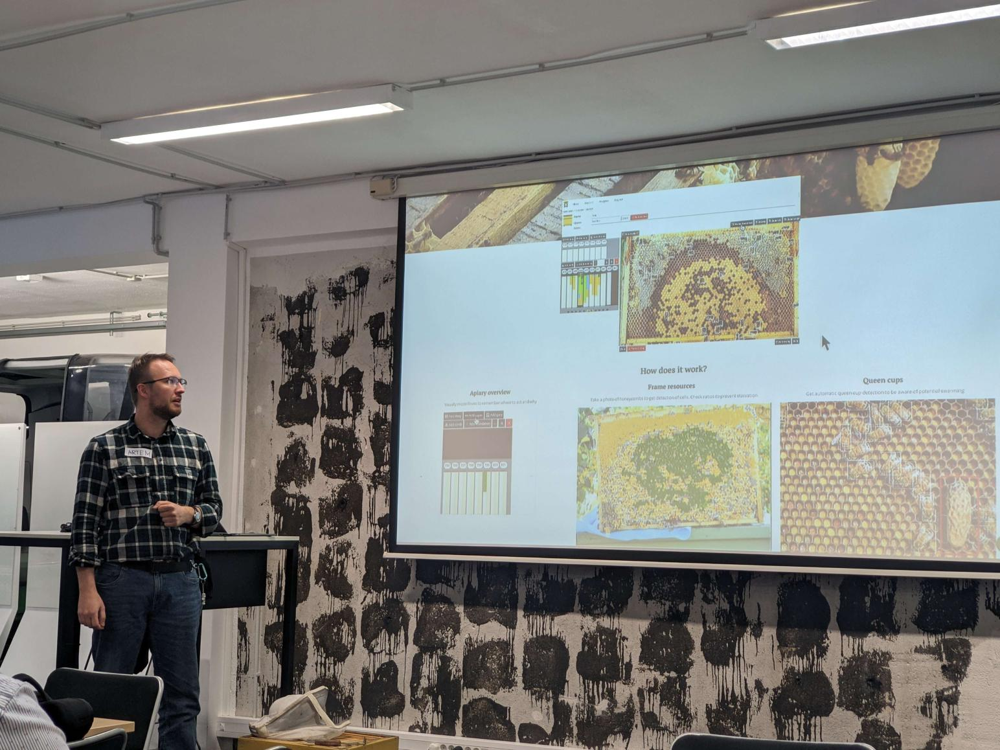
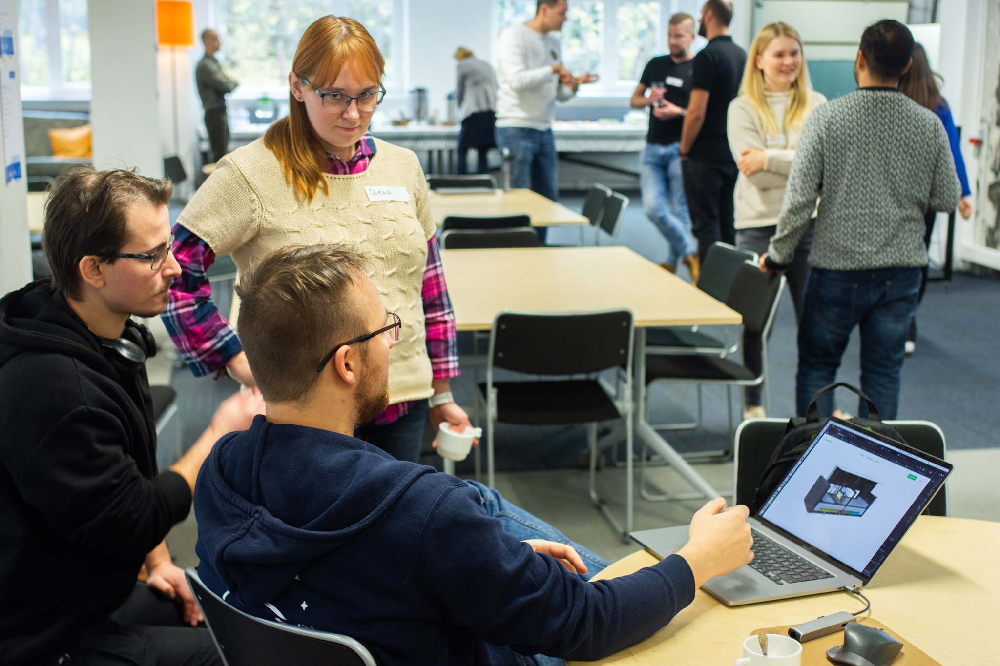

Participated in small climathon hackathon at TalTech

<!--truncate-->

## Organizers / Judges / Mentors

Kädi - growth, regulation

Rasmus - startup center, scientific side

Andy - particle physics, building detection

Veiko Karu - raw matetrials, remote sensing info

Anton - developer, TalTech

Ivo Krustak - green deal policy, waste water

Kristel - scalability, PM

Indrek

## Prizes

#1

- GreenExpo
- 500 EUR
- Estonian cleantech annual event

#2

- startup day
- 300 EUR

#3

- 200 EUR
- cleantech

Beamline.fund accelerator (estonian investors)

- preaccelerator program

## Our pitch

[Climathon hackathon](https://www.notion.so/Climathon-hackathon-5ecc2732cafe4b9bbbaaac4d037c0d7b?pvs=21)

## Feedback

- we could target environmental credits
- we could replace beekeepers in a long run
- Indrek / Beamline: use ultrasound instead of vision and robots to have less moving parts

> In summary, your beekeeping observability startup can be a vital player in environmental sustainability, biodiversity conservation, and climate resilience by safeguarding bee populations and their role in ecosystems and agriculture. Healthy bees and well-pollinated crops not only benefit the environment but also strengthen the capacity of natural systems to withstand the challenges posed by climate change.

ChatGPT

[https://docs.google.com/presentation/d/e/2PACX-1vQsXF8weZdAUXo3jlVPVdMTdLGtG1G2xi_4cMkuNjrTd4Y--OZBLYyW0yOTGC0ilHfimFBAo-mM1VRG/pub?start=false&loop=false&delayms=3000](https://docs.google.com/presentation/d/e/2PACX-1vQsXF8weZdAUXo3jlVPVdMTdLGtG1G2xi_4cMkuNjrTd4Y--OZBLYyW0yOTGC0ilHfimFBAo-mM1VRG/pub?start=false&loop=false&delayms=3000)

Hi. My name is Artjom and I represent **Gratheon**. Our mission is to [Company Mission](https://www.notion.so/Company-Mission-e052619834d4474793e15f95dba6dd04?pvs=21). I’m a software engineer and a beekeeper. A bee colony is a super-organism like a city while individual bees are cute and fluffy. I like both aspects of having such a complex pet.

## Hook

To understand the bee problems, lets think of a situation when humanity is infected with headcrabs and the only help can come from aliens that visit earth every 100 years and to count crab, they kills 3% of the population and temporarily cures humans. That is the state of modern beekeeping with lots of manual inspections.

## Solution

Our solution is a web app that can detect bees, cells, wasps these headcrabs so that all of your bees stay healthy and alive. You take a photo of a frame or you place phone at the beehive entrance to count bees. Then this image or video is analyzed with AI and you get a report on you beehive condition. Next steps is to automate this by building a robot that would send data automatically and would not need to open the hive and stress the bees.

## Competition

Although there are solutions that target same problems, they focus only on commercial beekeepers, they don’t provide sufficient information.

## Market

Our target audience is hobby beekeepers who wants to get lots of information and advice with minimal intervention using user-friendly machienery. Early adopters would be a tech-enthusiasts and startup companies with shared values.

World wide there are around 100M bee colonies. And in Europe about 620k beekeepers.

## Team

Our team is growing, we are experienced team of software engineers, with a startup background in API, AI, video processing and cloud. We are looking for more AI and robotics help.

## Call to action

We are looking for a 630k investment to have runway for 18 months for a team of 4. And we plan to build an MVP for the entrance counter and build a robotic nest as PoC.

You can contact us at **[pilot@gratheon.com](mailto:pilot@gratheon.com)**
