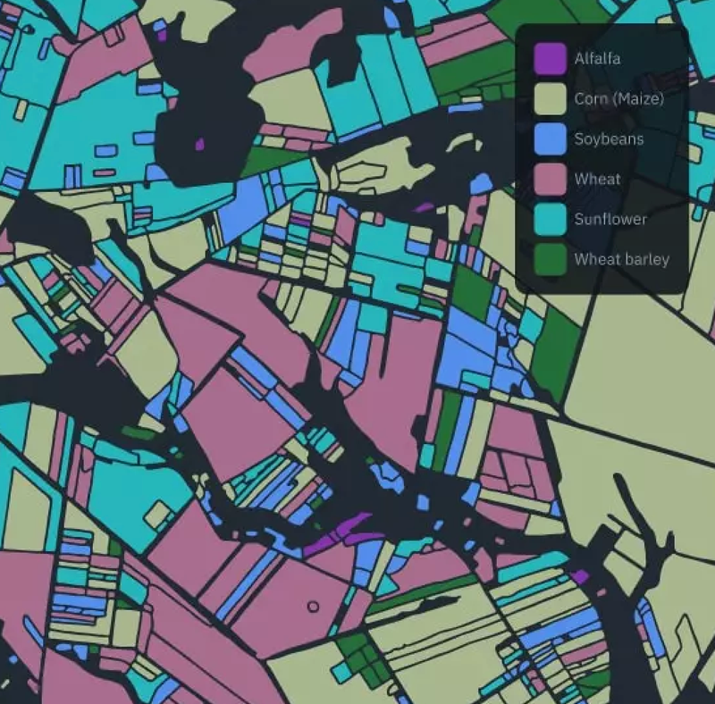
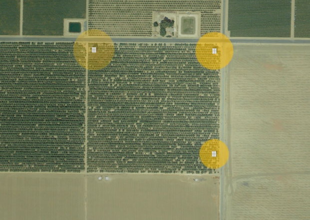
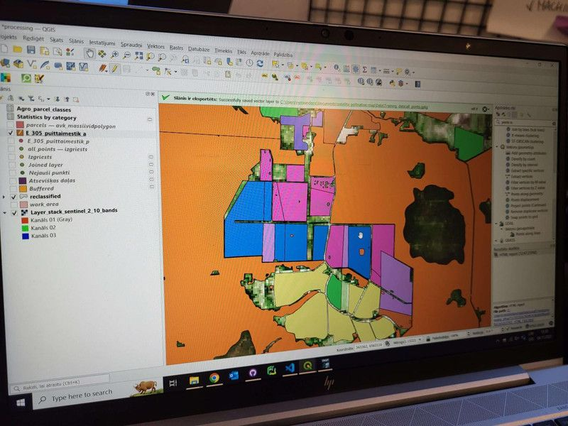
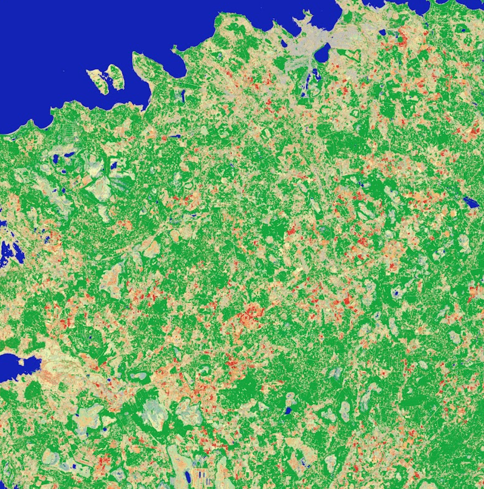
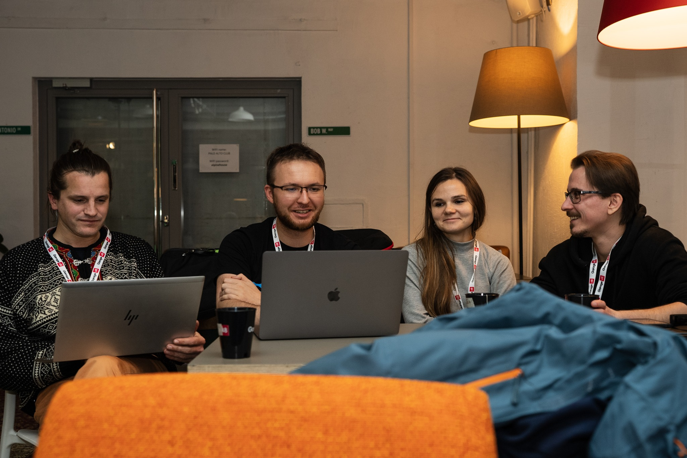
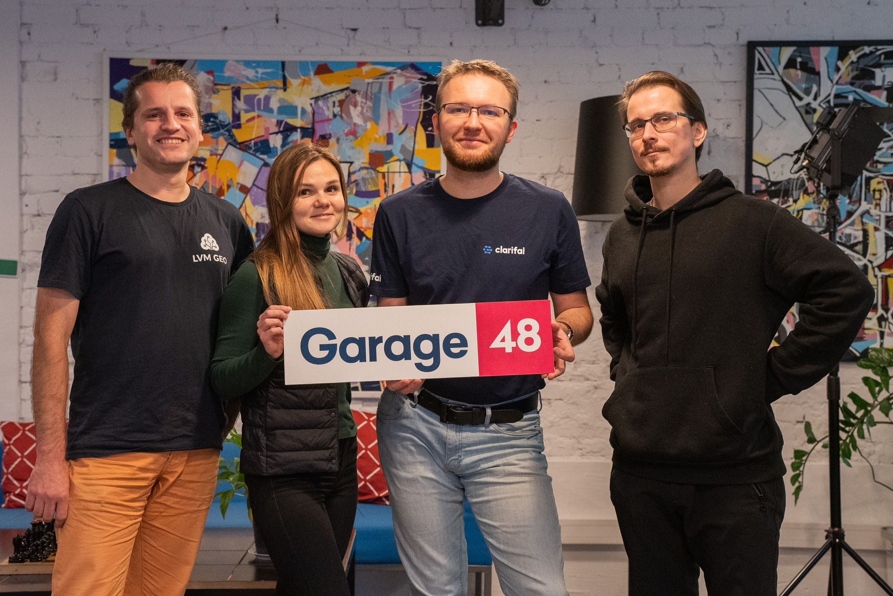
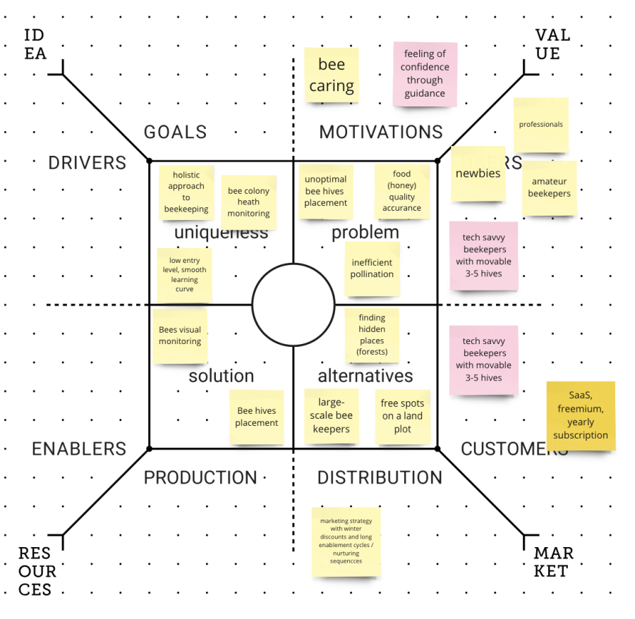

We participated in pan-European hackathon focused on satellite data processing, organized locally by Garage48.

Our main goal is to
- network to grow a team
- raise awareness as marketing
- develop product features with geo-data for our apiaries

https://taikai.network/cassinihackathons/hackathons/intdev-humaid

[Pitch PDF](files/First%20Gratheon%20Garage48%20pitch%20to%20get%20a%20team.pdf)

<!-- truncate -->

## **Problem**

Food security. 735.1M undernourished people worldwide according to FAO in 2022

Farming crops are inefficiently pollinated. This happens because beehives are currently positioned randomly, however beekeeper decides to. Beekeepers do not know where and why to place beehives. Bees are key to **natural pollination**, which increases **crop yields**, aiding in food supply, reducing the need in deforestation. ****Farmers can inadvertently kill bees with pesticides.

**Solution**

We're improving **environment overview** **for the beekeepers**.

By analyzing pollination coverage from satellite, beehives can be positioned more **efficiently**.

Thanks to our app, farmers can get better yields, beekeepers get more honey and healthy bees and bees get more nectar or pollen diversity.

Diverse pollen improves bee's health as well as taste of the honey. Bees also do not need to compete with each other as much over resources. Separate hive positioning reduces the risk of diseases.

In general, [Gratheon](https://gratheon.com/) helps beekeepers with observability and automation so that they could be more efficient and their colonies would stay healthy. We provide app and integrate hardware so that computer vision could alert a beekeeper in case of danger. Our long-term vision is autonomous robotic beehive.

**Pollen map feature ideation**

1. Given a satellite image of the apiary with 5 km radius (max flight range of a bee), run AI predictions to detect which **types** of trees and field crops are growing around the apiary and its **square area (m2)**.

Crop classification, image and feature by EOS data analytics as a goal

2. Given detected pollination sources, suggest to beekeeper how to optimally place bees to optimize for max nectar flow or max pollen diversity. This is also important given that crops may bloom at different time. Coupled with real-time pollination activity data at individual beehives, beekeeper can make informed decisions

Hive placement optimization, image and feature by [beehero.io](http://beehero.io)

Note that this feature targets beekeepers that are able to **move beehives** or city planners that want to optimally position autonomous beehives in the city. For static apiaries we would _only_ provide what type of nectar/honey you can expect, so that you would know at which time specific nectar (ex. buckwheat) is harvested as well as predict the amount of honey depending on the plant's nectar secretion

**Product Design Mockup**

We started with how we want user to interact with the map to receive interested data

- crop types
- ratios of crops within pollinateable area
- blooming time
- plant nectar production (kg/ha)

## EU space technologies

We are using Sentinel 2 L1C data, RGB layer to get base information about fields

We are then running segmentation on an image to detect fields

Then we run classification of detected fields to understand which crop we are dealing with. As we know time of the image, we can use it to match blooming time.

Then we calculate the square area of the field

Then we calculate the ratio of all field types within 5km vicinity and report this to the user (beekeeper)

Beekeeper can move the location of the beehive, which will result in recalculation of percentages

Beekeeper can also see how much bees from different hives intersect

# Team

[Artjom Kurapov](https://www.linkedin.com/in/kurapov/) -  software engineer

[Aleksei Boris](https://www.linkedin.com/in/alekseiboris/) - bizdev / legal / ops

[Natalia Kinash](https://www.linkedin.com/in/nataliia-kinash/) - machine learning engineer, applied mathematics

[Reinis Indans](https://www.linkedin.com/search/results/all/?heroEntityKey=urn%3Ali%3Afsd_profile%3AACoAACcYIOABh-CstsU-a3j6keX8AEZKUSY5El8&keywords=Reinis%20Indans&origin=ENTITY_SEARCH_HOME_HISTORY&sid=uqZ) - GIS / fullstack engineer

[Untitled](https://www.notion.so/1f6cefe4cafd43ef8a2f6ba21e684554?pvs=21)

## Design mockup

Apiary view with single hive map

Blooming time view

## System design

Service component diagram

Initial idea was that, given coordinates X,Y of the apiary, we make request to copernicus servers to receive RGB visible spectrum data. Then we pass result png image to a trained ML model that will do segmentation of fields and classification of them. We then wanted to store inference results to DB to have caching in place in case user visits same page.

**Machine learning and SATELLITE DATA USED**

We trained two separate models during development.

We tried first [a light-weight version](https://universe.roboflow.com/gratheon/crop-fields/model/2) which could do segmentation of  fields without actual classification. We did not end up using it as we wanted actual field types and it was trained on pre-existing dataset that was not related to Copernicus although it would be the fastest to integrate

Second model was more complex. We exported map of Estonia without cloud coverage (for 13 june 2023) from Copernicus Open Data Hub in multispectral .dim format which includes all layers (infrered etc), then we processed it in QGIS. We normalized resolution to be 20m.

For training a model we took polygon data from Estonian registries - PRIA (crop fields registry) and Maaamet (forests and buildings). Then we unified these layers, cleaned classes (out of original 300 classes we got 25 classes). To prepare dataset, for every class we picked training (300) and validation(50) instances. We used random forest model.

QGis interface

As a result, model produces an image where for every pixel we have a class prediction. This allows us to run inference in countries/regions that do not have digital field/crop mapping data available. This also allows us to easily calculate class ratios using simple per-pixel sumation.

For inference we use sentinel-2-l2a and process API

Visualization of trained field classification near Tallinn, Estonia (on top)

**Result app**

We have a web-app deployed and available for the customers.

We make request to copernicus server to get sentinel-2-l2a image for specific location +- 4 km (bee flight range) and provide a list of classes we can run inference on

To access it, you need to:

- register in the app - [https://app.gratheon.com/account/register](https://app.gratheon.com/account/register)
- create new apiary - [https://app.gratheon.com/apiaries/create](https://app.gratheon.com/apiaries/create)
- go into apiary view, drag the marker and click "Analyze crops" - [https://app.gratheon.com/apiaries/edit/2](https://app.gratheon.com/apiaries/edit/2)

**Source code**

- ML training dataset - [https://drive.google.com/drive/folders/1Gh4DXqaDFF1r3lsgxQlo2HREPjo6xlRK?usp=sharing](https://drive.google.com/drive/folders/1Gh4DXqaDFF1r3lsgxQlo2HREPjo6xlRK?usp=sharing)
- Backend & ML code - [https://github.com/Gratheon/satellite-pollination-map](https://github.com/Gratheon/satellite-pollination-map)
- Frontend recent changes related to hackathon - [https://github.com/Gratheon/web-app/commits/main](https://github.com/Gratheon/web-app/commits/main)

**Limitations & future work**

- We could connect beekeepers with farmers to prevent pesticide exposure affecting bees during blooming time
- ML model needs more work on precision. We used fixed date for dataset, so instead we could use historical data to train models with more precise blooming time (say every 2 weeks, april-june)
- We did not reach deploying model into production within hackathon timeframe.
- We did not reach integrating correct pollination times and nectar flow rate for classes that we intend to detect

[https://garage48.org/events/6th-cassini-hackathon](https://garage48.org/events/6th-cassini-hackathon) [https://www.cassini.eu/hackathons/estonia?mtm_campaign=6CHLOEE](https://www.cassini.eu/hackathons/estonia?mtm_campaign=6CHLOEE)

Gratheon project registered: [https://taikai.network/cassinihackathons/hackathons/intdev-humaid/projects/cloewercb02zevm01kqo4xlr7/idea](https://taikai.network/cassinihackathons/hackathons/intdev-humaid/projects/cloewercb02zevm01kqo4xlr7/idea)

APIs to be used:

[https://dataspace.copernicus.eu/analyse/apis](https://dataspace.copernicus.eu/analyse/apis)

[https://www.cassini.eu/hackathons/tools](https://www.cassini.eu/hackathons/tools)

### **6. JUDGING CRITERIA**

Both at the local level and the European level your solutions will be judged against three simple criteria.

1. **Relevance (33%) -** Does the project address one of the hackathon's three challenges? Does the project make use of Copernicus, Galileo and/or EGNOS data and signals?
2. **Innovativeness (33%) -** How innovative is the idea compared to products/services that are already on the market? Is there potential for a viable business case?
3. **Quality of the team (33%) -** Do the technical, business and creative expertise of the team members match the needs of the project?

# The Mentors

**David Clark**

Founder Tallon OÜ | Venture Partner at Tera VC I Entrepreneur & Angel Investor

**Indrek Kelder**

Mentor at Cleantech ForEst

**Ilya Bolkhovsky**

Geospatial Product Manager

**Karin Maasel**

Executive Director at Data Friendly Space

**Villem Nilbe**

Product Designer at eAgronom

**Calum Cameron**

CEO of DP Innovation Labs and Edasi Labs

**Jana Saastamoinen**

Marketing Manager at Garage48

**Romet Tagobert**

Senior Software Engineer at Twilio

**Fariha Harun**

Data Analyst/Developer at AlphaGIS

**Kristiina Lillestik**

Head of Foreign Relations in the Ministry of Regional Affairs and Agriculture

**Andres Luhamaa**

Product owner for KappaOne Sentinel-1 data layer services

**Berk Erdem**

Project Manager at ESTDEV

**Marius Taparavičius**

Lawyer at Lithuanian Red Cross society/Lietuvos Raudonojo Kryžiaus draugija

[First Gratheon Garage48 pitch to get a team.pdf](https://prod-files-secure.s3.us-west-2.amazonaws.com/6b3663fb-4bc2-4044-80e1-5d6ea956abef/a70c8f25-17ad-40cb-9721-af7dc661dc2f/Gratheon_Garage48___Cassini_pitch.pdf)

[Final Garage48 project page](https://www.notion.so/Final-Garage48-project-page-395bddc3353f45a5bae301ca13ddde28?pvs=21)

[Vocal pitch (by Aleksei)](https://www.notion.so/Vocal-pitch-by-Aleksei-94ab6405c75942408ba896194ed31d59?pvs=21)

[Project page on the web](https://www.notion.so/Share-of-beehive-inspection-public-URL-477d096f683542f4a182e53ff5f23780?pvs=21)

Product Field Map by **Ilya Bolkhovsky**