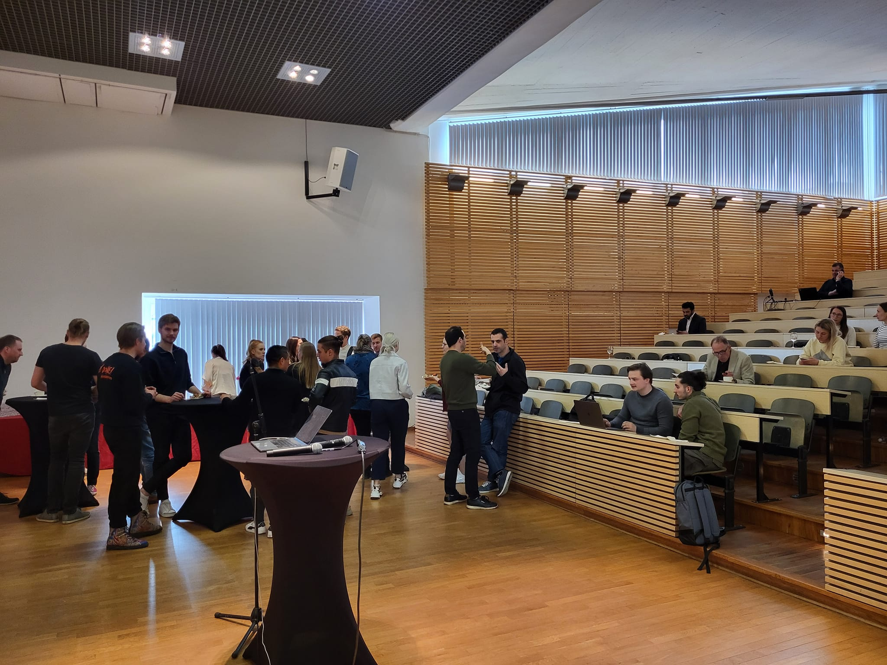
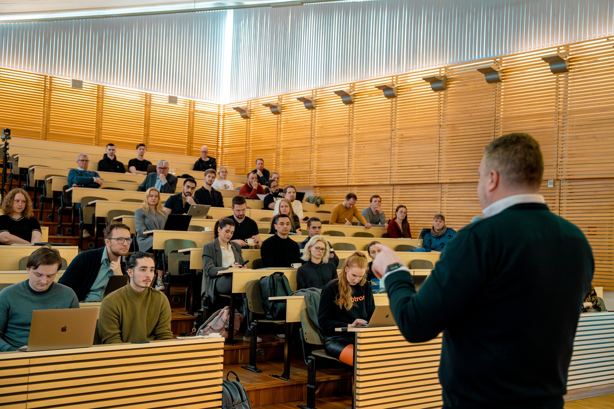
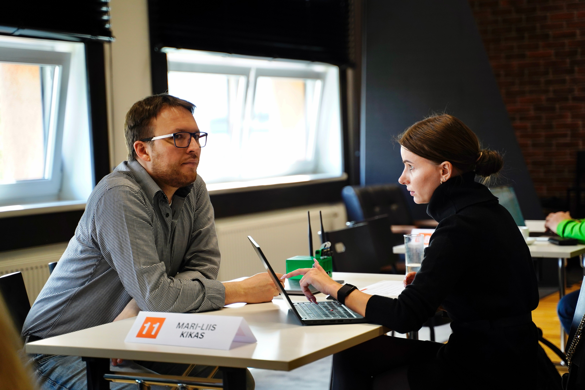
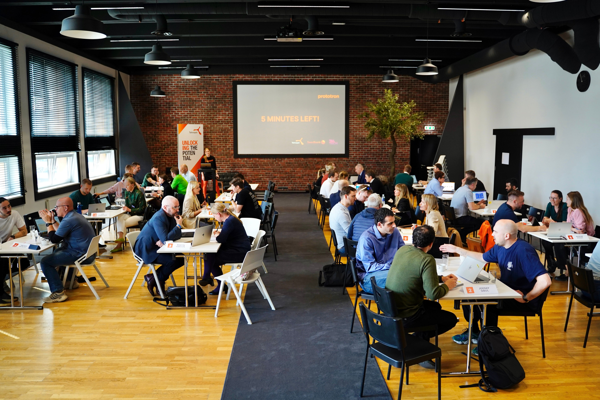
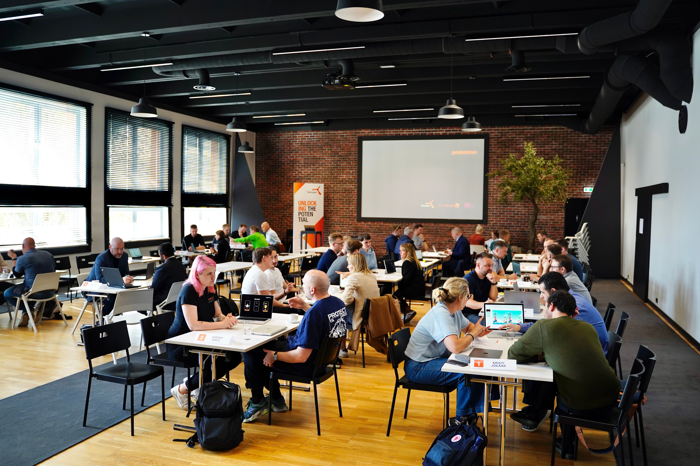

<!--truncate-->

- Prototron
    - Brait - [https://www.linkedin.com/in/brait-pilvik/](https://www.linkedin.com/in/brait-pilvik/)
    - Maret

- TalTech (Tiit Land rektor - [https://taltech.ee/ulikool/rektoraat](https://taltech.ee/ulikool/rektoraat))
    
    - more students
    - more value to forests
    - nordics - have own issues
    - low value added products
    - ÄIO - [https://investinestonia.com/estonian-biotech-startup-aio-raises-e1m-to-make-sustainable-oils/](https://investinestonia.com/estonian-biotech-startup-aio-raises-e1m-to-make-sustainable-oils/)
    - support creativity
- Swedbank
    
    - Triin Prem?
- Tehnopol
    
    - Martin Goroshko
        - investor (questions?) vs mentor (commands?)
        - tech (software + hardware)
        - product
        - investments (exit strategy)
        - market engagement
        - Q&A:
            - timing of entering the market
            - choosing co-founder - take different

Prototron has historically funded: CoModule, Lingvist

## Timeline

TOP50

15.04.2024 - MVP training + development plan task

17.04.2024 - announcement of TOP25 who will move forward in the programme

TOP25

22.04.2024 - IP training → Moosedog

29.04.2024 - Legal training → Hedman

06.05.2024 - Mentoring Day

07.05.2024 - announcement of TOP 10

TOP10

09.05.2024 - Pitch training

14.05.2024 - sending in your pitch (more on it at the training)

16.05.2024 - Sales training

23.05.2024 - Pitch competition @ Latitud59

- 3 min pitch 2 min Q/A

## MVP training

[Prototron fund on LinkedIn: Our TOP50 teams participated in MVP training led by Tauri Tuubel, a…](https://www.linkedin.com/posts/prototron_our-top50-teams-participated-in-mvp-training-activity-7187016513516621824-3cCK?utm_source=share&utm_medium=member_desktop)

[https://miro.com/app/board/uXjVKVZo3eA=/](https://miro.com/app/board/uXjVKVZo3eA=/)

## IP training

[Prototron fund on LinkedIn: #iptraining #moosedog #innovation #intellectualproperty #startups…](https://www.linkedin.com/posts/prototron_iptraining-moosedog-innovation-activity-7188557597153665024-WsSw?utm_source=share&utm_medium=member_desktop)

[Intellectual Property protection lecture by prototron.ee + MooseDog.fi](https://www.notion.so/Intellectual-Property-protection-lecture-by-prototron-ee-MooseDog-fi-a25522a756b24cb4983e7de18e1ea84f?pvs=21)

[Moosedog.fi](http://Moosedog.fi) team

- Pekka Laakso
- Anu Maasik
- Riin Rebane

### Mentors

- Heigo Mõlder (product)
- Martin Hanson (marketing)
- Mari-Liis Kikas (finance)
- Carl-Robert Reidolf (business)

## Feedback from mentors

It's crucial to define the target demographic before proceeding further. Trying to cater to both experienced beekeepers and tech novices may dilute the efforts and hinder progress. Instead, focusing on a specific target audience will allow for more effective product development and marketing strategies.

While the solution's AI and IT aspects show promise, there's a pressing need for expertise in user experience (UX) design to enhance usability and user satisfaction. Additionally, collaborating with a partner specializing in mechatronics or hardware can improve the prototype's functionality and overall performance.

It seemed that the team's ambition may be holding them back from fully realizing the potential of their idea. Encouragement and motivation are essential to inspire greater ambition and drive. Building a cohesive and motivated team will be instrumental in overcoming challenges and propelling the idea forward to success

