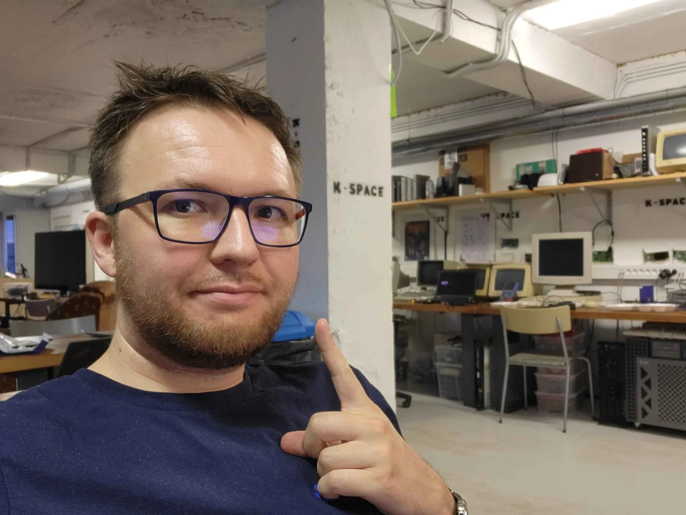
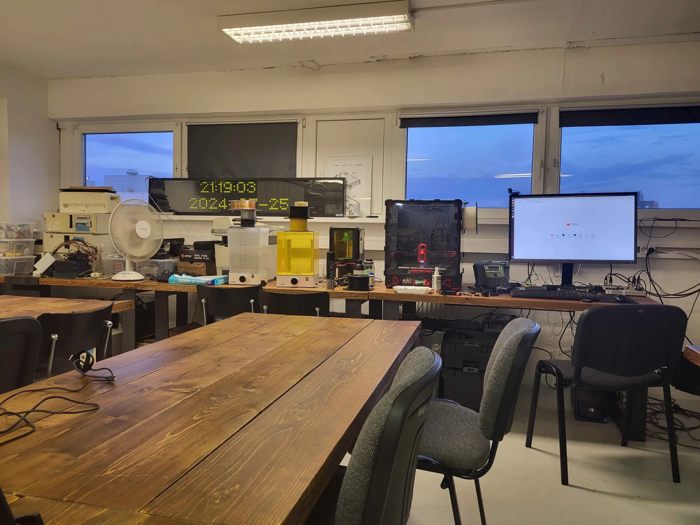
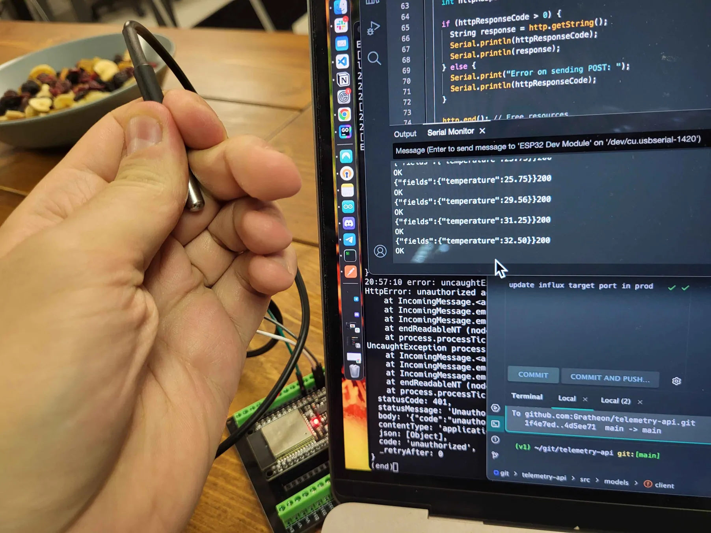
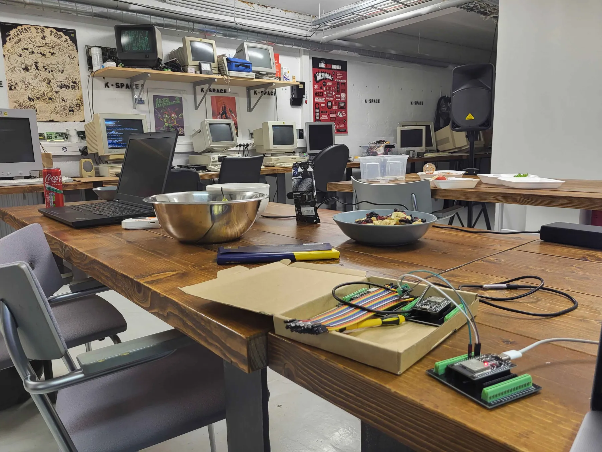

Visited local k-space (hacker space) co-working space with various equipment opportunities.
Was mainly experimenting with sensor telemetry as a product

<!--truncate-->

<iframe width="433" height="244" src="https://www.youtube.com/embed/zymSrfJdtHg" title="K-Space Hackathon 2024 ideas pitching" frameborder="0" allow="accelerometer; autoplay; clipboard-write; encrypted-media; gyroscope; picture-in-picture; web-share" referrerpolicy="strict-origin-when-cross-origin" allowfullscreen></iframe>

