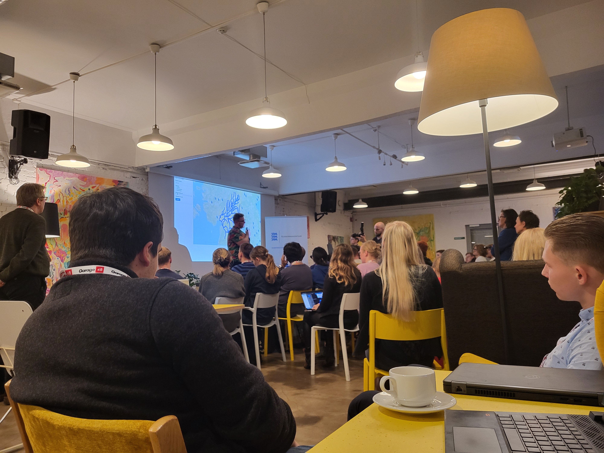
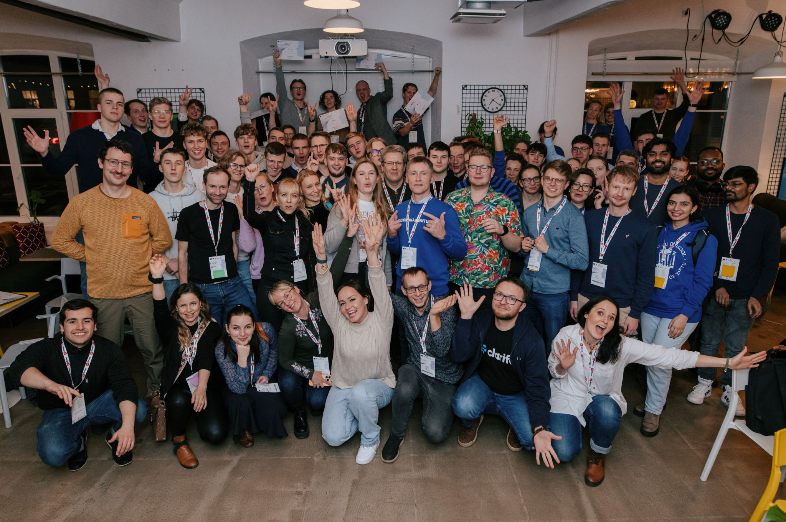
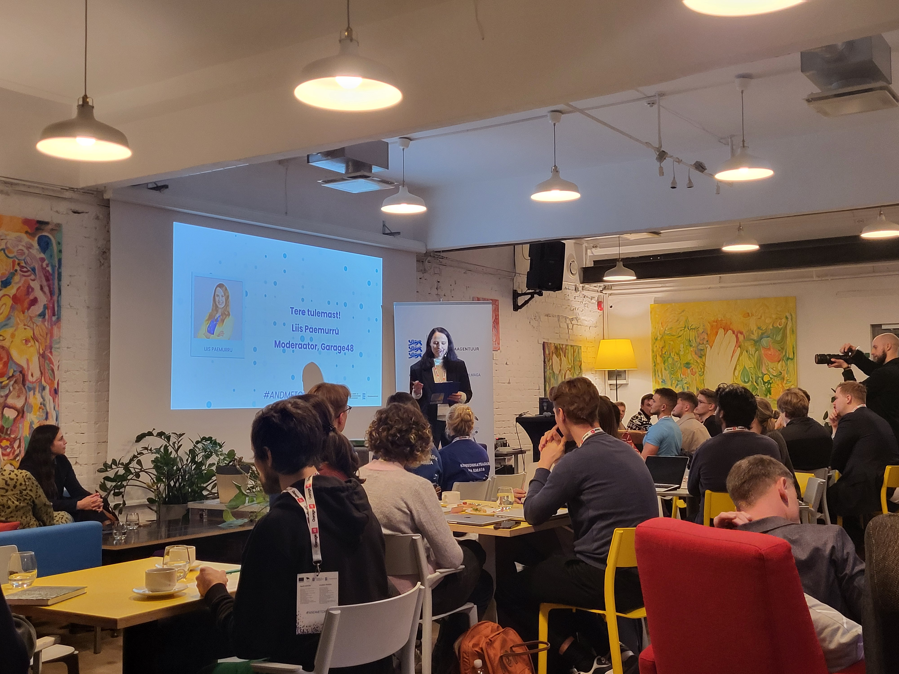

We are excited to participate in the **"Data Storm" hackathon**, which focuses on utilizing open government data from Estonia, particularly in areas such as environment, weather, hydrology, and alerts. Our project addresses challenges related to **storm winds collapsing beehives** and proposes a solution in the form of **weather alerts**.

### Our focus areas

- 🗃️ Storm wind collapsing beehives
- 📡 Weather alerts

## Team members

- Artjom Kurapov
- [Alonso Solis](https://www.linkedin.com/in/alonso-solis-a5b88020a/)
- Adrian Ala
- [Roop Runjan Khan](https://www.linkedin.com/in/roop-ranjan-khan-234a9014b/)

Participants and mentors collective foto by Tiit Tamme / Garage 48:

## First pitch slides

<object data={require('./img/andmetorm.pdf').default} type="application/pdf" width="100%" height="400"></object>

<!--truncate-->

## Event information

https://garage48.org/events/andmetorm
https://www.linkedin.com/events/7257354689556430849/comments/

## Key Participants

- Moderators - Liis Paemurru
- Main Beneficiary (API Provider): **Keskkonnaagentuur**
  - Taimar Ala (direktor)
  - Svetlana Pudova
  - Aivo Lanno
  - Sofia Paes
- Organizers: Garage 48
  - Merit Vislapu
  - Mari Hanikat
- Our Mentors & expertise
  - API choice
    - Miina Krabbi
    - Meila Kivisild
  - Design:
    - [Jaanus Jagomägi](https://www.linkedin.com/in/jagomagi/overlay/about-this-profile/)
    - [Andreas Roosson](https://www.linkedin.com/in/andreas-roosson-72057756/)

## Judges

- Jaanus Jagomägi
- Marko Tiirik
- Anne-Liisi Mändmets
- Sofia Paes
- Aivo Lanno

## Data sources

- https://keskkonnaportaal.ee/et/avaandmed/kliimaandmestik

## Challenges and Feedback for Keskkonnaagentuur

### Issues with [Detailed weather prediction API](https://avaandmed.keskkonnaportaal.ee/dhs/Active/documentList.aspx?ViewId=3b1f9939-7395-4710-968e-ed27eb8316fd)

- **Granularity**: No easy way to locate relevant files for given X/Y coordinates (of an apiary).
- **Binary Format**: Data is encoded in [WMO BUFR](https://library.wmo.int/records/item/35625-manual-on-codes-volume-i-2-international-codes) v4, requiring complex libraries for decoding. - Potential solutions include: - [NOAA EMC BUFR](https://github.com/NOAA-EMC/NCEPLIBS-bufr) - [TrollBUFR](https://trollbufr.readthedocs.io/index.html) (Python)
  
- **File Size**: Some files (e.g., NEMO model archives) are 1GB or larger.
- **UI/UX**: Downloading individual files requires clicking on small icons, which could be improved with clearer buttons or links.
  
- Short live data: In order to have detailed data about closest meteostation, we would need to do a lot of work by crawling the site, downloading all files, parsing them to extract windSpeed for example. And to keep data up to date we would need to do this over and over in a loop, which would add too much load on Keskkonnaagentuur servers

- (Old) [API forecast](https://www.ilmateenistus.ee/ilma_andmed/xml/forecast.php?lang=eng) for Estonia works, but it has some issues too

  - granularity is too broad - it is split into day and night, instead of hourly
  - its forecasts only 4 days
  - its tied to key regions, not coordinates
  - regions are forecasted only for 1 day ahead, the rest is considered the same for all regions
  - it does not always have wind speed property, even though text description has one

- Climate data time series API shows past data, but not future forecast.
  https://keskkonnaandmed.envir.ee/f_kliima_tund?aasta=eq.2024&kuu=eq.11&paev=lt.30 seems the best to retrieve past data per meteo station
  - We can still use it to correlate weather affecting beehives post-factum though. But our focus in hackathon is to prevent beehive collapse due to storms by alarming a beekeeper.

### Suggestions

- Implement REST APIs of weather prediction with filtering capabilities based on coordinates.
- Enable lightweight real-time data streams via web sockets or webhooks.

## Progress Updates

### Friday

- Developed an ad-hoc feature prototype.
- Created a **React app** prototype by Alonso:
  - [Live Demo](https://bee-app-zeta.vercel.app/)
  - [GitHub Repository](https://github.com/alonsosolisg/bee-app)
- Registered new internal graphql API `weatherEstonia` query type and we used https://www.ilmateenistus.ee/ilma_andmed/xml/forecast.php?lang=eng XML data, which was converted to JSON.
  - We had to find closes meteostation given lat/long coordinates, which was tricky
    
    
    

## Saturday progress

- We had to re-write API handling, because data nesting was
  `day -> data` instead of `data -> time` which we needed for charts in UI to plot the data

  https://github.com/Gratheon/weather/blob/main/app/resolvers.js#L19

- We decided to show both the react app prototype that will have full vision of what we intend to do, as well as mention that we have production ready service using real API

- later we found another API https://ilmmicroservice.envir.ee/api_doc/#api-Forecasts-GetV1ForecastsModelforecastbylocation that could be used for weather data. Although further discussion with mentors proved that this is somewhat private API that may change and using XML is best for now
- We were practicing the pitch scenario and decided to show both the react app prototype to show off what is the vision as well as show that we did integrate real API into existing Gratheon web-app and weather microservice
- We considered questions on marketing and sales (like that we target semi-professional beekeepers)
- We've updated the UI prototype to have better highlighting of the danger zones
- For the pitch, we configured twilio API to send SMS to all of the mentors/judges to effectively share our demo

## Alert use case

- Gratheon web-app monitors beekeepers apiaries and dangerous weather that can affect bees
- When there is a storm or a heatwave approaching the apiary, web-app generates an alert
- If user has entered the phone in the user profile and allowed us to contact him over the phone, we send an SMS
- User (beekeeper) receives an SMS alert on the phone with a URL to relevant apiary
- User opens apiary view, sees there is an alert details about high temperature (heat wave coming) or a high wind, when exactly it is expected and how dangerous it is
- User reads an advice of what he needs to do, for example in case of storm - limit hive entrance, tie together hive with a rope

## Data correlation use-case

Idea is to not only collect weather data when user opens the view or not only to predict data in advance, but also collect past weather information for specific apiary location.

This is needed so that beekeeper or AI model could correlate weather effects affecting the bees. For example, if there was 2 weeks of daily rain, then bees may be grounded and lose resources (pollen, nectar) which will be seen on hive weight graph too

## Result

We competed with 15 other teams and we did not win. Teams presented various solutions, winners suggested solutions with ESG and general data analysis that judges likely found to best fit judgement criterias and what Keskkonnaagentuur needed.

We had hands-on work on SMS alerting channels, weather APIs and more attractive UI for charts that will not go to waste. We shared the awareness of the product and did some networking.

