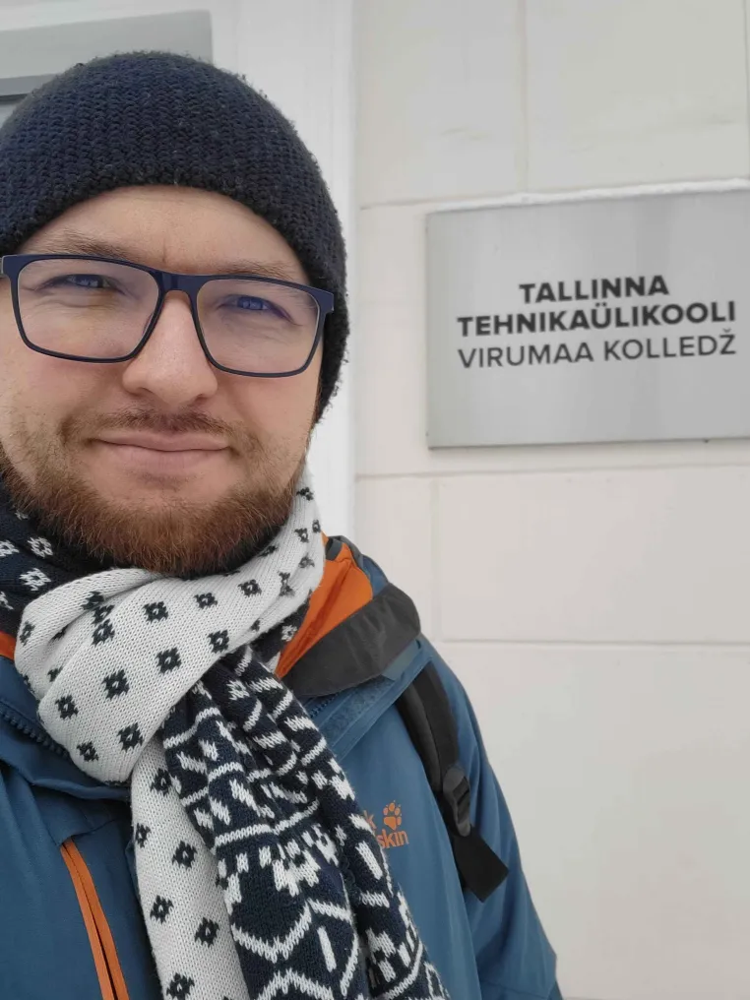

Had a meeting with [VIRUMAA DIGI- JA ROHETEHNOLOOGIATE INNOVATSIOONIKESKUS](https://vidrik.taltech.ee/) representatives (engineers, researchers and managers) on the topic of research and development collaboration with Gratheon. Seems like the most suitable topic is the area of IoT devices.

<!-- truncate -->

We talked about the project and its market, past experience of the team, funding sources, some technical details.

Specifically
- local team used nrf9160 chip (instead of esp32) to be more energy efficient
- MQTT and GSM were brought up as possible communication means for the device
- [https://tradex.ee/](https://tradex.ee/ "https://tradex.ee/") was used as a partner to make devices more prod ready (electronics)
- nokia dynanet - as a construction example of expandable frames and nest was brought up  for robotic beehive construction
- we should have a small research paper abstract published

