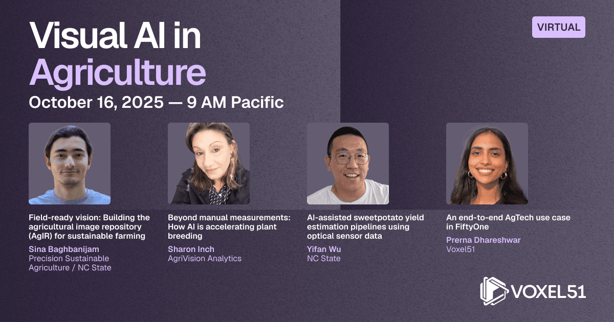

We attended a Webinar on agriculture, mostly showcasing voxel51 AI tool use with agriculture projects

<!--truncate-->

https://www.youtube.com/@voxel51

Pest dataset
- 102 classes
- hierarchical taxonomy
https://github.com/xpwu95/IP102

https://precision-sustainable-ag.atlassian.net/wiki/spaces/IR2/overview
https://www.precisionsustainableag.org/agimagerepo

Class distribution

Yifan Wu on Sweet Potatoes AI analytics

QR tag (track/trace) tracking

1st gen system - PC
2nd gen system
- desktop motherboard with GPU
- rgb cam -> mask rcnn
- polirarization cam
	- skin blemishes
	- LED
- water resistance

Keeping everything on the edge
- data privacy 
- remote location, poor internet -> reduces delay, no data lost

Cheaper and more compact system:
- all in one
- RTX3050 ~ 4gb DDR
- instance segmentation
- raspberry pi -> global shutter camera, magnetic halt sensor with converyor belt
- 

Dashboard:
