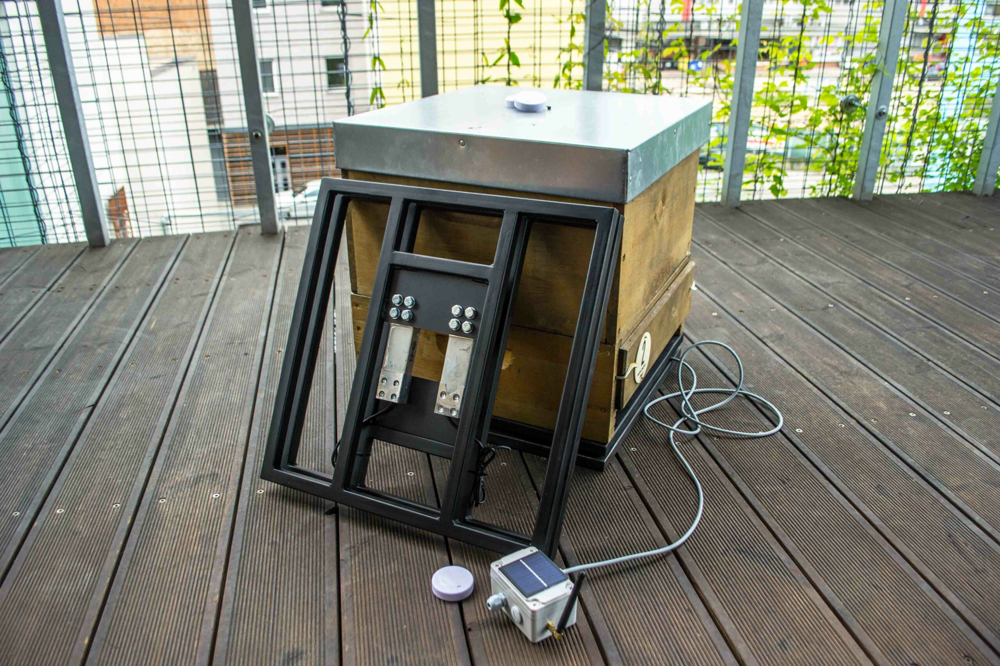
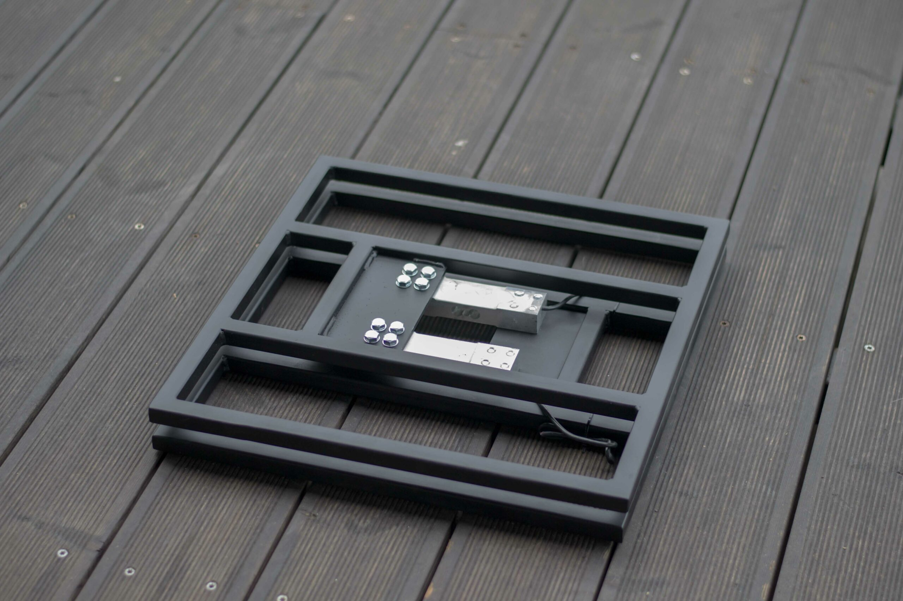
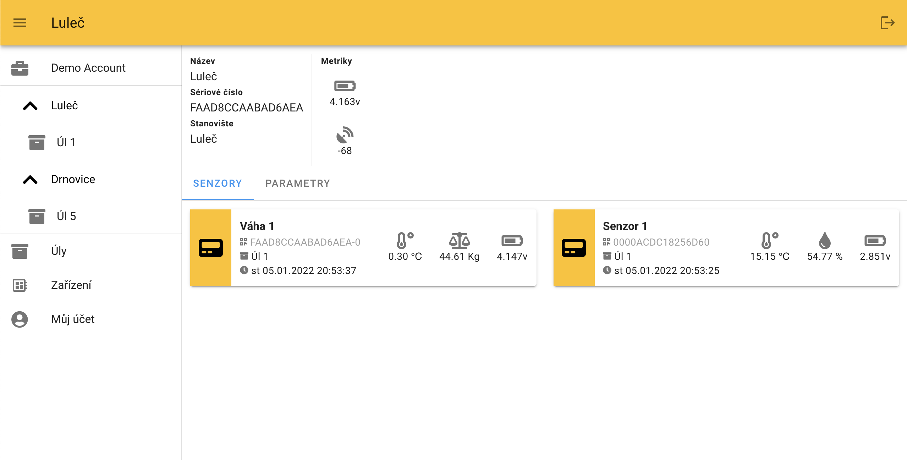

## Overview

ForSage offers hive monitoring sensors for European beekeepers. The system combines scales, internal/entrance sensors, a data transmitter and an app that summarizes measurements, history and hive events.

## Product Features

- Hive scale placed between hive bottom board and stand
- Sensor for audio tracks, humidity and temperature, placed in the entrance reducer or between frames
- Data transmitter/hub collecting sensor data and sending it to ForSage servers
- App with continuous data history and weekly summaries via SMS/e-mail
- Monitoring of honey weight gain, feed reduction, unusual events, temperature, humidity and bee buzzing
- Stated future goal: train software to analyze hive events from collected data
- Hub can connect up to five scales and unlimited sensors

## Competitive Analysis

### Strengths

- Practical, modular EU sensor system with visible pricing
- Includes sound monitoring, not just weight and temperature
- Weekly SMS/e-mail summaries reduce need for constant dashboard checking
- Czech/EU local support and e-shop

### Weaknesses vs Gratheon

- No camera or entrance computer vision
- No frame-level visual inspection
- Analytics appear mostly rule/time-series based rather than advanced AI
- Hardware cost can rise quickly when adding hub + multiple sensors/scales

### Strategic Implications

ForSage is a useful benchmark for modular pricing and the value of audio data. Gratheon should consider whether sound can complement vision, but can differentiate strongly with visual proof, richer AI and integrated app workflows.

