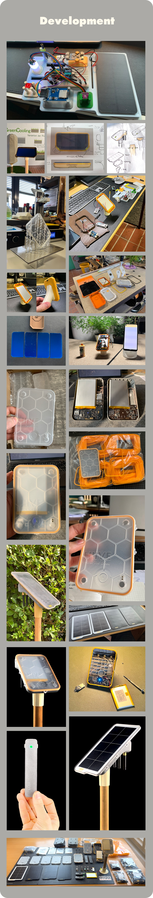
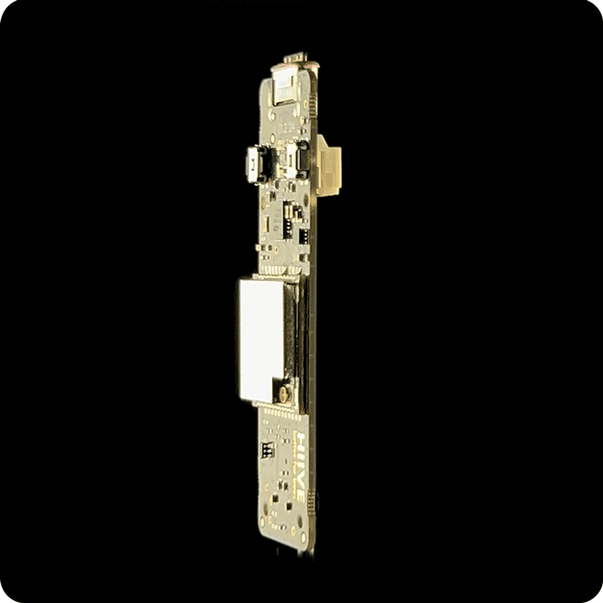

## Overview

HIIVE Link is a beehive monitoring hardware line from the HIIVE ecosystem. The public landing page is minimal, while the HIIVE store lists a HIIVE Link collection with sensors, gateway, solar panel and starter kits, all marked sold out during research.

## Product Features

- HIIVE Link sensor module
- Gateway and solar gateway options
- Solar panel add-on
- Full starter kit
- Store supports many countries/currencies, suggesting EU/international sales intent
- Prototype video available

## Competitive Analysis

### Strengths

- Clean modular package: sensor + gateway + solar power
- EU storefront and distribution infrastructure
- Attractive entry prices if available
- Solar option is important for remote apiaries

### Weaknesses vs Gratheon

- Store listings were sold out, making current availability unclear
- Public technical details are limited
- No visible computer vision, entrance observer or frame inspection
- Likely basic telemetry rather than AI-first analytics

### Strategic Implications

HIIVE Link is a reminder that small, modular, solar-friendly monitoring kits are a common market expectation. Gratheon should keep hardware installation simple and robust, but can win by offering more actionable analysis than raw telemetry kits.

https://hiive-link.com/
https://store.hiive.eu/collections/sensor

<iframe width="505" height="284" src="https://www.youtube.com/embed/KLv07PNKpPI" title="HIIVE Link Prototype" frameborder="0" allow="accelerometer; autoplay; clipboard-write; encrypted-media; gyroscope; picture-in-picture; web-share" referrerpolicy="strict-origin-when-cross-origin" allowfullscreen></iframe>

