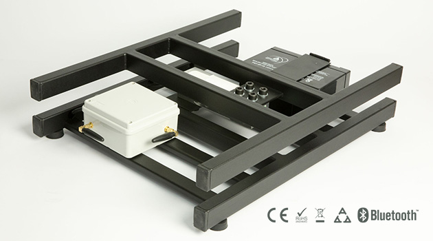

## Overview

SMS Vaga is a Serbian third-generation SMS hive scale/indicator for monitoring honey yield and apiary conditions. The product is designed for beekeepers who need simple real-time SMS/e-mail updates and theft protection without a complex dashboard.

## Product Features

- Electronic device for measuring honey yield / hive weight
- Real-time status delivery by SMS or e-mail
- Optional sensors for atmospheric/apiary conditions
- Alarm system for protecting apiary, hives or vehicle from theft
- Winter feed-consumption monitoring
- Designed to reduce travel time and apiary visits

## Competitive Analysis

### Strengths

- SMS-first workflow is robust for remote areas and older users
- Simple value proposition: weight, conditions, theft, less travel
- Local phone-based support and regional familiarity
- Likely lower complexity than cloud-heavy systems

### Weaknesses vs Gratheon

- Minimal public technical detail and modern app/cloud UX
- No computer vision, frame inspection or advanced AI
- Regional/language focus limits international competition
- SMS measurements provide limited context compared with rich telemetry/video

### Strategic Implications

SMS Vaga highlights the value of simple alerts and low-connectivity operation. Gratheon should consider SMS/Telegram/e-mail fallback notifications for critical events, especially for remote apiaries.

smsvaga.com

