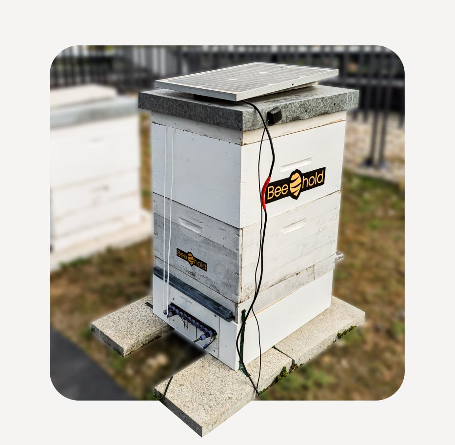
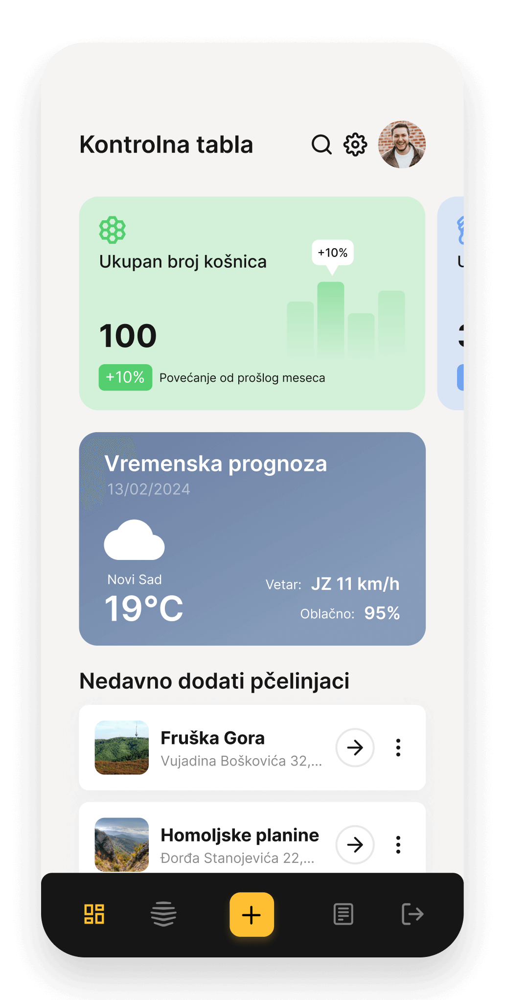
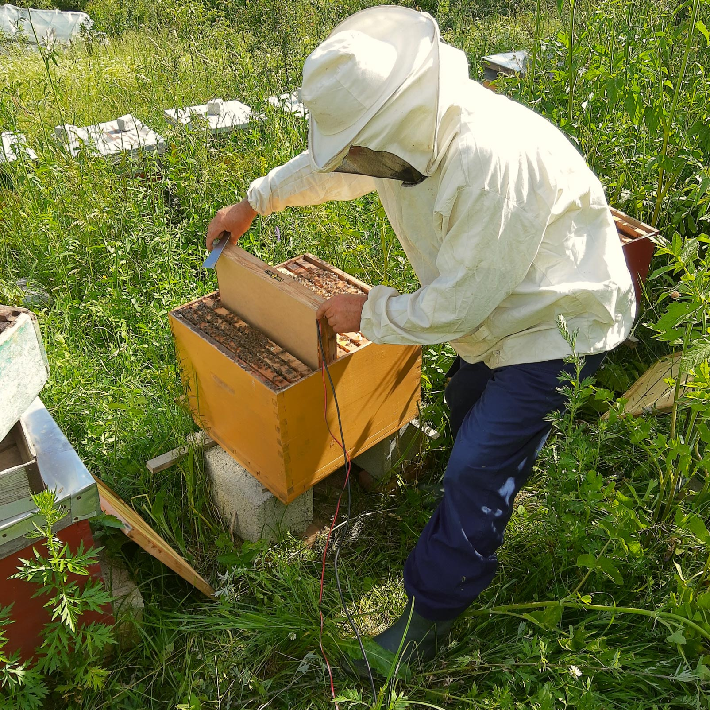
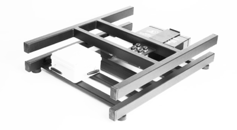
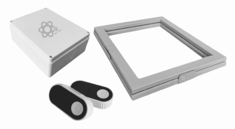

## Overview

Beehold is a Serbian AI-powered beekeepers' digital assistant. It positions itself around content analysis, decision making and data collection, with a vision to digitize hives and help beekeepers optimize hive management in real time.

## Product Features

- AI-powered beekeeper assistant
- Remote and real-time beekeeping support
- Data collection, content analysis and decision-making workflows
- Hive management optimization
- Productivity, honey-production and income improvement claims
- Partner network including Serbian beekeeping and technology organizations
- News/activity around EIT Food AgriTech Demo Day and AI beekeeping topics

## Competitive Analysis

### Strengths

- AI-first messaging is close to Gratheon's desired positioning
- Startup/grant ecosystem presence and public partner logos
- Clear story around reducing colony loss and improving productivity
- Balkan/EU proximity could make them a regional competitor or partner

### Weaknesses vs Gratheon

- Public site is high-level; concrete hardware/sensor specs and pricing are not visible
- No explicit entrance camera or frame-level visual inspection shown
- Claims need field validation and product-detail transparency
- Market traction and deployment scale are unclear

### Strategic Implications

Beehold is a conceptually close competitor in AI-assisted beekeeping, even if the public product details are thin. Gratheon should be precise about measurable features, datasets and device capabilities to avoid competing only on generic "AI assistant" messaging.

