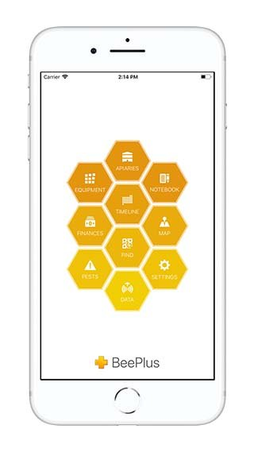
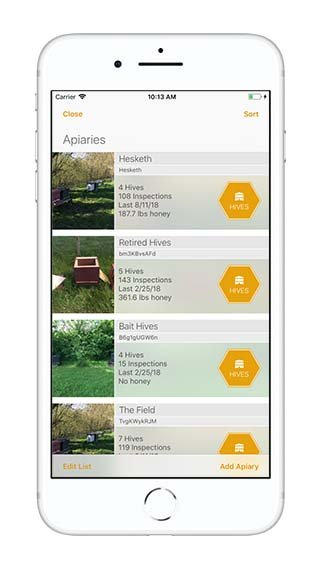
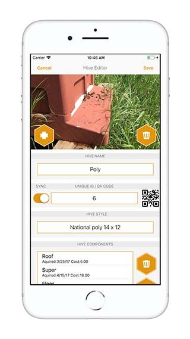

## Overview

BeePlus Beekeeping Manager is an iPhone/iPad hive-tool and apiary-management app by OmniChrome. It positions itself as a no-subscription, no-in-app-purchase beekeeping notebook for inspections, queens, equipment, harvests and finances.

## Product Features

- Quick and detailed hive inspection records
- Photo attachments for visual history
- Calendar, to-do items and timeline
- QR scanner and exporter for hive identification
- Apiary maps and forage areas
- Sharing between iOS devices and beekeeping buddies
- Equipment inventory, hive-component tracking and notebook
- Queen histories, harvest tracking and finance records
- Data export for printing or archiving
- No stated limit on number of hives

## Competitive Analysis

### Strengths

- Mature, focused field-record workflow for iOS users
- No subscription pricing can be attractive to hobbyists
- Strong coverage of manual records: queens, equipment, finances, photos
- QR and mapping features support real apiary workflows

### Weaknesses vs Gratheon

- iOS-centric, not a full cloud-first hardware ecosystem
- Manual record entry; no automated sensor, camera or AI inference
- No real-time alerts or remote hive health monitoring
- No frame-level computer-vision analysis

### Strategic Implications

BeePlus is a good benchmark for field UX and record completeness. Gratheon should keep inspection logging fast, offline-friendly and photo-rich, but can win by connecting those records to automated telemetry, entrance video and AI recommendations.

## Product images / screenshots

Official product visuals/screenshots used for competitive reference.

