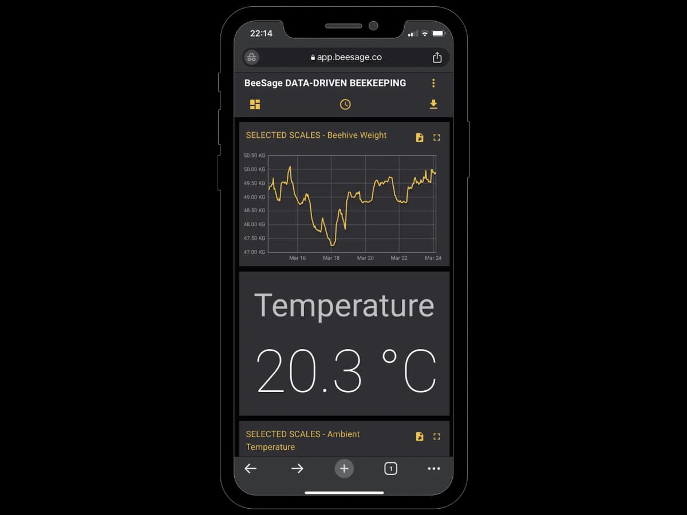
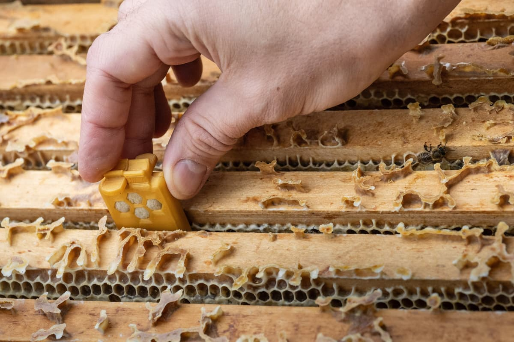
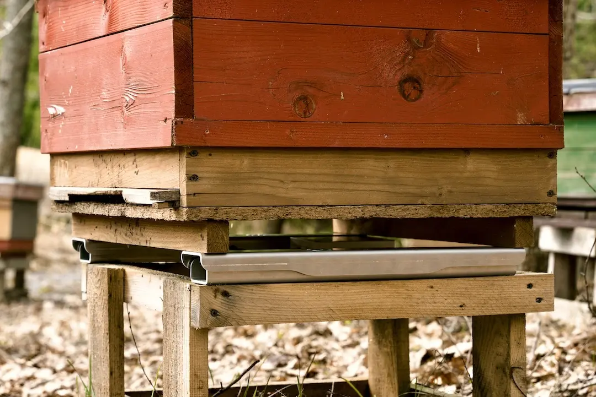

## Overview

BeeSage SIA is a Latvian beehive-monitoring company focused on HiveScale: a smart beehive scale with a mobile-friendly web app. The product reads hive weight, ambient temperature and location data hourly, with included mobile data during the initial service period.

## Product Features

- HiveScale v2 smart beehive scale
- Hourly weight, 24h weight change and ambient temperature data
- GPS/location map for theft awareness
- Critical alerts and weekly reports
- Mobile-friendly web app
- CSV/XLS/XLSX export
- Included/free SIM card and data during initial service period
- Rechargeable battery and weatherproof/stable design
- HiveNode sound/internal sensor listed as coming soon

## Competitive Analysis

### Strengths

- Baltic/EU location overlaps Gratheon's natural early market
- Clear value proposition around nectar flow, yield timing and fewer apiary trips
- Strong UX/marketing compared with many legacy scale vendors
- Included SIM/data simplifies onboarding
- Climate/food-security positioning may help with grants and partnerships

### Weaknesses vs Gratheon

- Current product is mainly a scale; no visual inspection or entrance behavior analysis
- Listed product was out of stock during research
- HiveNode internal sound monitoring is still presented as coming soon
- Hardware price (€399) leaves room for differentiated Gratheon bundles

### Strategic Implications

BeeSage is a credible regional competitor for smart scales and beekeeper dashboards. Gratheon should monitor BeeSage's HiveNode launch and differentiate with camera/AI evidence, frame inspection and a broader multi-sensor product line.

## Product images / screenshots

Official product visuals/screenshots used for competitive reference.

